# Tips and techniques for mastering 3D lighting in CGI

Learn about 3D lighting & how to create different light conditions that can completely alter a computer-generated scene & the way that objects look in it.

We perceive the world around us using our senses: we hear, we feel, we smell, we see. We can see because our eyes are picking up information brought to us by elementary particles called photons. This information is processed by our brain to produce an image. What we interpret as an object color, glossiness, translucency or metallic qualities are all products of the interaction between the photons and the object's surface.

Light mechanics in a computer generated 3D scene follow the same natural principle of photon scattering, through a process called ray tracing. Rays bounce off shapes and interact with their materials, effectively defining how objects appear in the final image. Lights expose dimensionality of anything that exists in a 3D scene. 

Some materials are more sensitive to lighting conditions than others. Take metals for instance: a chrome object is basically reflecting everything around it. If a light is moved, becomes brighter, or larger, all of that information is visible directly on the chrome surface in almost mirror-like detail, so  it can appear completely different from one light condition to the other.

## How to work with 3D lights to create effective 3D renders

The process of creating a 3D render is never quite the same, but these are the most common steps:

1. Object creation or acquisition
1. Scene assembly
1. Framing the scene
1. **Lighting**
1. Material creation or assignment
1. Rendering

When you get to the lighting phase, it is ideal to set up your lights before working on the materials. To do this, you can assign a neutral gray, matte material to the whole scene. That way, you'll be able to see and understand more clearly how the lights affect the object silhouettes in the scene. After the materials are completed, the lighting might need further refinement.

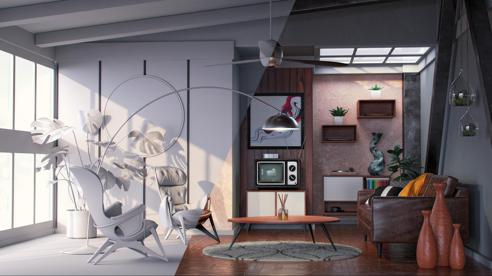

It's best to work on the lights one at a time. The active light should be the only one visible in the scene, whereas all other lights should be temporarily turned off. This way, you'll be able to see how a specific light influences the scene, and change that by working on its properties, such as the position, direction, intensity, etc.

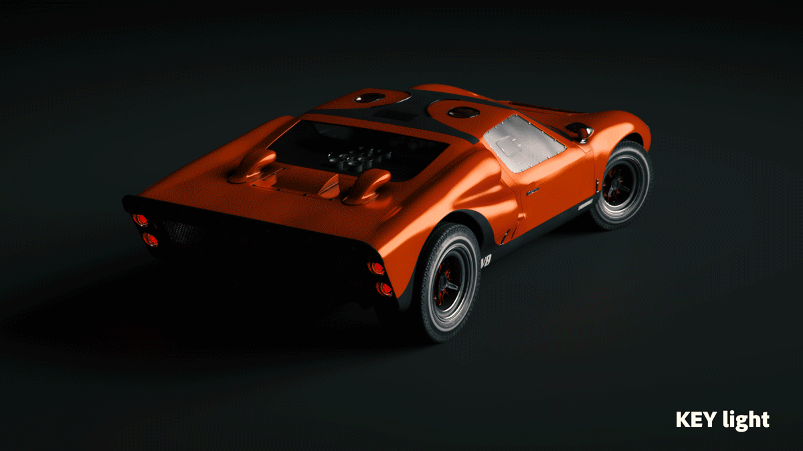

Another useful trick is to create a sphere with a shiny metal material (a chrome or a mirror). This "mirror ball" will effectively reflect the entire scene around it, so you can easily determine the light's position, direction, or size. In case of the environment lights, you'll be able to see its reflection in the mirror ball, which will help set up its orientation in space.

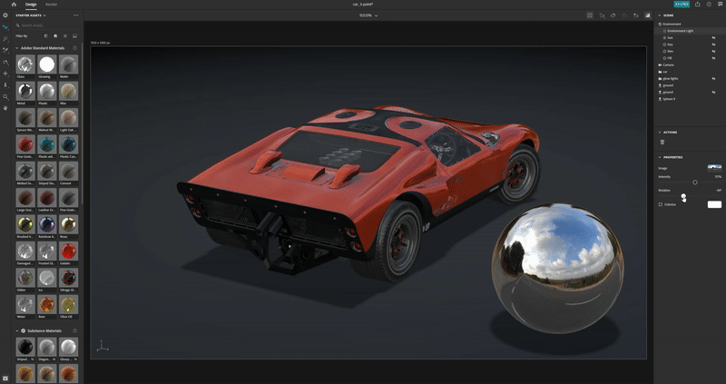

## Types of lights in Adobe [!DNL Dimension]

### Environment lights

Environment lights are equirectangular (spherical) images, which are wrapped around the entire scene. As the name suggests, these lights serve to emulate the whole environment, including the light sources, which are stored in them.

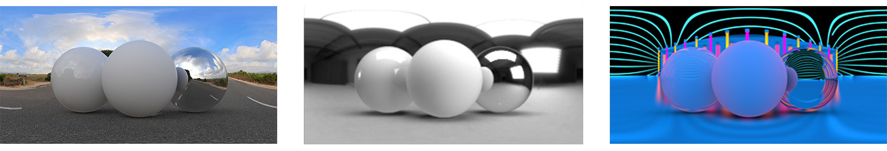

When you create a new scene in [[!DNL Dimension]](https://www.adobe.com/products/dimension.html), a default environment light will be created for you. This is why you are immediately able to actually see anything in the scene. Adobe [!DNL Dimension] Starter Assets include a certain number of environment lights, which you may try right away. In addition, [Adobe [!DNL Stock]](https://stock.adobe.com/search?filters[content_type:3d]=1&filters[3d_type_id][0]=2&load_type=3d+lp) offers a huge, curated selection of environment lights.

Environment lights produce highly realistic results, and can save you a lot of time. In order to achieve something similar manually, you would have to actually create the whole environment in 3D (including various light sources), which is a significant amount of work.

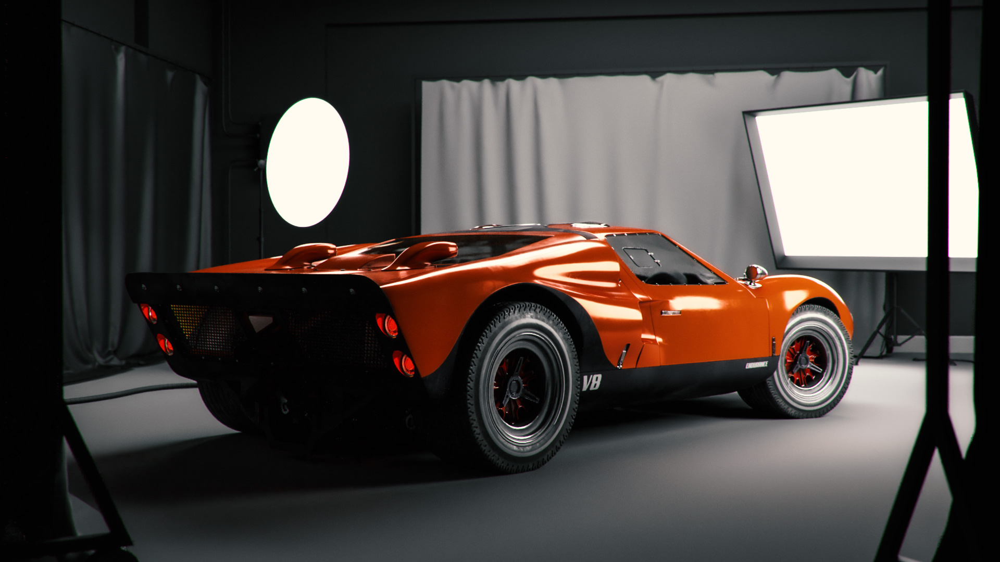

There are many ways to create environment lights, including capturing from a 3D scene, from a photograph, and using parametric systems. If the environment light is made out of a 3D scene, the process is straightforward. The output image needs to be 32 bit, which will capture the light information of all the lights in the scene. The 3D camera needs to use the equirectangular projection (to output a spherical image).

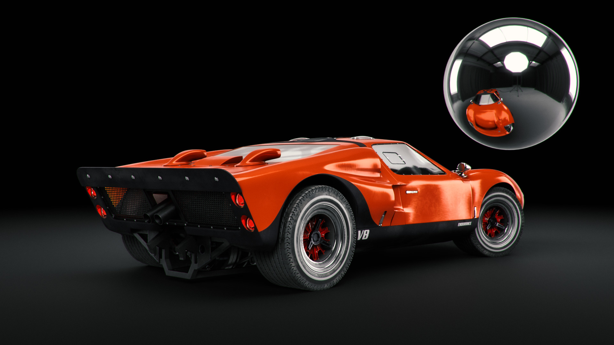

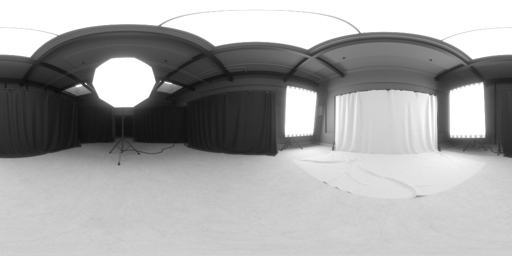

You can also create environment lights by capturing photographs of the real world. For this workflow, a 360 camera is needed (e.g., [Ricoh Theta Z1](https://theta360.com/en/about/theta/z1.html)). The camera is then used for exposure bracketing, or taking multiple shots of the same environment, taken with a range of different exposure values (from underexposed to overexposed). These shots are then used to construct 32 bits images, often called HDRs (short for a High Dynamic Range). One way to assemble such an image is with the Merge to HDR function in Photoshop. The embedded exposure range will become the intensity property.

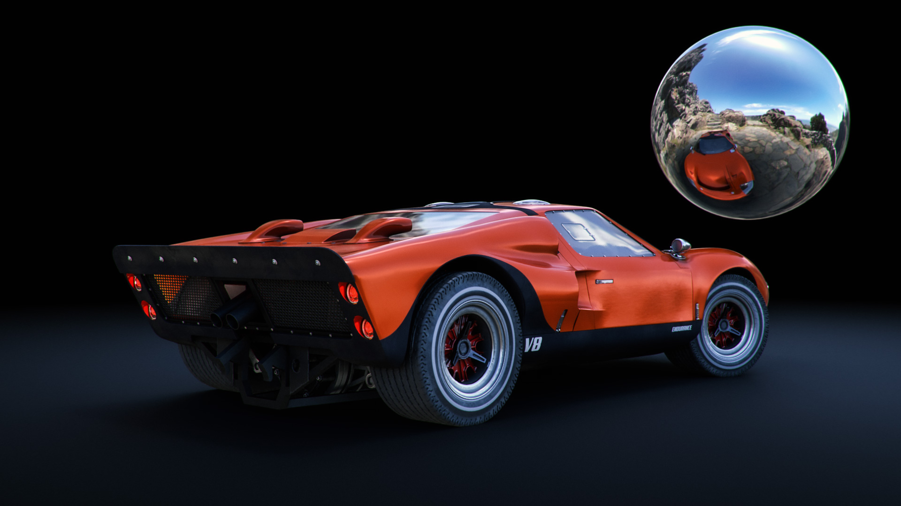

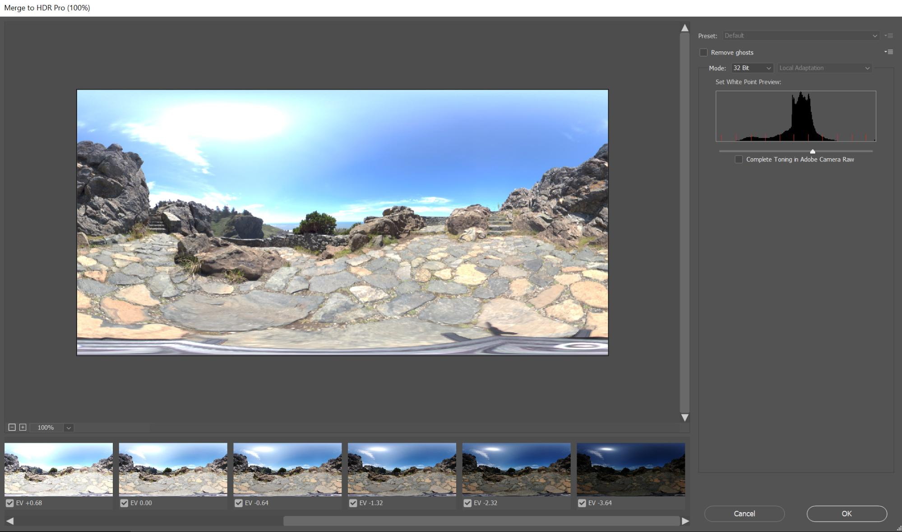

In both cases, the light sources (and their intensities) are "baked" into these images and will emit the light once they are used in [!DNL Dimension].

In these methods you've captured all the lighting, reflections, and details you need, but 3D apps let you continue editing them in the 3D space, so you can adjust the lighting rotation as well as change the overall intensity and color.

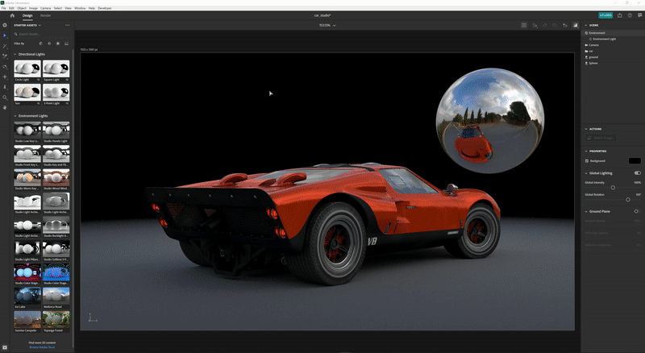

### Directional lights

In addition to Environment lights, which emit light from 360 degrees, there are also Directional lights, which emit light from one direction only. They are used to emulate flashlights and other types of lights coming from a well defined emitter, and they can be shaped as a circle or a square.

Using directional lights offers full control over the lighting setup. Lighting the scene using these lights is done in the same fashion as in traditional photography, where each light can be controlled independently, allowing you to build your own virtual photographic lighting. One of the most commonly used lighting setups is the 3-point light system.

[!DNL Dimension] has a convenient action, Aim Light at Point, which allows you to control the rotation and height by simply clicking and dragging across a 3D object. This way, you can dynamically direct the light rays. These parameters can be adjusted manually as well.

You are able to change the color and the intensity of the directional lights as well as adjust the shape of the light source – make it circular or rectangular, stretch it, or make it bigger. Finally, you can soften the edges of the light source.

![Modifying the shape of a directional light in Adobe [!DNL Dimension]](assets/Mastering3dlighting_12.gif)

If you make the light source smaller than the object, the shadows will be sharper, with a crisper outline, because the rays can't get past the illuminated object. Bigger light sources produce softer shadows, because in this case the rays are coming from all sides of the object (marked red in the illustration below), creating an array of shadows. These shadows are softened by the rays coming from the opposite direction.

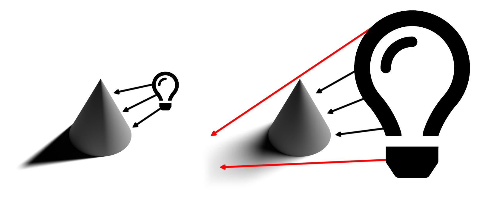

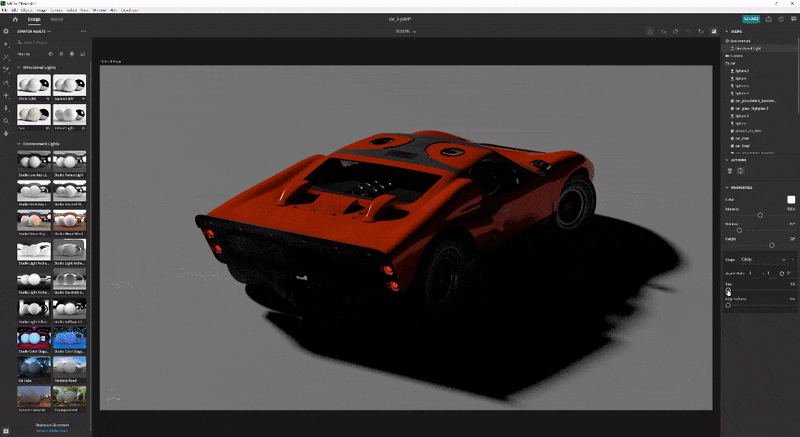

### Sun and sky

Sunlight is a special type of directional light. The process of setting it up is very similar to a regular directional light, however this light will automatically change the color with height; when it is close to the horizon (low height angle values), it will gradually become warmer to simulate the sunset. The color can also be changed by using presets. Meanwhile, cloudiness will affect the shadow softness.

![Manipulating lighting properties for sunlight lighting on a 3D car model in Adobe [!DNL Dimension]](assets/Mastering3dlighting_15.gif)

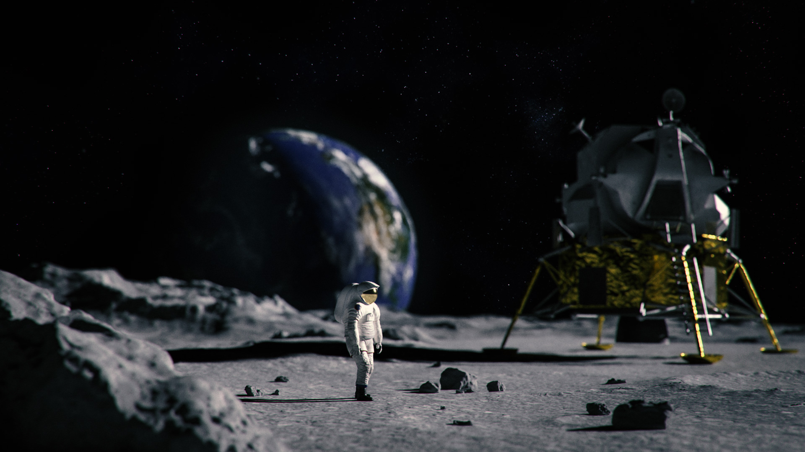

We are able to emulate the sky using environment lights, and any environment light featuring the sky can be used. Now, we have to align the sunlight (made in [!DNL Dimension]) with the Sun, captured in the environment light. A fast way to do this is to create a sphere and assign a metal material to it; this will provide us with real time reflections of the environment, so we can use Aim light at point to align the sunlight with the Sun. 

If the environment light features an overcast sky, the cloudiness property can be used to match these conditions more closely.

![Manipulating cloudiness properties for sky environment lighting on a 3D car model in Adobe [!DNL Dimension]](assets/Mastering3dlighting_17.gif)

Once the Sunlight and the Sky Environment light are paired, you may rotate them together using the Global Rotation property.

### Object based lights

Objects can be turned into light sources, by turning the Glow property on for their materials. This way, it is possible to create objects like light bulbs, neon lights, softboxes, and all kinds of screens and displays.

The key benefit of using this type of illumination is the intensity falloff, which produces very natural results. This is quite useful for product visualization or other studio based scenes.

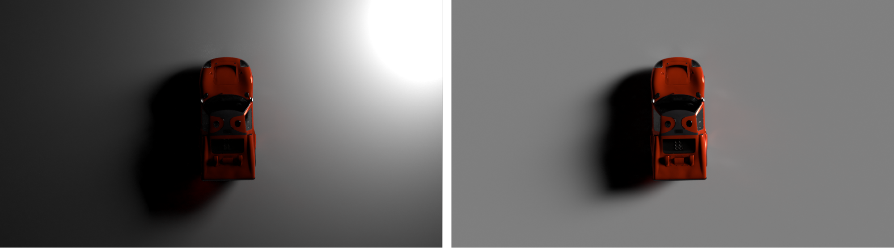

You can control the softness of the shadows by scaling the glowing object up or down, using the transformation tool. Making it bigger will also increase the light intensity.

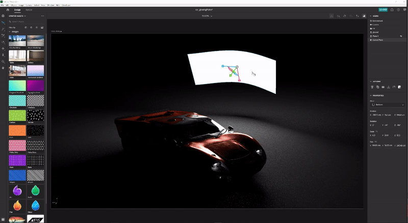

Unlike the previous types of lights we've covered, these lights can also utilize textures, in addition to plain colors. The textures can be attached to the base color of their materials, and the light intensity is controlled via a glow slider.

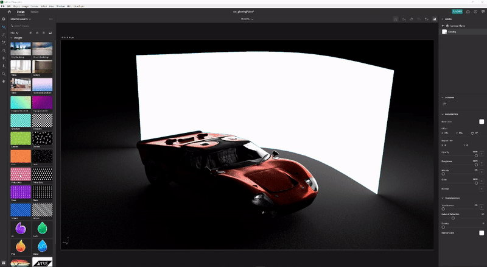

## Examples of effective 3D lighting

### Product lighting

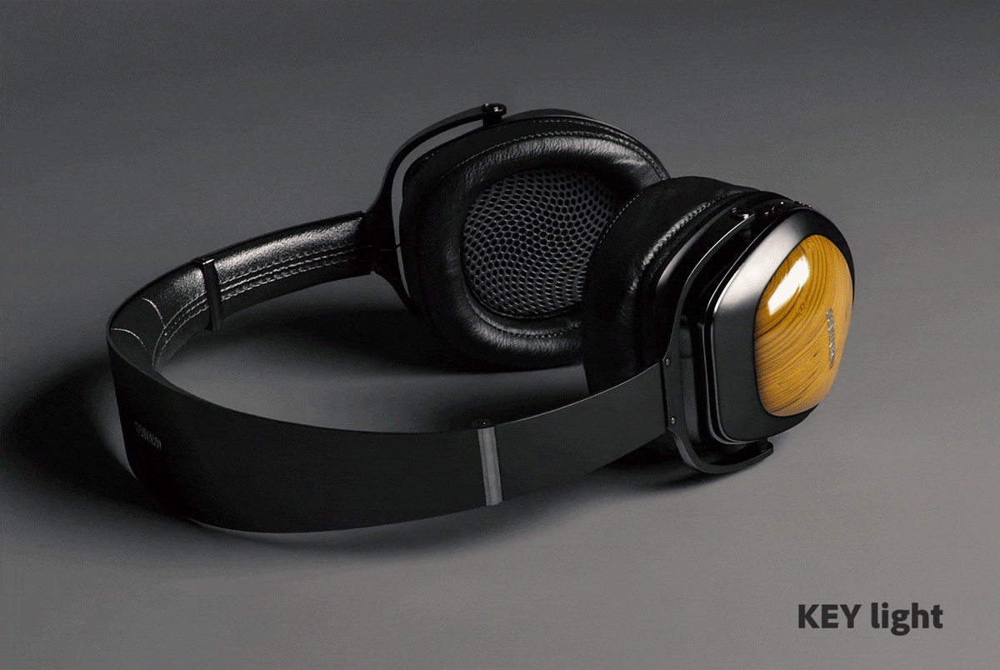

There are many photographic techniques for setting up the light for a product shot. We will use one of the most commonly used setups, which is the 3-point light system.

This setup consists of three lights: 

1. **Key light:** used as the primary source, this shines approximately from the camera direction

    

1. **Rim light:** oriented on the opposite side from the key, this is used to expose the silhouette of the subject.

    

1. **Fill light:** less intensive and serving to fill in darker areas, this is used for areas the previous two lights don't reach.

    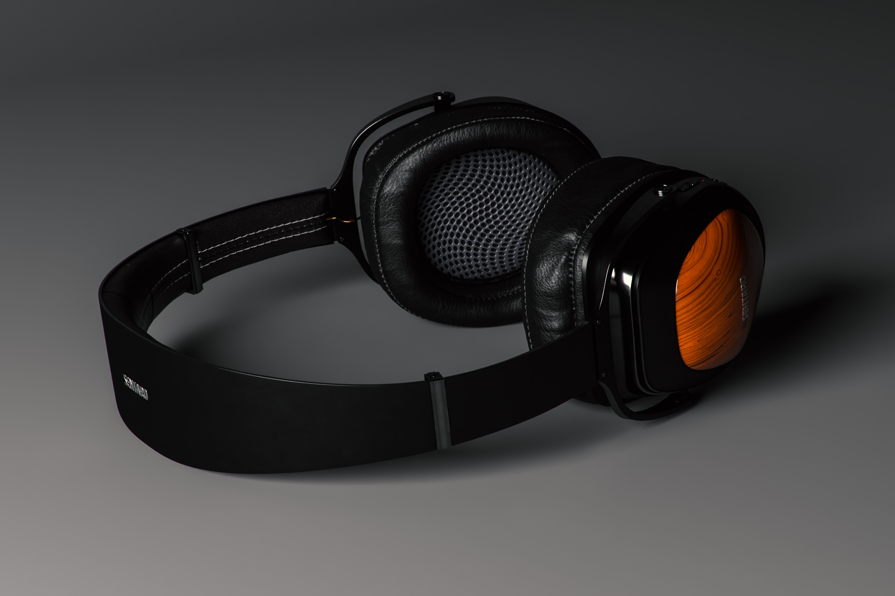

There are two ways to create the 3-point lighting in [!DNL Dimension] – using Directional lights (individually adding them to the scene or using a 3-Point Light preset) or via glowing objects.

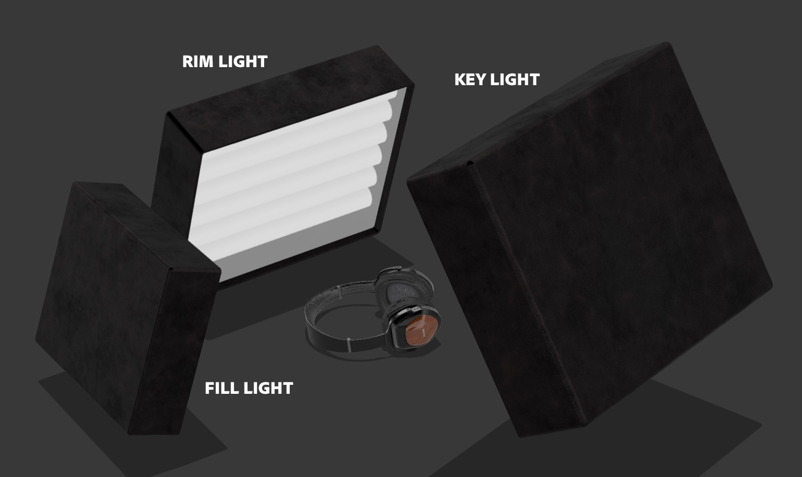

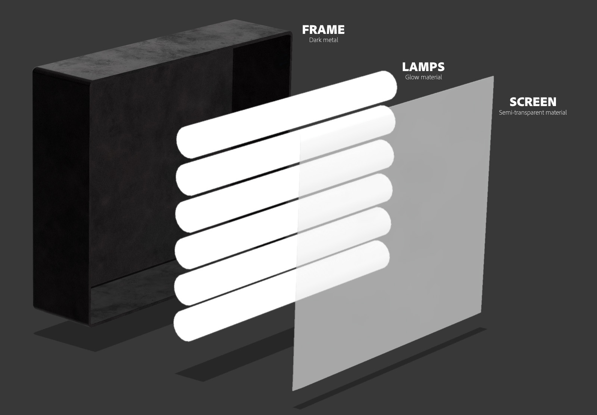

### Creative lighting

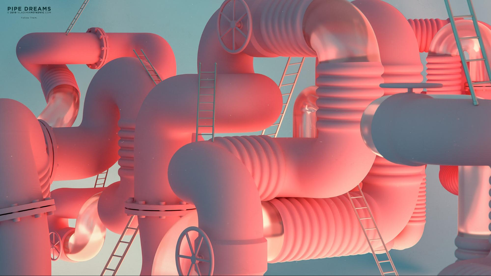

Creative lighting is used where physical accuracy is not the primary goal. This includes abstract and surreal scenes of all kinds, so there are no real boundaries where our imaginations can take us.

In the example above, the idea was to portray a dream-like environment: candy, pastel colors, and smooth surfaces. The lighting system is made out of three glowing plates (two on the side, and the main one shining from the bottom). All of the glowing plates are unrealistically big, which creates very smooth shadows and highlights. The light sources are colored and that color is transferred into the material assigned to the objects in the scene.

The subject of the scene (pipes) is completely surrounded by the walls geometry. This will cause light rays to bounce back and forth and mix together in interesting ways. Playing with cool VS warm tones often produces nice contrast (this technique is sometimes used in portrait photography).

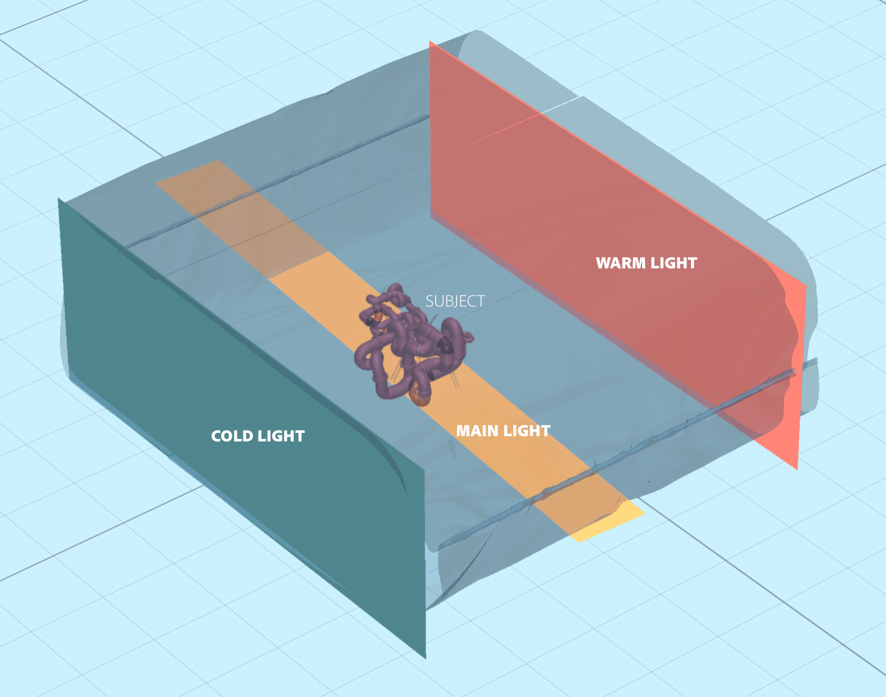

### Interior visualization

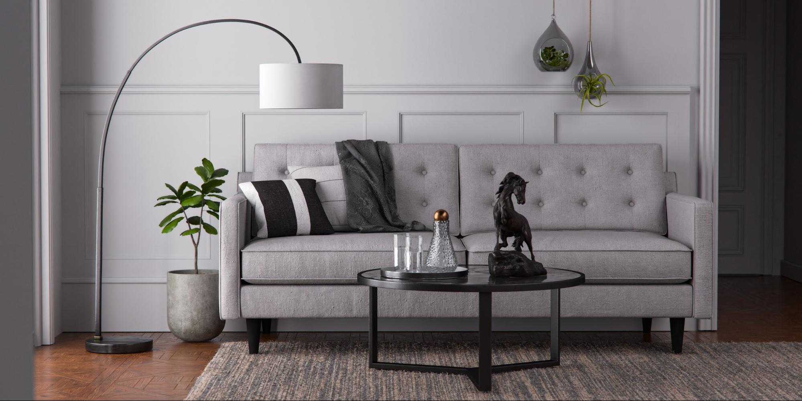

Creating a visualization of a 3D interior follows a certain set of rules, which almost always guarantees good results. For this use case, we will consider only natural light (no artificial sources, like lamps).

First and foremost, a scene like this needs to be in an enclosed environment. Just like in real life, the interior will need walls, floor, ceiling, and windows. This will ensure that the light comes through the windows and then bounces around (via a process called ray tracing). This behavior produces very natural lighting (for instance, the occluded areas, like corners, will be darker).

Since the scene is almost completely surrounded by architectural geometry, we will see very little illumination and almost no reflections coming from the Environment light. However, in this case, we are actually building our own environment, which is the interior itself. So the light will react with the objects in the scene by bouncing off of them and the surrounding walls. The objects will reflect only each other and the walls around them. Nonetheless, it is a good idea to add an Environment light, featuring the sky. This will add some diffuse blue fill.

The easiest way to set this light is by using planes with glowing materials. In this use case we have three planes, which cover all the openings in the interior.

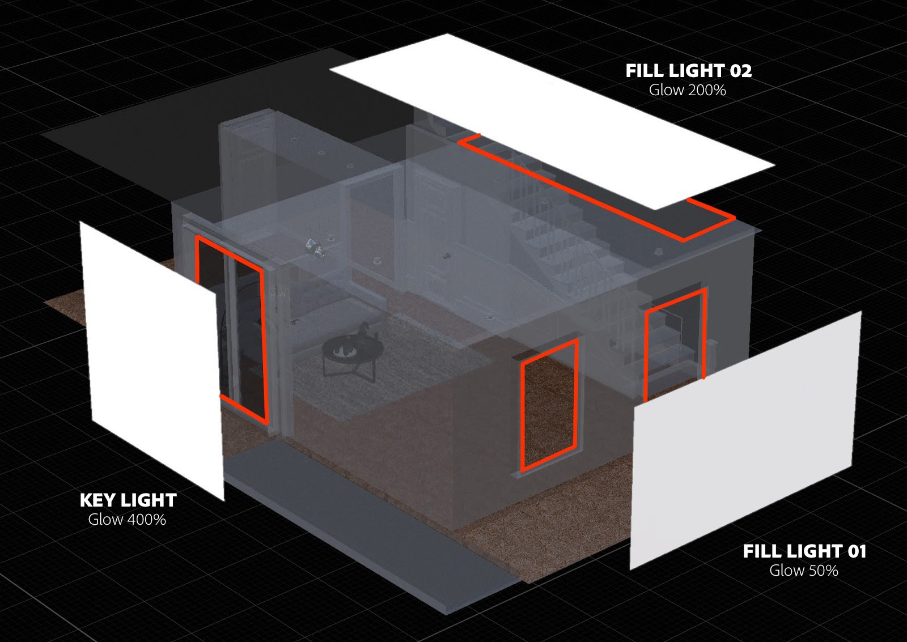

The intensity of the light is controlled by the glow property on the planes' materials. You are able to add a color or even a texture, which can be used to cast interesting shadows. Using glow materials will also provide the light intensity falloff, which is quite important for interior lighting.

### Outdoor lighting

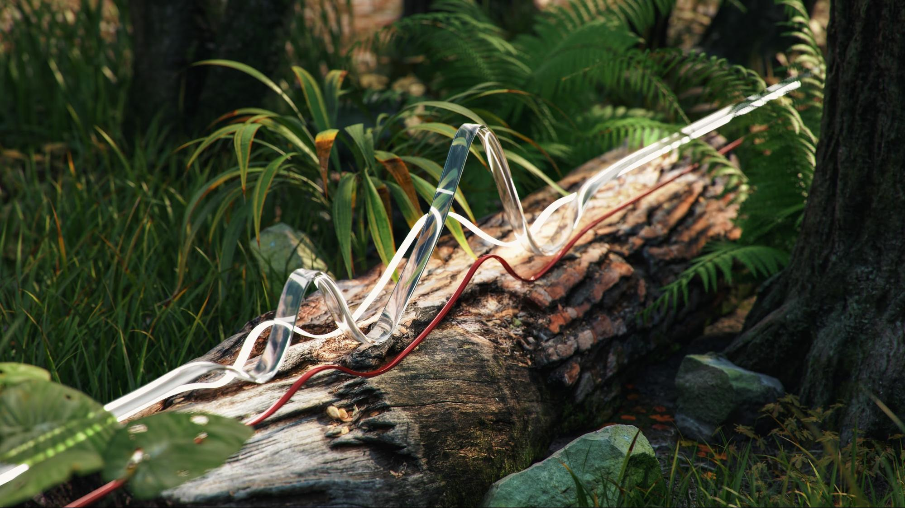

Creating outdoor lighting is fairly straightforward and it comes down to using a Sun and Sky light system (see above). It is important to match the sunlight correctly with the sky-based environment light – paying attention to both the orientation and the cloudiness value.

The scene itself plays a big role in this. To produce compelling results, use objects in your scene as catalysts that interact with the light. In the forest render shown above, the objects (various plants, logs, and trees) are placed close to each other.

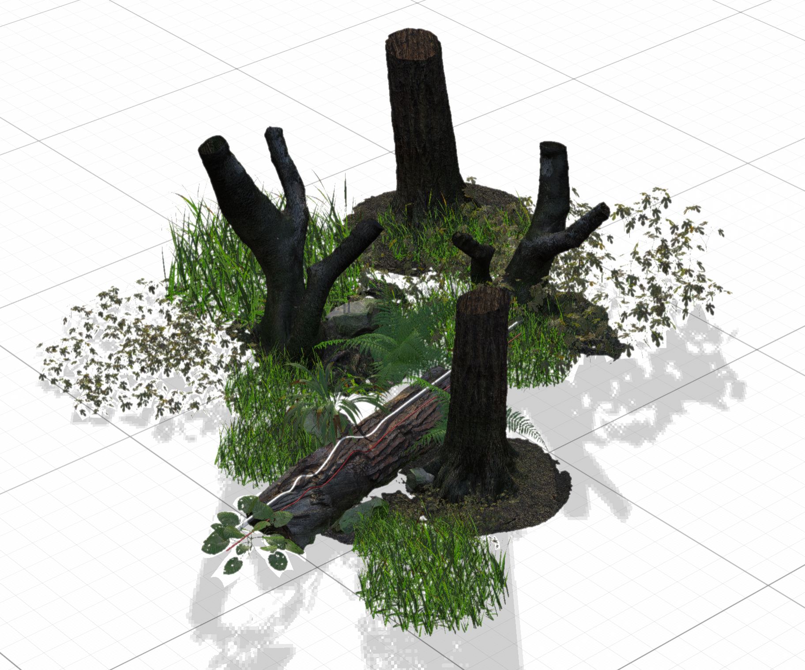

This means there will be a lot of complex ray tracing interaction, as the light bounces between the objects. Shaded spots will appear dark (as expected), whereas exposed areas remain bright.

![Using the Global Rotation in Adobe [!DNL Dimension] to re-orient the Sun and Sky light system in a 3D scene](assets/Mastering3dlighting_34.gif)

I hope this overview illustrates the importance of mastering 3D lights in various situations. You should be ready to start producing more compelling results.

Happy lighting! Download the [latest release](https://creativecloud.adobe.com/apps/download/Dimension) of Dimension today.
