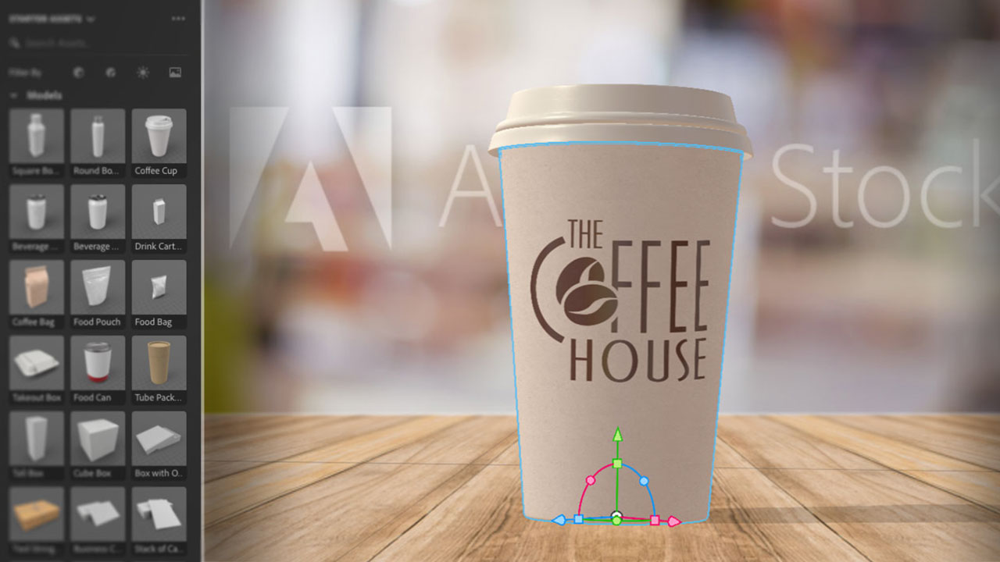
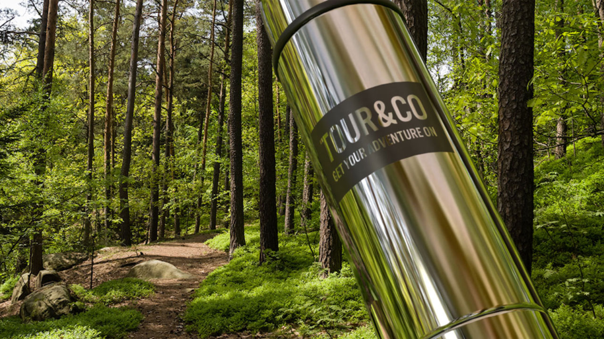
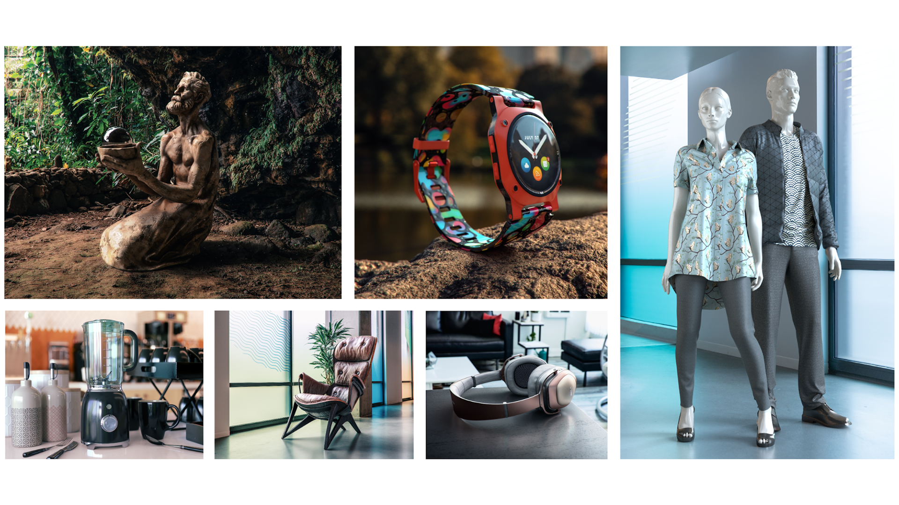

# Adobe 3D & VR tutorials

Create engaging content in 3D faster with high-quality models, materials, and lighting. Dimension makes it easy to build brand visualizations, illustrations, product mockups, packaging designs, and other creative work.

## Click to view an Adobe 3D & VR tutorial

<table>
<tr>
 <td>
   
    

   <a href="assets/CreateRealistic3DMockupswithAdobeStockandDimension.pdf"><strong>Create Realistic 3D Mock-ups with Adobe Stock and Dimension (PDF)</strong></a>
    

    <em>Easily combine a 2D design with a 3D model using Adobe Stock and placed graphics in Adobe Dimension</em>
     
  </td>
  <td>
   
    

   <a href="assets/VisualizeTextileDesignsorPatternson3DObjectswithAdobeDimension.pdf"><strong>Visualize Textile Designs or Patterns on 3D Objects with Adobe Dimension (PDF)</strong></a>
    

    <em>Create an ultra-realistic representation of your final product in a matter of minutes</em>
     
  </td>
  <td>
   
    

   <a href="../cce/assets/VisualizeyourProductinaRealisticEnvironment.pdf"><strong>Visualize your Product in a Realistic Environment (PDF)</strong></a>
    

    <em>When you want to see how your products will look in the real world, Adobe Dimension is your go-to app</em>
     
  </td>
</tr>
   <tr>
 <td>
   
    

   <a href="mastering3dlighting.md"><strong>Tips and techniques for mastering 3D lighting in CGI</strong></a>
    

    <em>Learn about 3D lighting & how to create different light conditions that can completely alter a computer-generated scene & the way that objects look in it</em>
     
  </td>
  <td>
   
    

   <a href="photorealistic.md"><strong>Creating photorealistic virtual photography with 3D rendering and compositing</strong></a>
    

    <em>Learn how to create stunningly deceptive, photorealistic virtual photography with 3D image compositing and rendering in Adobe Dimension</em>
     
  </td>
  <td>
    
    

     
  </td>
</tr>
</table>