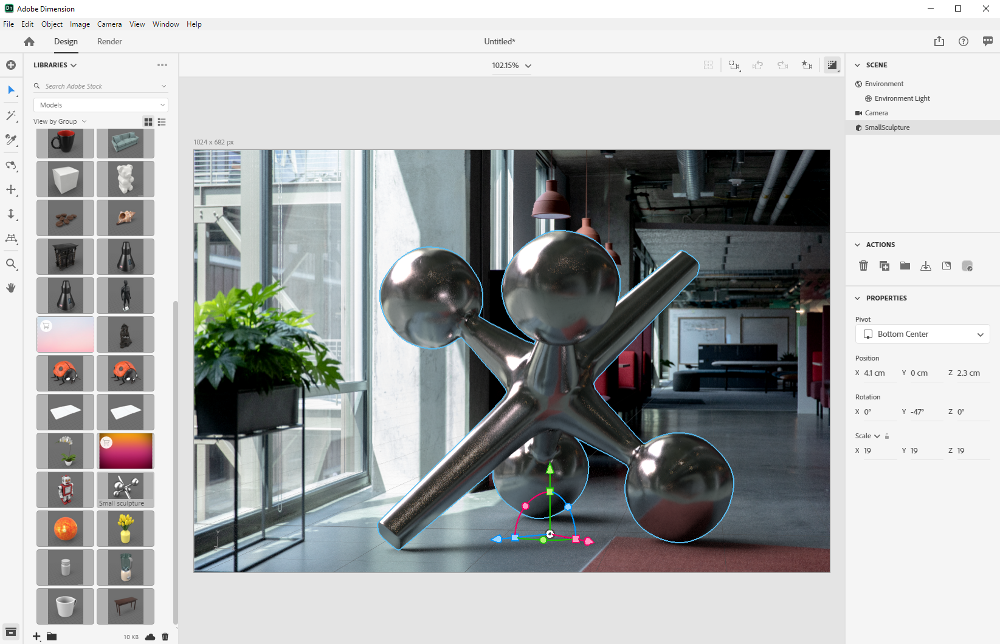

# Creating photorealistic virtual photography with 3D rendering and compositing

Looking at the images above, you'd be forgiven for assuming everything you see is real. With the technological advancements in the rendering of photorealistic 3D imagery, however, it's harder than ever to determine what is real and what is virtual. In this case, the images are a mix of real, photography, and rendered 3D content — and this is exactly the type of 3D design that companies are investing in.

This technique, of layering, or ‘compositing’ 3D models into an image or video, is not new, and in fact its origins go back to the early days of VFX (as far back as the 1980s). What is new and exciting is that this technique has become a powerful tool for [Adobe Dimension](https://www.adobe.com/products/dimension.html) users, and an intriguing new workflow for photographers.

## The technology behind creating composite images in Adobe Dimension

Adobe Dimension has allowed users to seamlessly combine 2D and 3D elements together directly in the app by using the Adobe Sensei powered match image function. The main benefit of compositing elements in this way is that it turbo boosts the process of creating a realistic looking image by substituting a fully realized 3D scene with a background image, which can be captured from reality. 

The Match Image feature analyzes the background image and estimates the focal length and position of the camera that was used to capture it. A 3D camera is then created in the Dimension scene which can be used to render 3D elements within the same perspective as the background image so they will composite together.

But what about everything not captured within the camera’s frame?  The full environment an image is captured in matters significantly because it defines how everything looks within it. An object within an image is reflecting the light of the world around it, which includes everything behind the camera too. So, for the layered 3D elements to really blend in with the background of your image, they need to fully reflect the lighting in the environment in which the image was taken.

Match Image will attempt to ‘hallucinate’ the lighting environment in which a background image was taken. It does an impressive job that will produce excellent results in short order, but capturing the environment along with the background image will produce even more realistic results. This is even the method used to train the Adobe Sensei feature to do it on its own.

Enter the world of 360° HDR panoramic images. These images have long been used in 3D graphics to expedite the lighting effects of a full world lighting environment. The process for capturing them in the past has been quite complex due to the high level of knowledge and specialized equipment needed to make them. With the advent of 360° cameras, creating these images is now more possible than ever.

Cameras like the Ricoh Theta, Gopro MAX, and Insta 360 can capture 360 panoramas. The Ricoh Theta has automatic exposure bracketing built in which is a key part of the capture process. This reduces the time and effort to capture HDRs and makes it more approachable for photographers.

## The process for creating photorealistic composite images

### Capture

To get started capturing environments for compositing, you need two main elements; a high quality background image or images and a 360° HDR panorama of the environment in which it was taken.

One of the most important aspects of capturing this type of content effectively is to take advantage of a photographer’s existing skills and tools. Creating a beautiful background image, requires an eye for composition and attention to detail. The background images also require a special mindset in order to create something that is useful for compositing 3D elements into.

### Choosing a location

Look for locations that are interesting for both their context and lighting. When considering context, it can be helpful to imagine a scene’s potential use. For example, a view of an empty road could be used for adding in a 3D car while a view of a table at a coffee shop might be used for [displaying packaging](https://www.adobe.com/products/dimension/packaging-design-mockup.html) of food products.

When it comes to capturing the background image, it is important to keep in mind that 3D elements will be composited into it. There should be an empty area of focus to leave room for these objects. The 3D content will often be the primary focus of the final composition, so it is important that the background does not overly stand out on its own.

Equally important is the lighting situation within the image as this will greatly affect the composited 3D content. Light should be coming into the shot from over the shoulder or from the side — this will produce the best results because it will act as a key light when 3D objects are placed in the scene. It may be tempting to shoot towards the light when there is no element of focus in view, but remember that this will result in content that is always backlit. Adding a temporary, stand-in object to the scene may be useful for composing and assessing the lighting.

## Capturing the HDR Pano

### Camera placement

Place your 360° camera in the general center of the area where you will be focusing on for capturing the backgrounds. It may be ideal in cases where the backgrounds show a wider scene to raise the camera off the ground with a monopod, otherwise the camera can be set directly on the ground.

### Color

Maintaining color between the camera used to shoot the environment and the camera used to shoot the background is very important since the images will be used together. Here we have both the cameras’ color temperature set to 5000k and took a photo of a color chart with both cameras for further alignment in post.

### Bracketed exposure values

To create an HDR environment with the 360° camera, several EVs need to be captured to be combined into an HDR image in post. The amount of EVs is not standardized, but generally you want the higher end of the exposure range to go to a point where there is no more information in the shadows and the lower end of the exposure range to a point where there is no more information in the highlights.

Ideally, the 360° camera will have an automatic bracketing feature that allows the various exposures to be batched by the camera. Ideal settings are to use the lowest ISO value available to avoid noise and a high aperture value for sharpness. Exposure Values can then be varied using the shutter speed and broken up by stops; halving or doubling the exposure.

Here is an example of EVs used for shooting an IBL outdoors:

01 - F 5.6, ISO 80, Shutter speed 1/25000, WB 5000 K

02 - F 5.6, ISO 80, Shutter speed 1/12500, WB 5000 K

03 - F 5.6, ISO 80, Shutter speed 1/6400, WB 5000 K

...

16 - F 5.6, ISO 80, Shutter speed 1, WB 5000 K

If the 360° used is capable of outputting RAW images, the EVs can be split in 2-4 stop increments since they retain more information than 8bit images like JPEG.

After making any color adjustments to the EVs they can be exported temporarily to individual files to then be merged in Photoshop. The filetype should depend on the source, but don’t use a compressed format like JPEG in either case. In Photoshop use File > Automate > Merge to HDR Pro… and select all of the exported EVs.

Make sure ‘Mode’ is set to 32 bit. Using ‘remove ghosts’ can help remove details that changed between the EVs, but don’t use it if you don’t need it. The slider under the histogram only affects the preview exposure so ignore it. Uncheck ‘Complete Toning in Adobe Camera Raw’ and press OK.

The result is an HDR image that can be used to light scenes in 3D.

Final steps will be to remove any shadowing and tripod legs visible at the nadir of the image and adjusting the default exposure of the image to light the scene correctly. Removal of details can be done using the clone tool in Photoshop. Adjusting exposure should be done in conjunction with the backgrounds in Dimension, since the exposure value of the HDR IBL is the lighting values for the 3D objects.

### Capturing the backgrounds

After capturing the environment you can now capture backgrounds using a camera of your choice. The higher quality and higher resolution the better. This, along with an eye for composition that photographers have is the main benefit of this process. The images above were captured with a Canon 5D MK IV.

There is a lot of leeway for framing and composition with the backgrounds. The camera can have high or low apertures for varied depth of field, use long or short focal lengths, and be angled up or down. The main requirement is that the camera is aimed towards the center point of where the environment was captured with the 360 camera.

When the capturing is complete, the images should be post processed to match the color of the environment as close as possible. The color and exposure should be as neutral and natural as possible. Any stylized looks should be applied after 3D elements have been composited into the image with Adobe Dimension.

## Assembling your composite image in Dimension

With these elements gathered and complete, they can now be assembled in a scene in Adobe Dimension. This is as simple as dragging the background into the scene, where it will then be applied to the background; then, add the HDR pano into the environment light image slot.

Drag and drop the background image into an empty area of the canvas, or select the Environment within the scene panel and add the image to the background input.

Add the HDR pano by selecting the Environment Light and adding it to the Image input.

You can then use "Match Image" on your background to match the resolution and aspect as well as the camera perspective. Instead of generating the environment from the background image, the captured HDR pano image is used to light the scene, so the ‘create lights’ option can be left unchecked.

Now, objects that are added into the scene will be composited realistically into the background since they are being lit by the environment where the image was taken.

To quickly assess the orientation and exposure of the HDR pano relative to the background, a sphere primitive with a metal material, taken from the free asset panel in Dimension, can be placed in the scene. The environment light’s rotation can then be positioned so the reflections look correct. If the lighting from the HDR pano over or under-exposes the sphere, the HDR pano’s exposure should be increased or decreased to compensate.

To quickly assess the orientation and exposure of the HDR pano relative to the background, a sphere primitive with a metal material, taken from the free asset panel in Dimension, can be placed in the scene. The environment light’s rotation can then be positioned so the reflections look correct. If the lighting from the HDR pano over or under-exposes the sphere, the HDR pano’s exposure should be increased or decreased to compensate.

## The end result: A photorealistic composite image

Once the scene is complete, the workflow for the end-user is straightforward. Simply drag and drop your own model or any [Adobe Stock 3D](https://stock.adobe.com/3d-assets) content directly into the image to render it as if it were there when the photo was taken. This opens new avenues for creating highly realistic ad content, or the ability to iterate on designs within many different contexts.

The end result is a convincing blend of reality and 3D that helps end users achieve the goal of creating photorealistic images with minimal effort. Give it a try yourself with some [free Dimension scenes](https://assets.adobe.com/public/3926726a-2a17-43d4-4937-6d84a4d29338) we created to demonstrate the workflow.

[Download the latest release](https://creativecloud.adobe.com/apps/download/dimension) of Dimension today and start building your photorealistic images.
