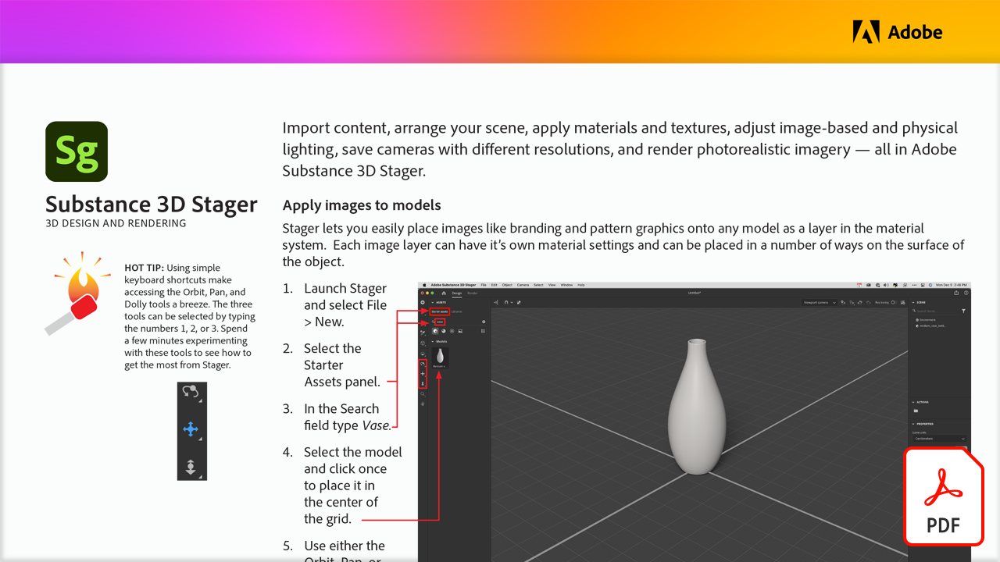

# 3D design and rendering

Import content, arrange your scene, apply materials and textures, adjust image-based and physical lighting, save cameras with different resolutions, and render photorealistic imagery — all in Adobe Substance 3D Stager.

Select the image below to view or download this PDF tutorial.

[{width="680"}](assets/Adobe-Substance-Stager.pdf){target="blank"}
