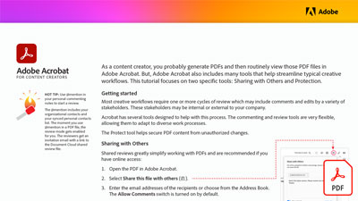

# Acrobat for Content Creators

As a content creator, you probably generate PDFs and then routinely view those PDF files in Acrobat. But, Acrobat also includes many tools that help streamline typical creative workflows.

**Select the image below to download Acrobat for Content Creators (PDF).**

