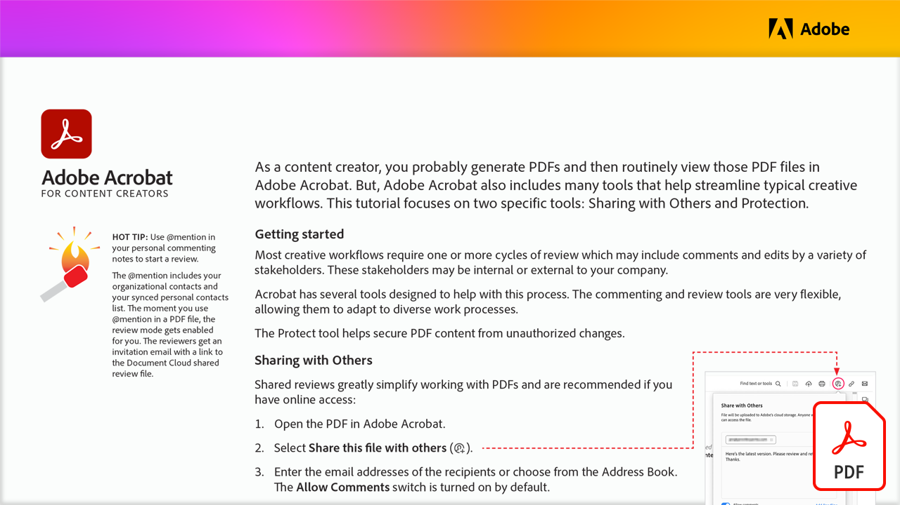

# Acrobat for content creators

As a content creator, you probably generate PDFs and then routinely view those PDF files in Acrobat. But, there are many other tools that help streamline typical creative workflows. 

Select the image below to view or download this PDF tutorial.

[{width="680"}](assets/Acrobat-for-Content-Creators.pdf){target="blank"}
