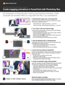

# Decoding the alphabet soup of graphic formats

JPG, PNG, SVG, GIF, and EPS files are all commonly used in design, some for web pages, others for presentations, publications, and creative projects. But, what do they mean, and which should you pick? Find out in this 15-minute hands-on workshop. Quickly learn how to apply transparency effects in Photoshop that can bring your presentation skills to a new level while exploring different graphic export and optimization settings. Follow along with designer/developer Chris Converse to create a compelling animation in PowerPoint using customized graphics exported from Photoshop.

>[!VIDEO](https://video.tv.adobe.com/v/333805?hidetitle=true)

 &nbsp;

[**Download Quick Reference PDF Guide**](../quick-reference/Decodingthealphabetsoupofgraphicformats.pdf)

