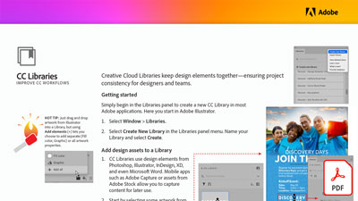

# Improve CC workflows with CC Libraries

Learn how Creative Cloud Libraries keep design elements together—ensuring project consistency for designers and teams in this hands-on tutorials.

**Select the image below to download Improve CC workflows with CC Libraries (PDF).**

