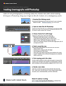

# Creating cinemagraphs with Photoshop

In this step-by-step workshop video tutorial, create a living photograph by combining video from Adobe [!DNL Stock] with clever masking techniques in Photoshop.

>[!VIDEO](https://video.tv.adobe.com/v/331002?hidetitle=true)

 &nbsp;

[**Download Quick Reference PDF Guide**](../quick-reference/CreatingCinemagraphswithPhotoshop.pdf)

