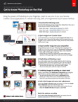

# Create unique composites with Adobe [!DNL Stock] and Photoshop for iPad

Bring the power of Photoshop to your fingertips. Learn to use one of your favorite Creative Cloud applications in a whole new way, with a re-engineered touch-based interface.

>[!VIDEO](https://video.tv.adobe.com/v/331004?hidetitle=true)

 &nbsp;

[**Download Quick Reference PDF Guide**](../quick-reference/GettoknowPhotoshopontheiPad.pdf)

