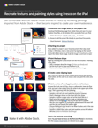

# Try your hand at Fresco on the iPad (and iPhone)

Explore a whole new world of digital drawing and painting with Adobe Fresco in this 15-minute hands-on workshop. Quickly learn to work with layers and clipping masks to conform paint and textures to a base shape. Follow along with designer/developer Chris Converse to recreate part of a still life illustration using Fresco and Adobe Stock.

>[!VIDEO](https://video.tv.adobe.com/v/333804?hidetitle=true)

 &nbsp;

[**Download Quick Reference PDF Guide**](../quick-reference/Frescoworkshop.pdf)

