# Creative Cloud for enterprise tutorials

As an enterprise creative, you must collaborate with distributed teams, establish scalable processes, and comply with corporate systems and guidelines. These tutorials help you learn new features in Creative Cloud—-from an enterprise perspective.

## Click to view a product tutorial (listed in alphabetical order)

### Adobe Acrobat

<table style="table-layout:fixed">
<tr>
 <td>
   <a href="acrobat-content-creators.md">
      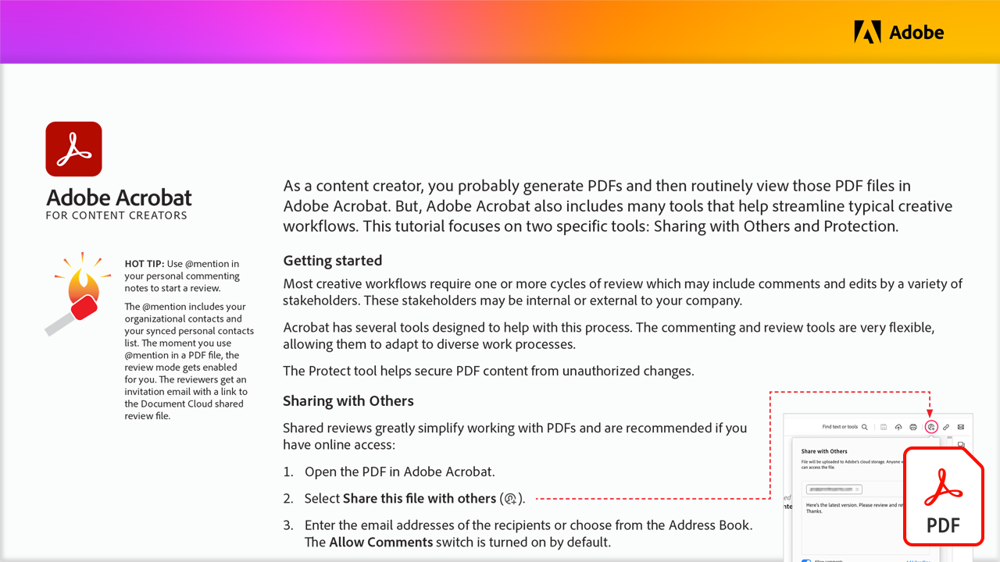
   </a>
    

   <a href="acrobat-content-creators.md"><strong>Acrobat for content creators (PDF)</strong></a>
    

    <em>Learn about the Acrobat tools that help streamline creative workflows</em>
     
  </td>
  <td>
    
    

     
  </td>
  <td>
    
    

     
  </td>
  <td>
    
    

     
  </td>
</tr>
</table>

### Adobe Express (formerly Adobe Spark)

<table style="table-layout:fixed">
<tr>
 <td>
   <a href="adobe-express-content-that-stands-out.md">
      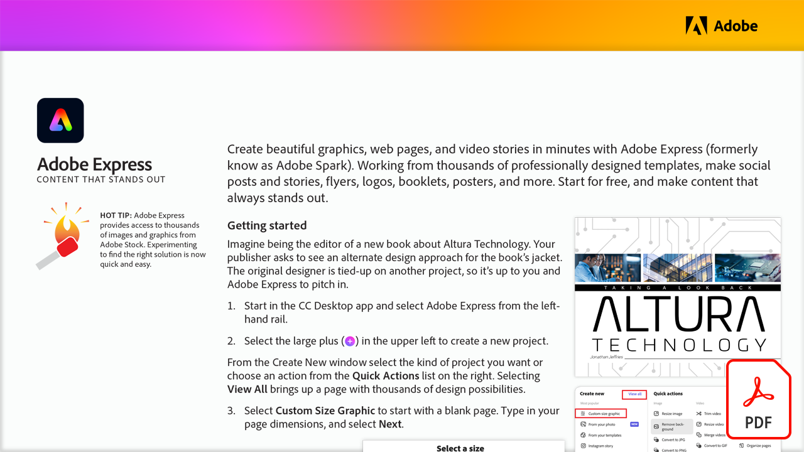
   </a>
    

   <a href="adobe-express-content-that-stands-out.md"><strong>Adobe Express: Content that stands out</strong></a>
    

    <em> Create beautiful graphics, web pages, and video stories in minutes with Adobe Express</em>
     
  </td>
  <td>
   <a href="assets/CreatingYourBrandinAdobeSpark.pdf">
      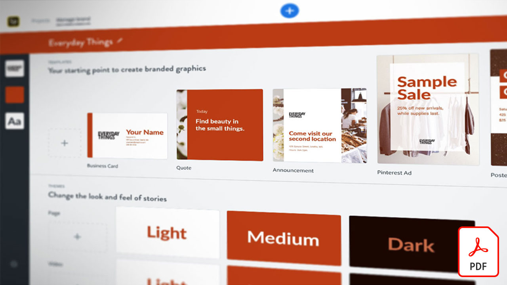
   </a>
    

   <a href="assets/CreatingYourBrandinAdobeSpark.pdf"><strong>Creating Your Brand in Adobe Spark (PDF)</strong></a>
    

    <em>Adobe Spark makes it easy to define your brand</em>
     
  </td>
  <td>
   <a href="assets/AddingaGlideshowtoyourSparkPageAdobeBlog.pdf">
      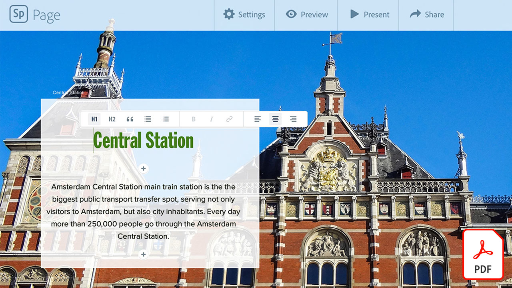
   </a>
    

   <a href="assets/AddingaGlideshowtoyourSparkPageAdobeBlog.pdf"><strong>Adding a glideshow to your Spark Page (PDF)</strong></a>
    

    <em>Adobe Spark offers some amazing and easy-to-use layout components that bring your web stories to life</em>
     
  </td>
  <td>
   
    

   <a href="assets/CreatingYourBrandinAdobeSpark.pdf"><strong>Creating Your Brand in Adobe Spark (PDF)</strong></a>
    

    <em>Adobe Spark makes it easy to define your brand</em>
     
  </td>
  <td>
   
    

   <a href="assets/MeetYourNewProductionArtistAdobeSparkPost.pdf"><strong>Meet Your New Production Artist: Adobe Spark Post (PDF)</strong></a>
    

    <em>Adobe Spark learns from you as you create layouts, define colors, import artwork, and arrange elements within your compositions</em>
     
  </td>
</tr>
</table>

### Adobe Portfolio

<table  style="table-layout:fixed">
<tr>
   <td>
   
    

   <a href="assets/GettingStartedWithAdobePortfolio.pdf"><strong>Getting Started With Adobe Portfolio (PDF)</strong></a>
    

    <em>Sharing your best work with Adobe Portfolio is an effective way to share your success and attract new creative talent</em>
     
  </td>
  <td>
   <a href="assets/ConnectingLightroomandBehancetoYourAdobePortfolio.pdf">
      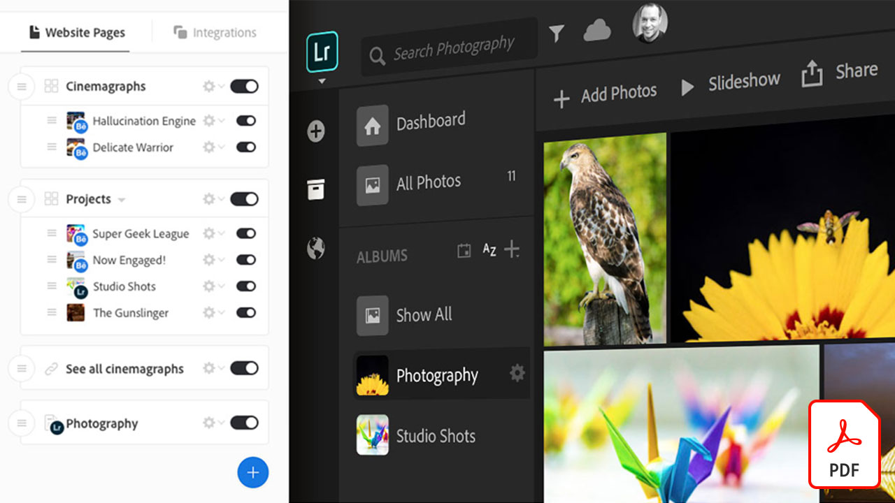
   </a>
    

   <a href="assets/ConnectingLightroomandBehancetoYourAdobePortfolio.pdf"><strong>Connecting Lightroom and Bēhance to your Adobe Portfolio (PDF)</strong></a>
    

    <em>Use Bēhance projects as pages in your portfolio</em>
     
  </td>
  <td>
   
    

   <a href="assets/ShowYourBestWorkwithAdobePortfolio.pdf"><strong>Show your best work with Adobe Portfolio (PDF)</strong></a>
    

    <em>Adobe Portfolio lets you upload, organize, and share your work with potential staff and clients all over the world</em>
     
  </td>
  <td>
    
    

     
  </td>
 </tr>
 </table>

### CC Libraries

<table  style="table-layout:fixed">
<tr>
  <td>
   <a href="cc-workflows-cc-libraries.md">
      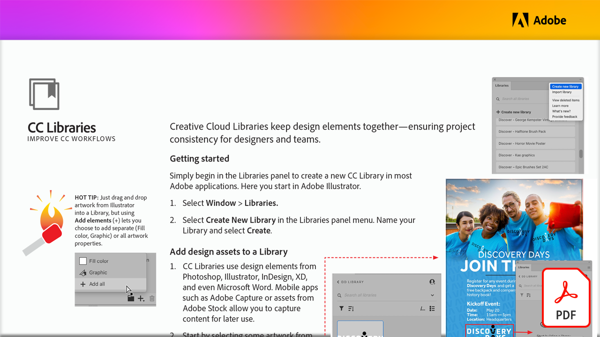
   </a>
   

   <a href="cc-workflows-cc-libraries.md"><strong>Improve CC workflows with CC Libraries</strong></a>
    

    <em>Learn how Creative Cloud Libraries keep design elements together—ensuring project consistency for designers and teams</em>
     
  </td>
  <td>
   
   

   <a href="ccteamlibraries.md"><strong>Creating Creative Cloud Libraries for teams</strong></a>
    

    <em>Learn how to share assets within a group or team using Creative Cloud Libraries for teams</em>
     
  </td>
  <td>
   <a href="sharecclibraries.md">
      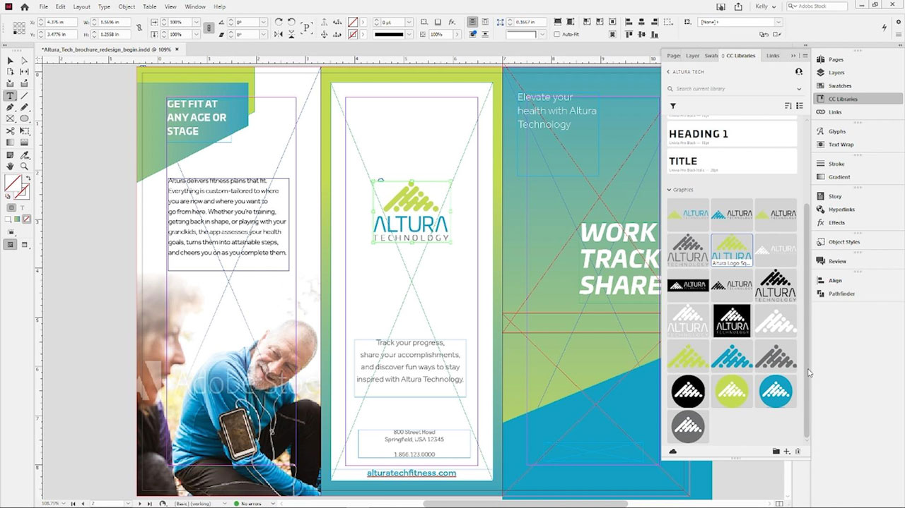
   </a>
   

   <a href="sharecclibraries.md"><strong>Sharing branding assets with Creative Cloud Libraries for teams</strong></a>
    

    <em>Learn how to create, use, and share branding assets for your group or team using Creative Cloud Libraries for teams</em>
     
  </td>
  <td>
   <a href="assets/CreateAddandShareYourBrandAssetswithCreativeCloudLibraries.pdf">
      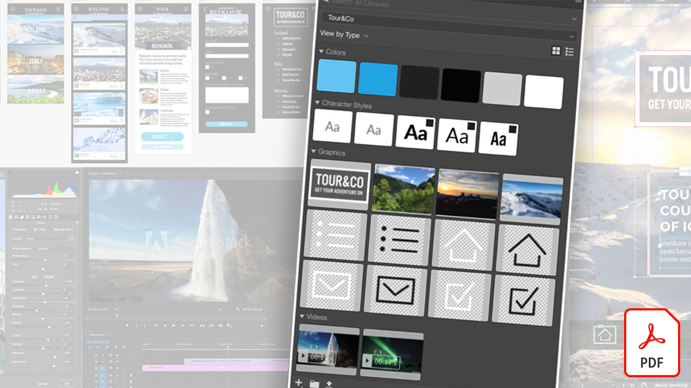
   </a>
    

   <a href="assets/CreateAddandShareYourBrandAssetswithCreativeCloudLibraries.pdf"><strong>Create, add, and share your brand assets with Creative Cloud Libraries (PDF)</strong></a>
    

    <em>Creative Cloud Libraries provides a built-in brand system that allows designers to share brand assets across creative teams</em>
     
  </td>
  </tr>
  <tr>
  <td>
   <a href="assets/ShareTextStylesFromIllustratorwithCreativeCloudLibraries.pdf">
      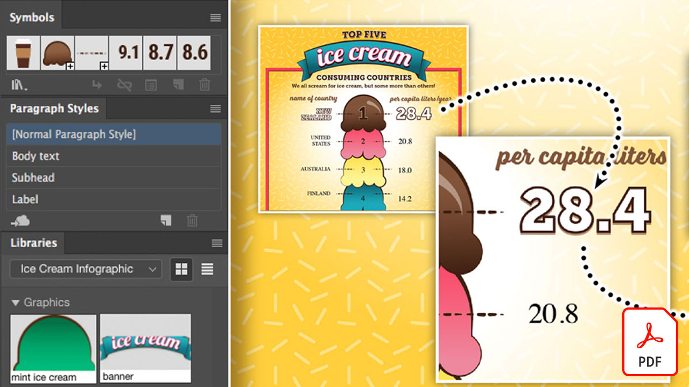
   </a>
    

   <a href="assets/ShareTextStylesFromIllustratorwithCreativeCloudLibraries.pdf"><strong>Share Text Styles From Illustrator with Creative Cloud Libraries (PDF)</strong></a>
    

    <em>Work Smarter, Not Harder, in Illustrator</em>
     
  </td>
  <td>
    
    

     
  </td>
  <td>
    
    

     
  </td>
  <td>
    
    

     
  </td>
</tr>
</table>

### Creative Cloud for enterprise

<table style="table-layout:fixed">
<tr>
 <td>
   <a href="collaboration-the-future-of-creativity.md">
      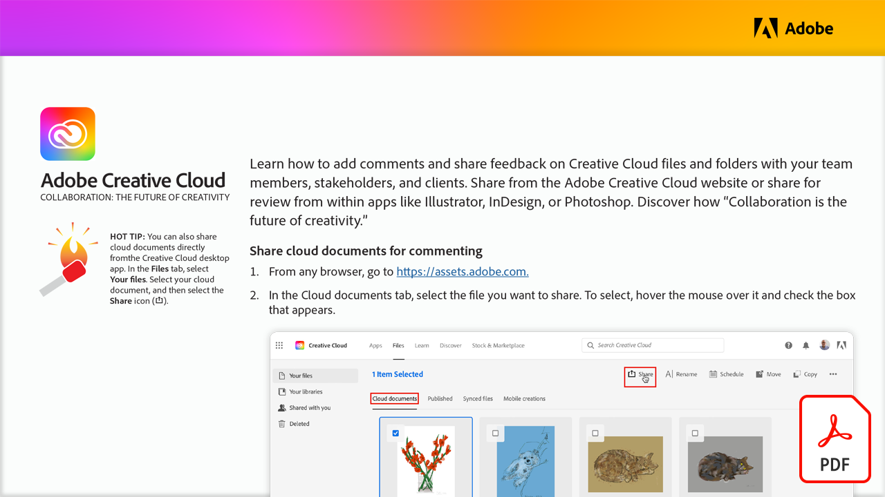
   </a>
    

   <a href="collaboration-the-future-of-creativity.md"><strong>Collaboration: The Future of Creativity</strong></a>
    

    <em>Among the many perks of an Adobe Creative Cloud subscription is free access to more than 20,000 professionally designed and curated fonts from Adobe Fonts</em>
     
  </td>
  <td>
   <a href="assets/FromHandLetteringtoIllustratorviaCreativeCloud.pdf">
      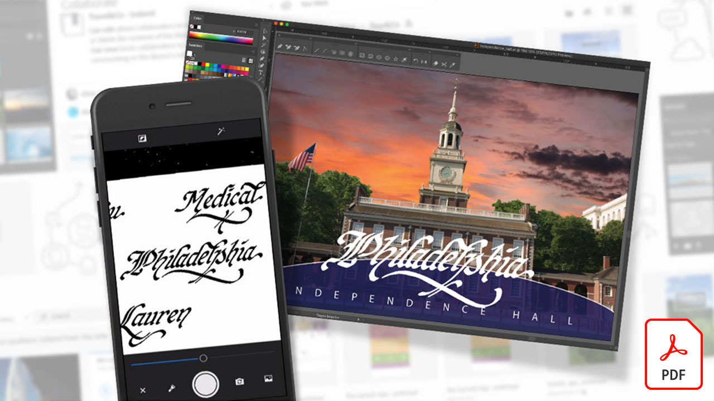
   </a>
    

   <a href="assets/FromHandLetteringtoIllustratorviaCreativeCloud.pdf"><strong>From Hand Lettering to Illustrator via Creative Cloud (PDF)</strong></a>
    

    <em>Using the power of Creative Cloud for enterprise, Adobe mobile and desktop apps allow you to capture, convert, and create from anywhere — on any device</em>
     
  </td>
  <td>
   <a href="assets/FromLightroomWebtoInDesignviaCreativeCloud.pdf">
      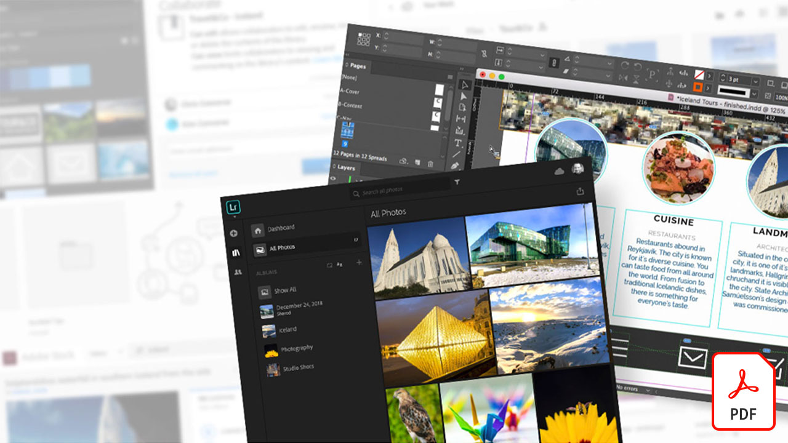
   </a>
    

   <a href="assets/FromLightroomWebtoInDesignviaCreativeCloud.pdf"><strong>From Lightroom Web to InDesign via Creative Cloud (PDF)</strong></a>
    

    <em>Take your creativity from the camera to the final design with Creative Cloud files and libraries</em>
     
  </td>
</tr>
</table>

### [!DNL Dimension]

<table  style="table-layout:fixed">
<tr>
   <td>
   
    

   <a href="assets/VisualizeyourProductinaRealisticEnvironment.pdf"><strong>Visualize your Product in a Realistic Environment (PDF)</strong></a>
    

    <em>When you want to see how your products look in the real world, Adobe [!DNL Dimension] is your go-to app</em>
     
  </td>
  <td>
    
    

     
  </td>
  <td>
    
    

     
  </td>
  <td>
    
    

     
  </td>
</tr>
</table>

### Fresco

<table>
<tr>
 <td>
   <a href="frescoworkshop.md">
      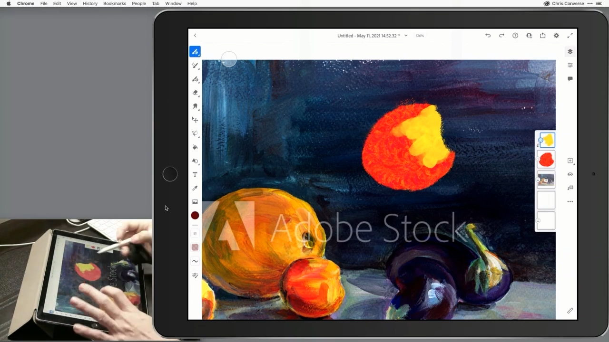
   </a>
    

   <a href="frescoworkshop.md"><strong>Try your hand at Fresco on the iPad (and iPhone)</strong></a>
    

    <em>Explore a whole new world of digital drawing and painting with Adobe Fresco in this 15-minute hands-on workshop</em>
     
  </td>
  <td>
    
    

     
  </td>
  <td>
    
    

     
  </td>
  <td>
    
    

     
  </td>
</tr>
</table>

### Fonts

<table  style="table-layout:fixed">
<tr>
<td>
   <a href="taming-type-anxiety.md">
      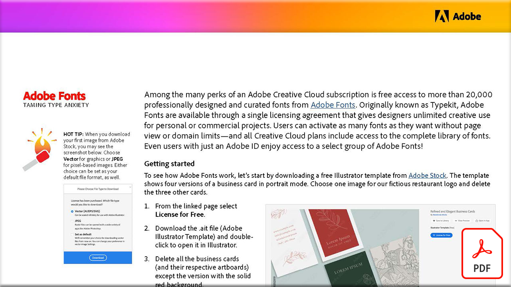
   </a>
    

   <a href="taming-type-anxiety.md"><strong>Taming Type Anxiety</strong></a>
    

    <em>Learn how to access and use over 20,000 professionally designed fonts in Creative Cloud</em>
     
  </td>
  <td>
   
    

   <a href="assets/CreatingBeautifulTypographywithCreativeCloud.pdf"><strong>Creating beautiful typography with Creative Cloud (PDF)</strong></a>
    

    <em>Learn to take advantage of the state-of-the-art typographic controls found in your favorite design tools</em>
     
  </td>
   <td>
   
    

   <a href="assets/DiscoveringFontswithCreativeCloud.pdf"><strong>Discovering Fonts with Creative Cloud (PDF)</strong></a>
    

    <em>Finding the right font for a project can seem overwhelming at times. With various Creative Cloud apps and services, finding the right font is now fun and inspiring</em>
     
  </td>
  <td>
   <a href="assets/UnleashHiddenGemsinOpenTypefonts.pdf">
      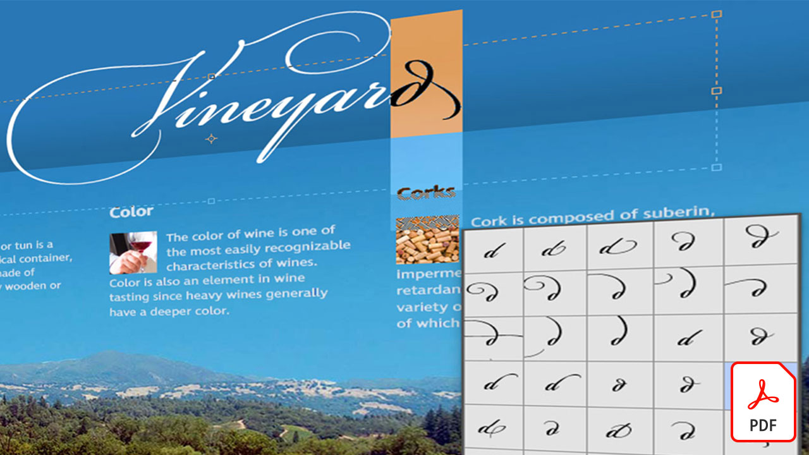
   </a>
    

   <a href="assets/UnleashHiddenGemsinOpenTypefonts.pdf"><strong>Unleash Hidden Gems in OpenType fonts (PDF)</strong></a>
    

    <em>The OpenType format allows for a font to contain up to 65,536 glyphs</em>
     
  </td>
</table>

### Illustrator

<table  style="table-layout:fixed">
<tr>
   <td>
   <a href="assets/GettoKnowGraphicStylesinIllustrator.pdf">
      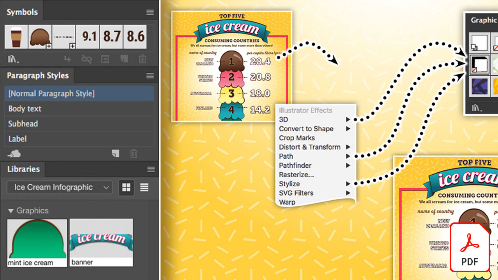
   </a>
    

   <a href="assets/GettoKnowGraphicStylesinIllustrator.pdf"><strong>Get to Know Graphic Styles in Illustrator (PDF)</strong></a>
    

    <em>Illustrator gives you the ability to style artwork in much the same way you style your text</em>
     
  </td>
   <td>
   <a href="assets/WorkSmarterNotHarderwithIllustrator.pdf">
      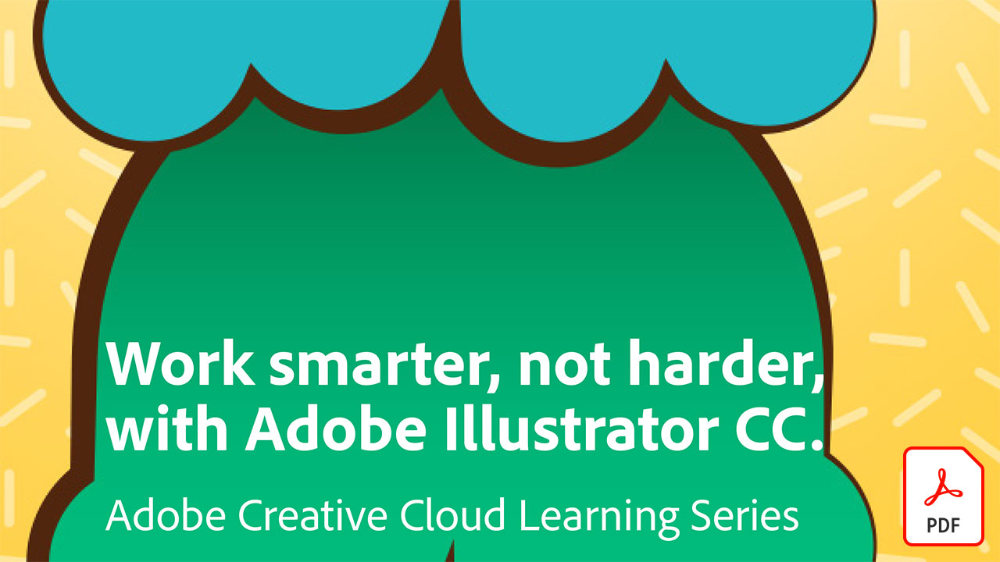
   </a>
    

   <a href="assets/WorkSmarterNotHarderwithIllustrator.pdf"><strong>Work smarter, not harder, with Adobe Illustrator CC (PDF)</strong></a>
    

    <em>Speed up your vector drawings in Illustrator</em>
     
  </td>
  <td>
   <a href="assets/IllustratorSymbolsandLayersequalsPerfectStructureforResponsiveSVG.pdf">
      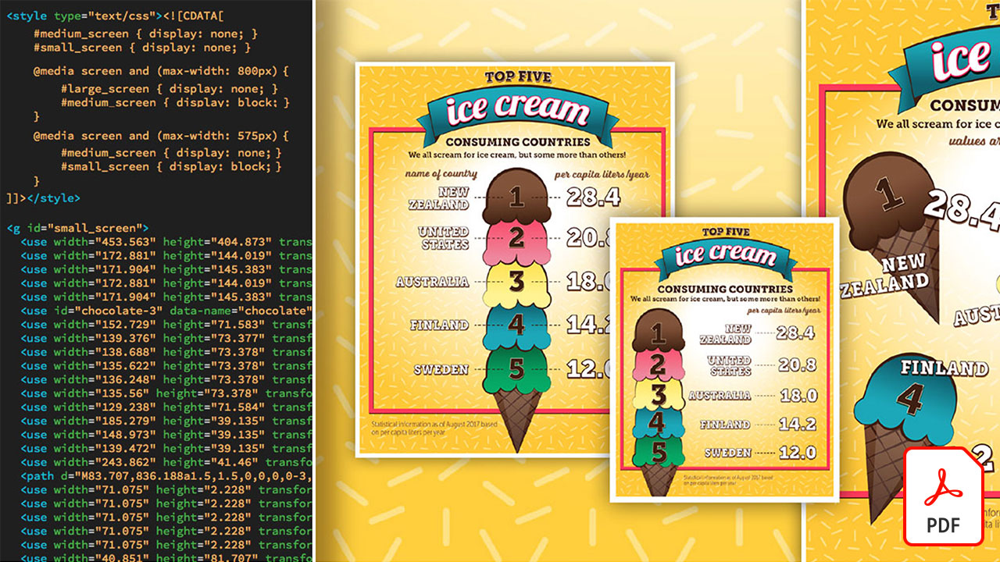
   </a>
    

   <a href="assets/IllustratorSymbolsandLayersequalsPerfectStructureforResponsiveSVG.pdf"><strong>Illustrator Symbols + Layers = Perfect Structure for Responsive SVG! (PDF)</strong></a>
    

    <em>Illustrator provides unparalleled support for the SVG format, including the ability to create symbols, groups, IDs, and precise vector definitions of your artwork</em>
     
  </td>
  <td>
    
    

     
  </td>
</tr>
</table>

### InDesign

<table  style="table-layout:fixed">
<tr>
  <td>
   
    

   <a href="assets/CreatingInteractivePDFsfromInDesign.pdf"><strong>Creating interactive PDFs from InDesign (PDF)</strong></a>
    

    <em>InDesign contains many features that help you format, style, manage, and track the content in your documents</em>
     
  </td>
   <td>
   <a href="assets/EasilyGatherandIncorporateDesignFeedbackwithAdobeAcrobatandInDesign.pdf">
      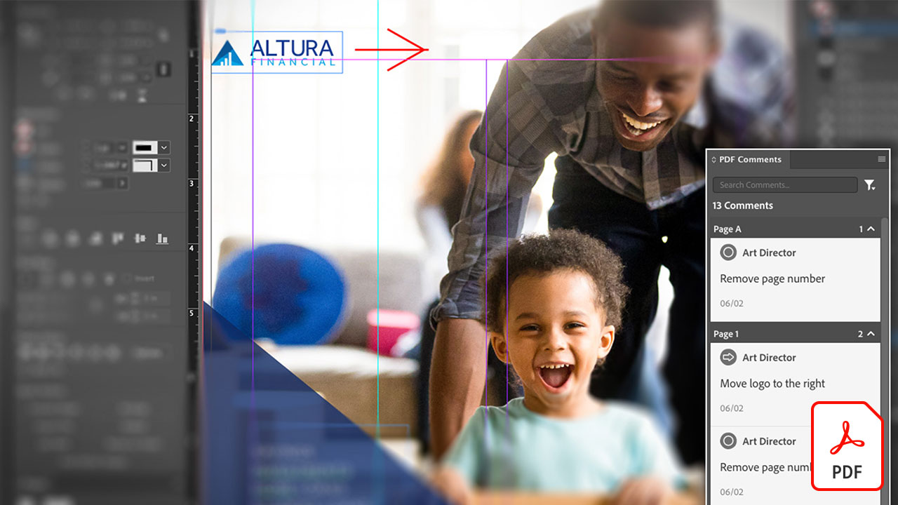
   </a>
    

   <a href="assets/EasilyGatherandIncorporateDesignFeedbackwithAdobeAcrobatandInDesign.pdf"><strong>Easily Gather and Incorporate Design Feedback with Adobe Acrobat and InDesign (PDF)</strong></a>
    

    <em>Stakeholders can use Acrobat to add detailed comments and annotations, and then you can quickly bring those markups back into Adobe InDesign to see them in the context of your layout</em>
     
  </td>
  <td>
   
    

   <a href="assets/StyleWebContentwithInDesign.pdf"><strong>Style web content with Adobe InDesign CC (PDF)</strong></a>
    

    <em>Did you know that you can harness the power of InDesign to output HTML and web graphics?</em>
     
  </td>
  <td>
   <a href="assets/InteractivePDFBookmarksandLinkedTOCsfromInDesign.pdf">
      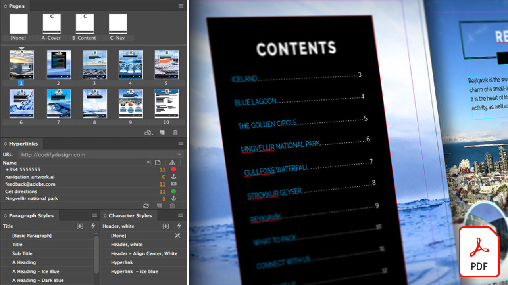
   </a>
    

   <a href="assets/InteractivePDFBookmarksandLinkedTOCsfromInDesign.pdf"><strong>Interactive PDF: Bookmarks and Linked TOCs from InDesign (PDF)</strong></a>
    

    <em>Learn to use the Table of Contents feature in InDesign to generate both bookmarks and hyperlinks that help your readers quickly find information in your PDF files</em>
     
  </td>
</tr>
<tr>
  <td>
   <a href="assets/InteractivePDFGraphicalHyperlinksandNestedMasterPagesinInDesign.pdf">
      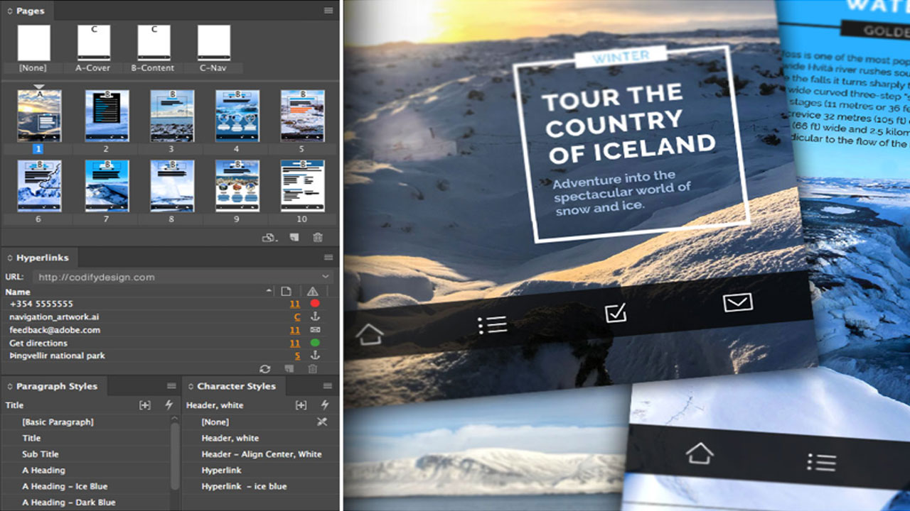
   </a>
    

   <a href="assets/InteractivePDFGraphicalHyperlinksandNestedMasterPagesinInDesign.pdf"><strong>Interactive PDF: Graphical Hyperlinks and Nested Master Pages in InDesign (PDF)</strong></a>
    

    <em>Applying hyperlinks with master pages allows you to quickly manage a navigation system throughout all of your pages</em>
     
  </td>
  <td>
    
    

     
  </td>
  <td>
    
    

     
  </td>
  <td>
    
    

     
  </td>
</tr>
</table>

### Photoshop  

<table style="table-layout:fixed">
<tr>
  <td>
    <a href="alphabetsoup.md">
      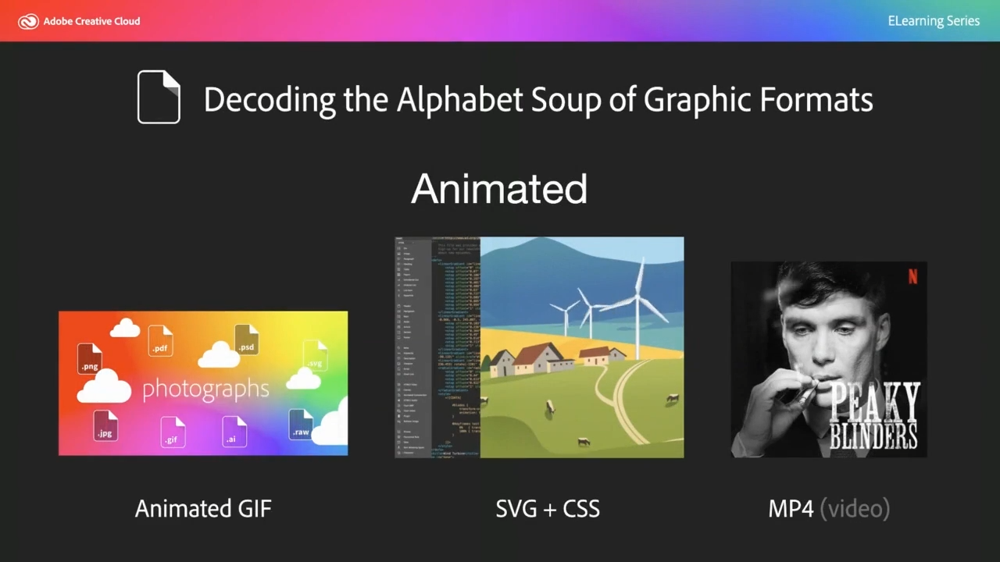
    </a>
    

    <a href="alphabetsoup.md"><strong>Decoding the alphabet soup of graphic formats</strong></a>
    

    <em>JPG, PNG, SVG, GIF, and EPS files are all commonly used in design, some for web pages, others for presentations, publications, and creative projects. But what do they mean, and which should you pick?</em>
     
  </td>
  <td>
    <a href="compositepsipad.md">
      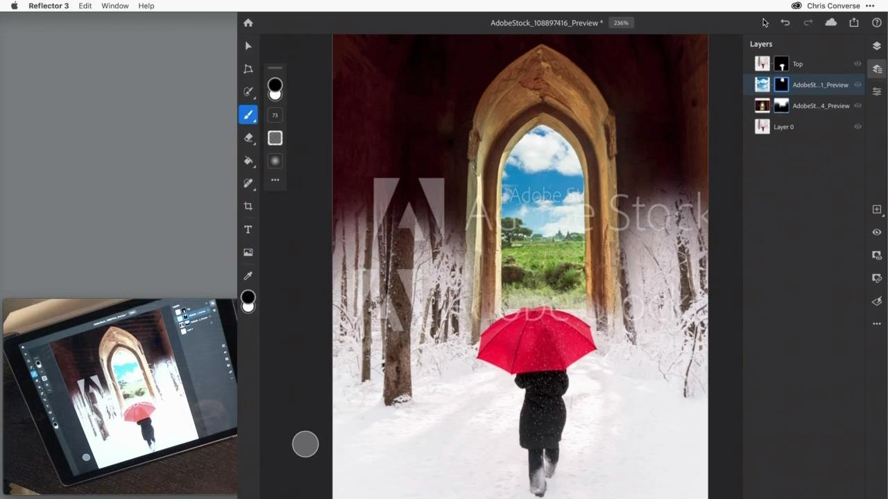
    </a>
    

    <a href="compositepsipad.md"><strong>Create unique composites with Adobe [!DNL Stock] and Photoshop for iPad</strong></a>
    

    <em>Bring the power of Photoshop to your fingertips. Learn to use one of your favorite Creative Cloud applications in a whole new way, with a re-engineered touch-based interface</em>
     
  </td>
  <td>
    
    

    <a href="cinemagraphps.md"><strong>Creating Cinemagraphs with Photoshop</strong></a>
    

    <em>In this step-by-step workshop video tutorial, you create a living photograph by combining video from Adobe [!DNL Stock] with clever masking techniques in Photoshop</em>
     
  </td>
  <td>
    
    

    <a href="assets/AddRemarkableLightingtoaPhotowithPhotoshopandAfterEffects.pdf"><strong>Add remarkable lighting to a photo with Photoshop and After Effects (PDF)</strong></a>
    

    <em>Learn to use the Light Burst effect in Adobe After Effects to dramatically enhance a photograph</em>
     
  </td>
</tr>
<tr>
  <td>
    
    

    <a href="assets/CreateCinemagraphsinaSnapwithPhotoshopandAdobeStock.pdf"><strong>Create Cinemagraphs in a snap with Photoshop and Adobe [!DNL Stock] (PDF)</strong></a>
    

    <em>Searching for seamlessly looping videos on Adobe [!DNL Stock] for quickly assembling eye-catching cinemagraphs in Photoshop</em>
     
  </td>
  <td>
    
    

    <a href="assets/CreatingaLivingPhotographwithPhotoshopPart1.pdf"><strong>Creating a living photograph with Photoshop — Part 1 (PDF)</strong></a>
    

    <em>Adobe Photoshop lets you quickly turn your short videos into living photographs that mesmerize your audience on any social platform</em>
     
  </td>
  <td>
    <a href="assets/CreatingaLivingPhotographwithPhotoshopPart2.pdf">
      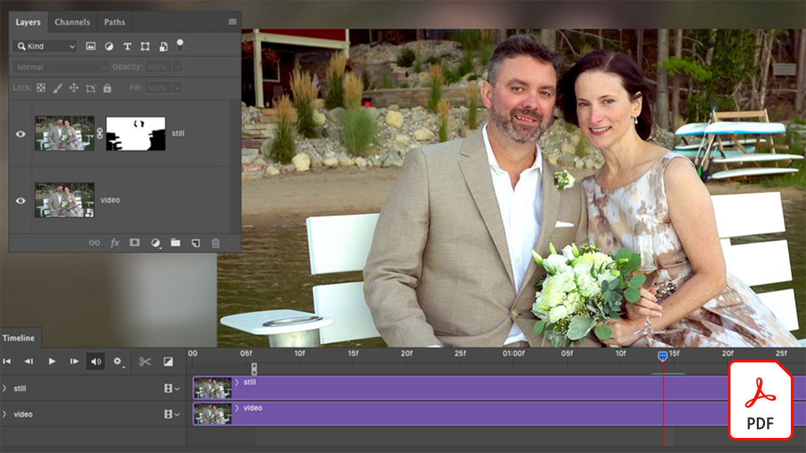
    </a>
    

    <a href="assets/CreatingaLivingPhotographwithPhotoshopPart2.pdf"><strong>Creating a living photograph with Photoshop — Part 2 (PDF)</strong></a>
    

    <em>Combining photos with video is a powerful way to add an engaging quality to your photos without sacrificing the message or tone of your original image</em>
     
  </td>
  <td>
    
    

    <a href="assets/PhotoshopAfterEffectsAwesomenessAdobeMAX2018LabRecap.pdf"><strong>Photoshop + After Effects = Awesomeness: Adobe MAX 2018 Lab Recap (PDF)</strong></a>
    

    <em>In this hands-on, step- by-step lab, combine Photoshop with After Effects to create jaw -dropping images and effects suitable for use in any medium</em>
     
  </td>
</tr>
<tr>
  <td>
    
    

    <a href="assets/QuicklyBrandYourInstagramPhotoswithAdobePhotoshopActions.pdf"><strong>Quickly Brand Your Instagram Photos with Adobe Photoshop Actions (PDF)</strong></a>
    

    <em>Eliminate the tedium and save tons of time by using Actions in Photoshop</em>
     
  </td>
  <td>
    <a href="assets/WorkSmarterNotHarderwithPhotoshop.pdf">
      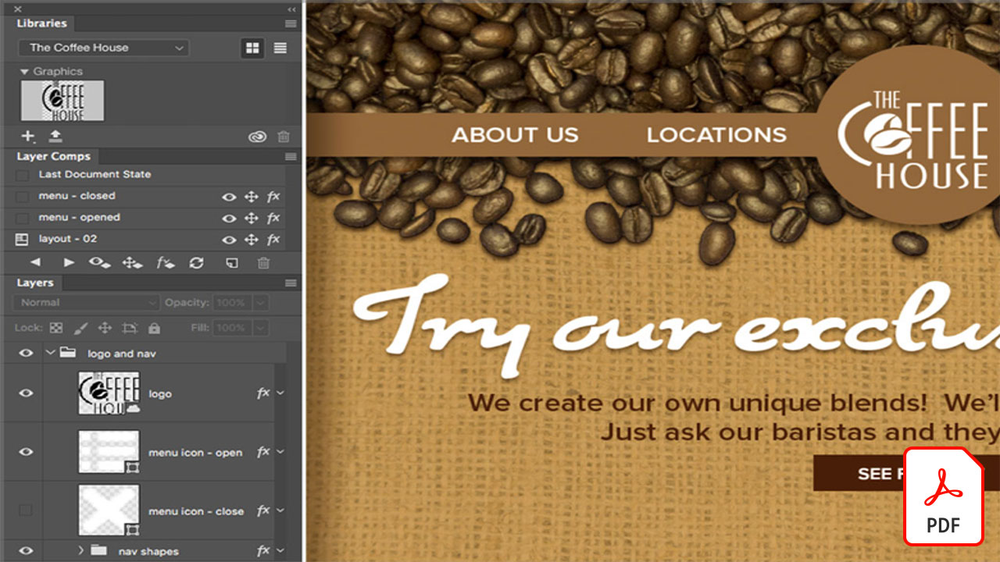
    </a>
    

    <a href="assets/WorkSmarterNotHarderwithPhotoshop.pdf"><strong>Work Smarter, Not Harder, with Photoshop (PDF)</strong></a>
    

    <em>Changes in Photoshop can be time consuming, but it doesn't have to be</em>
     
  </td>
  <td>
    <a href="assets/AnyoneCanBeCreativewithAdobeCreativeCloud.pdf">
      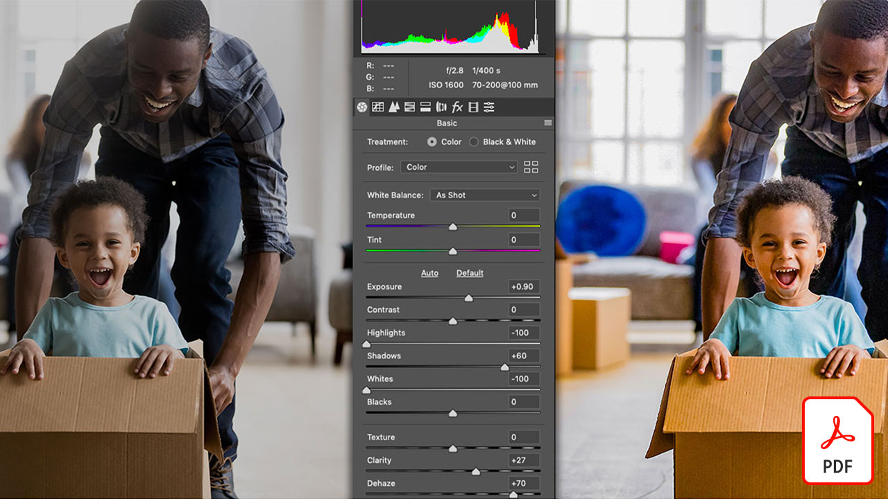
    </a>
    

    <a href="assets/AnyoneCanBeCreativewithAdobeCreativeCloud.pdf"><strong>Add a little Adobe Photoshop to your creative skill set (PDF)</strong></a>
    

    <em>Add a little Adobe Photoshop to your creative skill set</em>
     
  </td>
  <td>
    
    

    <a href="assets/GreenScreenisNotJustforVideo.pdf"><strong>Green Screen is Not Just for Video (PDF)</strong></a>
    

    <em>You can use green screen in a photo studio and use After Effects to prepare the photo use in Photoshop</em>
     
  </td>
</tr>  
</table>
