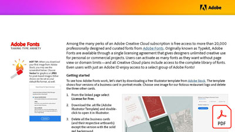

# Taming type anxiety

Among the many perks of an Adobe Creative Cloud subscription is free access to more than 20,000 professionally designed and curated fonts from Adobe Fonts. Originally known as Typekit, Adobe Fonts are available through a single licensing agreement that gives designers unlimited creative use for personal or commercial projects.

**Select the image below to download Taming type anxiety (PDF).**

