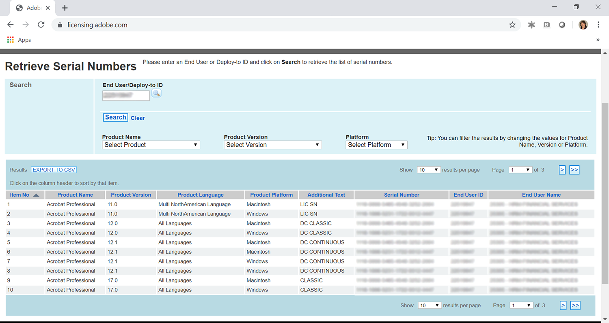
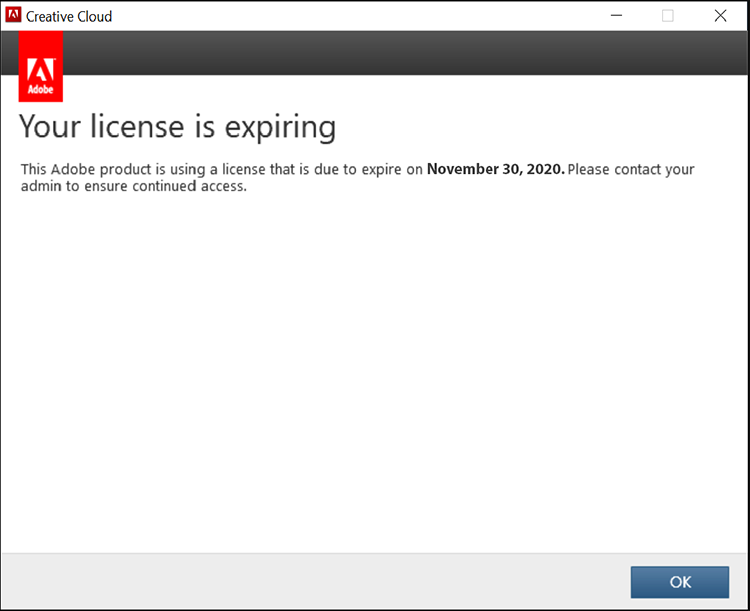
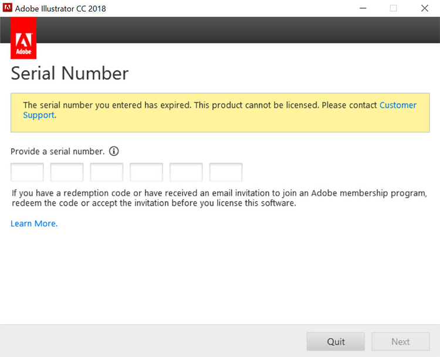
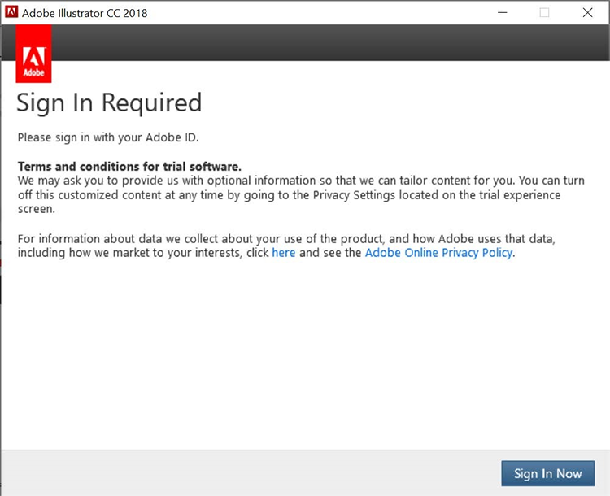
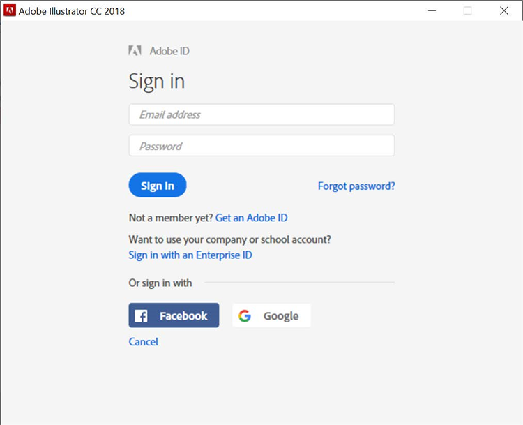
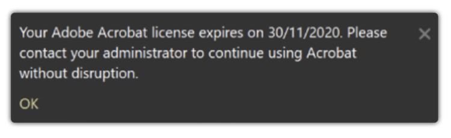
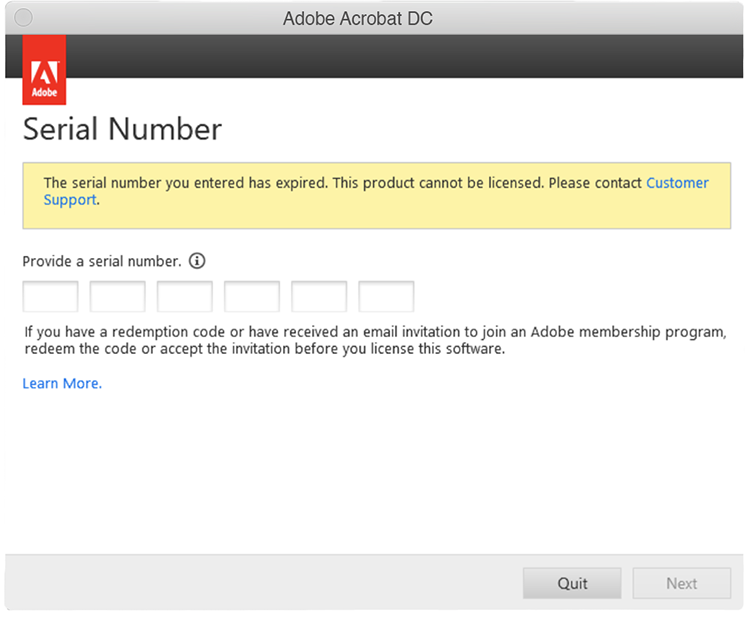
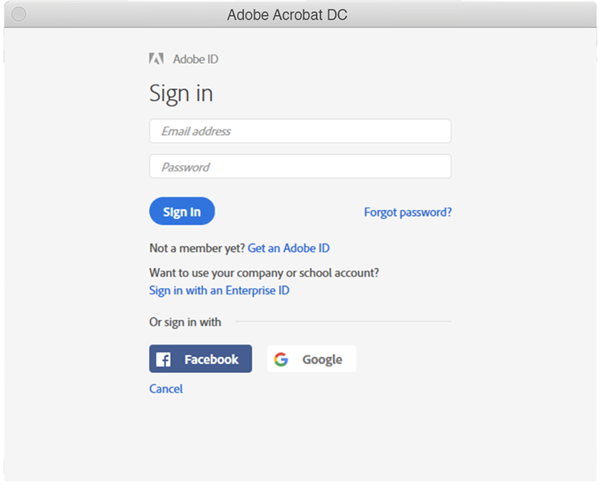

# Understanding Creative Cloud for enterprise and Acrobat serial number expiration

Historically, Adobe issued serial numbers with our apps (i.e. Creative Suite, Creative Cloud for enterprise, Acrobat XI, Acrobat DC) to customers on Enterprise Term License Agreements (ETLAs). These serial numbers do have an expiration date. Once the expiration date has passed, the product will no longer work so it is important to plan your migration before your serial numbers expire. This page outlines the steps necessary to ensure your end users have continued access to their Adobe apps and services.

## Checking your serial numbers for their expiration date

### Find your serial number(s)

The serial number licenses associated with your ETLA agreement are available via the [Adobe Licensing Website](https://licensing.adobe.com/) (LWS). Follow these instructions to display and download:

1. Sign in to [Adobe Licensing Website](https://licensing.adobe.com/) (LWS) with your Adobe ID and password.
1. Choose **Licenses > Retrieve Serial Numbers**.
1. Enter your **End User ID** or **Deploy-to ID**.
1. (Optional) Select a **Product Name**, **Product Version**, or **Platform** to filter results.
1. Click Search.
1. The product name and serial numbers are displayed.
1. (Optional) Select “EXPORT TO CSV” to download the list of serial numbers.

### Check the expiration date

The [AdobeExpiryCheck](https://helpx.adobe.com/enterprise/kb/volume-license-expiration-check.html) is a command-line utility for IT Admins to check whether Adobe products on a computer are using serial numbers that have expired or are expiring. The tool will display information such as the product licensing identifier (LEID), the encrypted serial number, and the expiration date. This [page](https://helpx.adobe.com/enterprise/kb/volume-license-expiration-check.html) contains instructions on downloading & using the tool on either Mac or Windows computers.

### Understanding the end user experience before and after serial number expires

Both Acrobat and Creative Cloud for enterprise apps will begin to display messages (in the apps) starting 60 days before expiration. Once the serial number expires, the products stop working, and prompt the user to take action.

## Creative Cloud for enterprise experience

The following information outlines the end user experience. There’s a short video below followed by review of the end user experience.

>[!VIDEO](https://video.tv.adobe.com/v/331746?hidetitle=true)

**Before expiration**

Beginning 60 days before the serial number expires, all Creative Cloud for enterprise apps display an in product dialog box to the end user. This message will appear weekly, until 30 days before expiration, it will then appear daily until the expiration date stating Your license is expiring. This Adobe product is using a license that is due to expire on November 29, 2020. Please contact your admin to ensure continued access.

**After expiration**

Once the serial number expires, the users will no longer have access to the Creative Cloud for enterprise apps. On the first launch after expiration, the user will be prompted with a dialog box stating *The serial number you entered has expired. This product cannot be licensed. Please contact Customer Support*.

For all subsequent attempts to launch the apps, the end user will be prompted to **Sign In Now** followed by the option to create their own Adobe ID and enter trial mode. However, any new Adobe ID created by the end user will not be associated with your organization’s licenses and will cause additional confusion to your users. To avoid business disruption and/or unnecessary confusion, migrate your users to named user licensing before your serial number(s) expire.

### Acrobat experience

The following information outlines the end user experience. There’s a short video below followed by review of the end user experience.

>[!VIDEO](https://video.tv.adobe.com/v/331749?hidetitle=true)

**Before expiration**

Beginning 60 days before the serial number expires, Acrobat displays an in product pop-up message to the end user. This will appear once a week until 7 days before expiration. It will then begin to appear daily stating Your Adobe Acrobat license expires on 30/11/2020. Please contact your administrator to continue using Acrobat without disruption.

**After expiration**

Once the serial number expires, the users will no longer have access to Acrobat. On the first launch after expiration, the user will be prompted with a dialog box stating *The serial number you entered has expired. This product cannot be licensed. Please contact Customer Support.*

For all subsequent attempts to launch Acrobat, the end user will be prompted to **Sign In Now** followed by the option to create their own Adobe ID and enter trial mode. However, any new Adobe ID created by the end user will not be associated with your organization’s licenses and will cause additional confusion to your users.

## Contact us if you need help

If you have questions about using the [AdobeExpiryCheck](https://helpx.adobe.com/enterprise/kb/volume-license-expiration-check.html) tool or need help migrating from serial number deployment to named user, you have a few options:
* Send an email to the Adobe Enterprise Onboarding team – **entonb@adobe.com**
* Open a support ticket in [Admin Console](https://adminconsole.adobe.com/support)
* Reach out to your Adobe Account Manager or Customer Success Manager
