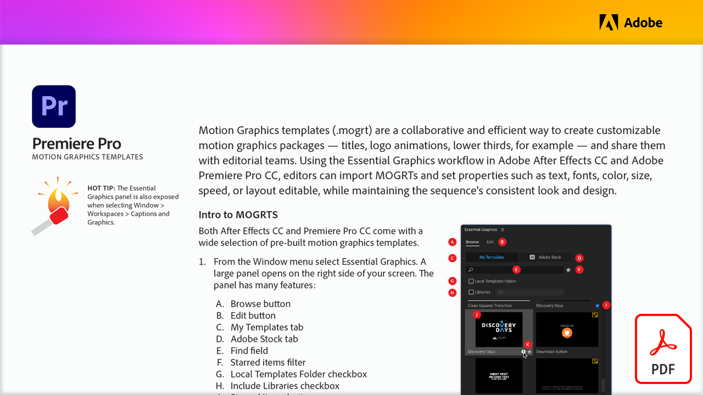

# Professional motion graphics templates

Motion Graphics templates (.mogrt) are a collaborative and efficient way to create customizable motion graphics packages — titles, logo animations, lower thirds, for example — and share them with editorial teams. Using the Essential Graphics workflow in Adobe After Effects CC and Adobe Premiere Pro CC, editors can import MOGRTs and set properties such as text, fonts, color, size, speed, or layout editable, while maintaining the sequence's consistent look and design.

Select the image below to view or download this PDF tutorial.

[{"width=680"}](assets/Adobe-Premiere-Pro-Motion-Graphics-Templates.pdf){target="blank"}
