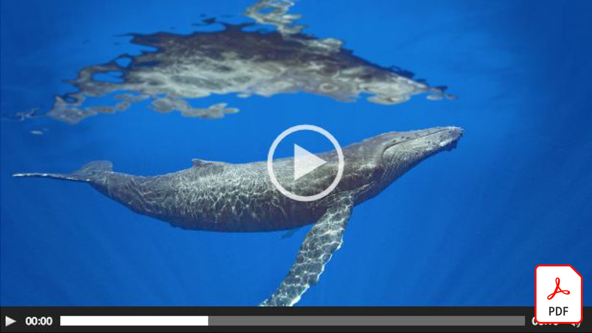

# Video quick reference guides

Bring your ideas to life with Adobe software and apps for video editing, motion graphics, visual effects, animation, and more. Select an image to download or view a PDF of the quick reference guide.

## Adobe Audition

<table>
<tr>
   <td>
      
      

      <a href="assets/QuicklyRemoveUnwantedAudioContentwiththeSpotHealingBrushinAdobeAudition.pdf" target="_blank"><strong>Quickly Remove Unwanted Audio Content with the Spot Healing Brush in Adobe Audition (PDF)</strong></a>
      

      <em>Did you know the Adobe Photoshop Spot Healing Brush lets you remove distracting sounds from your audio files in Adobe Audition?</em>
       
  </td>
  <td>
    
    

     
  </td>
  <td>
    
    

     
  </td>
  <td>
    
    

     
  </td>
</tr>
</table>

## Adobe Express (formerly Adobe Spark)

<table>
<tr>
<td>
   
    

   <a href="assets/ShowcaseyourSparkVideoinyourSparkPage.pdf" target="_blank"><strong>Showcase your Spark Video in your Spark Page (PDF)</strong></a>
    

    <em>Adobe Spark Page allows you to load video from a variety of sources, including videos you create with Spark Video!</em>
     
  </td>
  <td>
    
    

     
  </td>
  <td>
    
    

     
  </td>
  <td>
    
    

     
  </td>
</tr>
</table>

## After Effects

<table>
<tr>
 <td>
   
    

   <a href="assets/AfterEffectsforPhotography.pdf" target="_blank"><strong>After Effects for Photography (PDF)</strong></a>
    

    <em>Learn to use the amazing effects in After Effects to enhance your photographs</em>
     
  </td>
  <td>
   
    

   <a href="assets/CinemagraphsTheMesmerizingPlaceBetweenaPhotoandaVideo.pdf" target="_blank"><strong>Cinemagraphs: The Mesmerizing Place Between a Photo and a Video (PDF)</strong></a>
    

    <em>Learn more about cinemagraphs — those eye-catching hybrids that exist somewhere between a photo and a video</em>
     
  </td>
  <td>
   
    

   <a href="assets/CreateanIllustrationfromanAdobeStockPhotowithAfterEffects.pdf" target="_blank"><strong>Create an Illustration from an Adobe [!DNL Stock] Photo with After Effects (PDF)</strong></a>
    

    <em>Combine the Hue/Saturation and Levels with the Cartoon effects in After Effects to create a unique stylized illustration from an Adobe [!DNL Stock] photo</em>
     
  </td>
   <td>
   
    

   <a href="assets/CreateBeautifulKaleidoscopePatternswithAfterEffects.pdf" target="_blank"><strong>Create Beautiful Kaleidoscope Patterns with After Effects PDF)</strong></a>
    

    <em>Create an endless number of patterns and textures, from any image, using the CC Kaleida effect in Adobe After Effects</em>
     
  </td>
</tr>
<tr>
<td>
   
    

   <a href="assets/CreateIntricateTransparencyinyourPhotographswithKeyinginAfterEffects.pdf" target="_blank"><strong>Create Intricate Transparency in your Photographs with Keying in After Effects (PDF)</strong></a>
    

    <em>Keying is used quite a lot for video, it can also be a big help when your photographs are needed for design projects</em>
     
  </td>
 <td>
   
    

   <a href="assets/CreateAnimatedTitlesUsingMotionGraphicsTemplatesinAdobePremiereRush.pdf" target="_blank"><strong>Create Animated Titles Using Motion Graphics Templates in Adobe Premiere [!DNL Rush] (PDF)</strong></a>
    

    <em>Make your videos look even more amazing by adding professionally designed Motion Graphics templates that fit your story or match your personal brand</em>
     
  </td>
  <td>
      
      

      <a href="assets/DazzlingLightEffectsforPhotographywithAfterEffects.pdf" target="_blank"><strong>Dazzling Light Effects for Photography with After Effects (PDF)</strong></a>
      

      <em>Lighting effects in Adobe After Effects can dramatically change the look of your photo</em>
       
  </td>
  <td>
      
      

      <a href="assets/EditingVRPhotography360photoswithAfterEffects.pdf" target="_blank"><strong>Editing VR Photography (360 degree photos) with After Effects (PDF)</strong></a>
      

      <em>While more immersive interactive games and experiences are not quite as commonplace, 360-degree photography is already here</em>
       
  </td>
</tr>
</table>

## Premiere Rush

<table>
<tr>
   <td>
      
      

      <a href="assets/SmoothlyCombineMusicandDialogueorNarrationwithAutoduckinginAdobePremiereRush.pdf" target="_blank"><strong>Smoothly Combine Music and Dialogue or Narration with Auto-ducking in [!DNL Adobe Premiere Rush] (PDF)</strong></a>
      

      <em>Adobe Premiere [!DNL Rush] delivers advanced video-editing features in a simple-to-use app, so anyone can create a pro-quality video in minutes</em>
       
  </td>
  <td>
    
    

     
  </td>
  <td>
    
    

     
  </td>
  <td>
    
    

     
  </td>
</tr>
</table>
