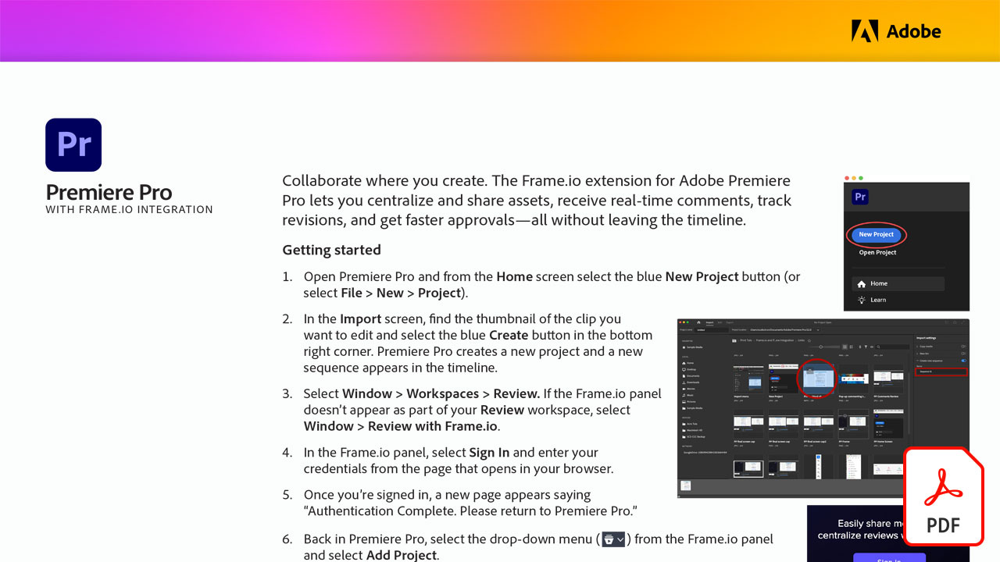

# Adobe Video tutorials

Bring your ideas to life with Adobe software and apps for video editing, motion graphics, visual effects, animation, and more.

## Click to view an Adobe Video tutorial

<table>
<tr>
 <td>
   
    

   <a href="video-review-frame-io.md"><strong>Video review with Frame-io (PDF)</strong></a>
    

    <em>Learn how the Frame.io extension for Adobe Premiere Pro lets you centralize and share assets, receive real-time comments, track revisions, and get faster approvals—all without leaving the timeline </em>
     
  </td>
  <td>
    
    

     
  </td>
  <td>
    
    

     
  </td>
  <td>
    
    

     
  </td>
</tr>
</table>
