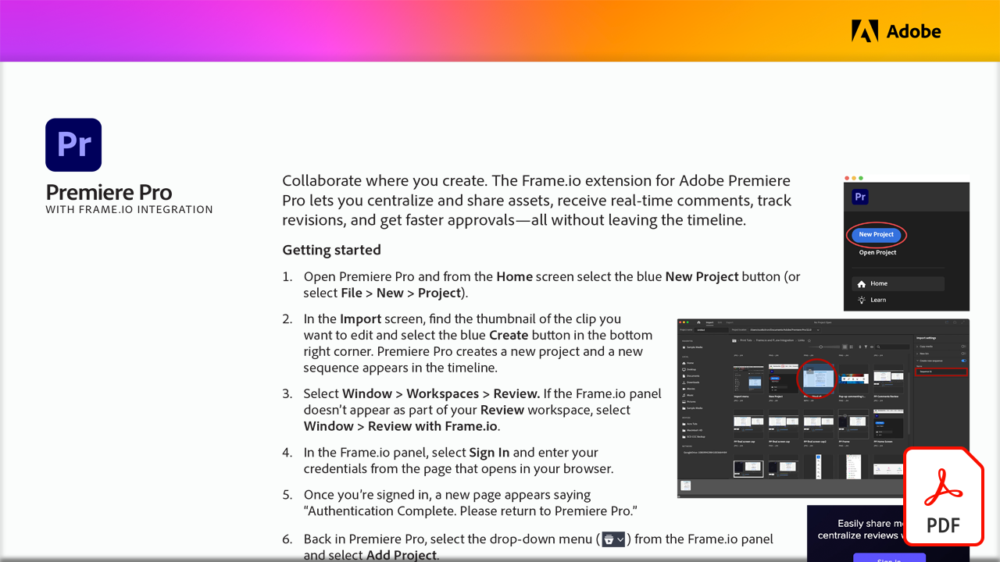

# Video review with Frame.io

Collaborate where you create. Learn how the Frame.io extension for Adobe Premiere Pro lets you centralize and share assets, receive real-time comments, track revisions, and get faster approvals—all without leaving the timeline in this hands-on tutorial.

Select the image below to view or download this PDF tutorial.

{target="blank"}
