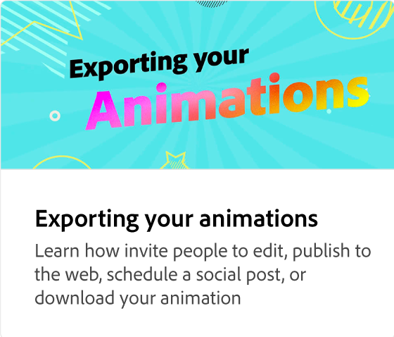

# Adding sections to your animation

Level up your animation by adding elements such as images and headlines to an animation. Learn how to add, duplicate, rearrange, or replace elements in a scene while keeping the animations intact.

>[!VIDEO](https://video.tv.adobe.com/v/3426982?quality=12&learn=on&hidetitle=true)

## Additional videos in this series

<table style="table-layout:fixed">
<tr>
   <td>
         
   </td>
  <td>
         
   </td>
   <td>
         
   </td>
   <td>
         
   </td>
</tr>
<tr>
    <td>
         
   </td>
   <td>
         
   </td>
   <td>
         
   </td>
   <td>
         
   </td>
</tr>
</table>

