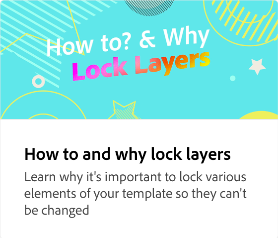

# Creating a template

Learn how to create a template where certain layers are locked while others are unlocked for teams to make changes. You can also include instructions to the teams using this template.

>[!VIDEO](https://video.tv.adobe.com/v/3420208?quality=12&learn=on&hidetitle=true)

## Additional videos in this series

<table style="table-layout:fixed">
<tr>
    <td>
            
    </td>
    <td>
            
    </td>
    <td>
            
    </td>
    <td>
      
      

       
    </td>
</tr>
</table>
