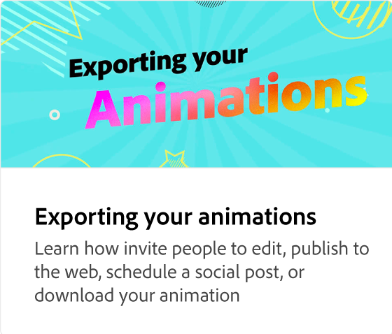

# Different types of animations

Learn about the three different types of animations (intro, looping, and outro) you can add to your projects to make them more engaging. Each animation has a different style that you can preview and select.

>[!VIDEO](https://video.tv.adobe.com/v/3426976?quality=12&learn=on&hidetitle=true)

## Additional videos in this series

<table style="table-layout:fixed">
<tr>
   <td>
         
   </td>
   <td>
         
   </td>
   <td>
         
   </td>
   <td>
         
   </td>
</tr>
<tr>
   <td>
         
   </td>
   <td>
         
   </td>
   <td>
         
   </td>
   <td>
         
   </td>
</tr>
</table>
