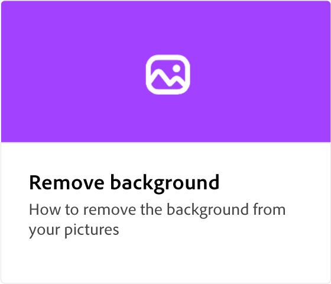
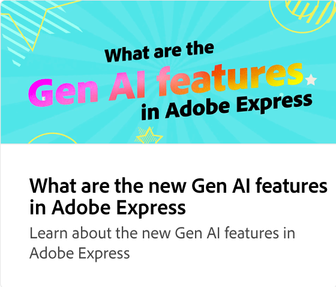
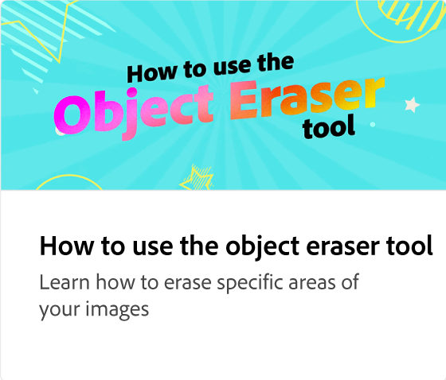
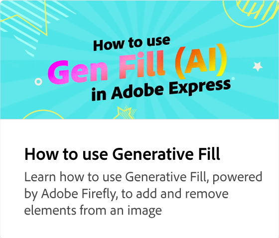
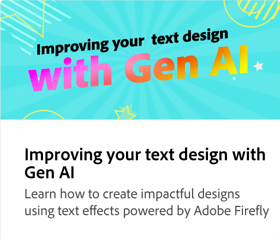
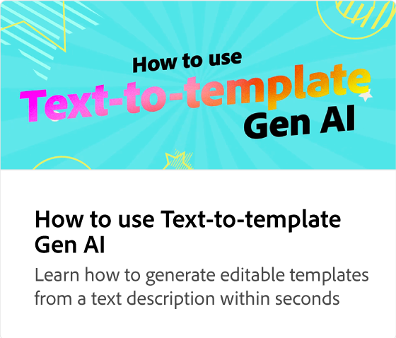
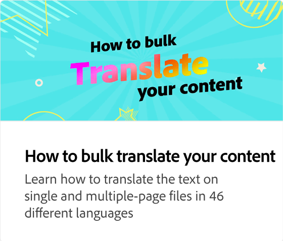
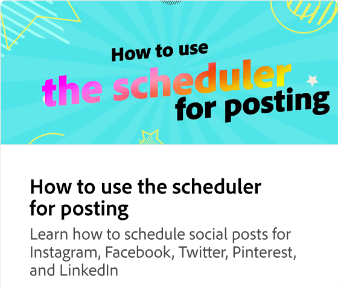

# How to edit a PDF

Learn how to give your static, outdated PDFs a makeover by adding eye-catching text, images, brands, colors, animations, and more. Once the editing is complete, you can downloaded the PDF, share, or convert the PDF to other file formats like JPEG.

>[!VIDEO](https://video.tv.adobe.com/v/3427024?quality=12&learn=on&hidetitle=true)

## Additional videos in this series

<table style="table-layout:fixed">
<tr>
   <td>
         
   </td>
   <td>
         
   </td>
   <td>
         
   </td>
   <td>
         
   </td>      
</tr>
<tr>
   <td>
      
   </td>
   <td>
      
   </td>
   <td>
      
   </td>
    <td>
      
   </td>
</tr>
</table>
