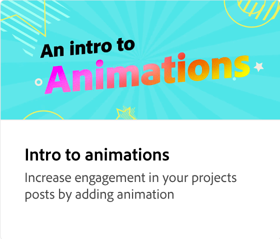
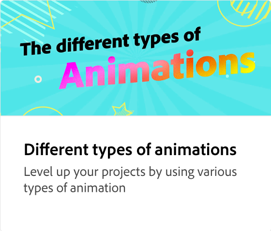
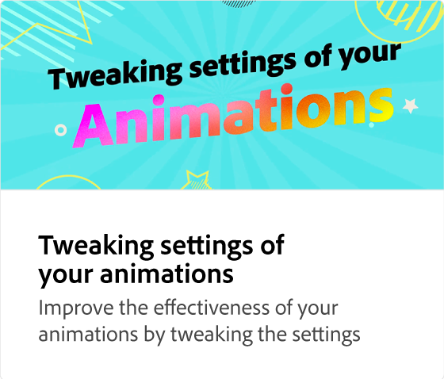
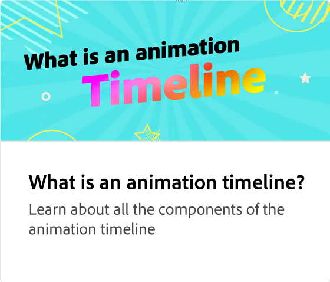
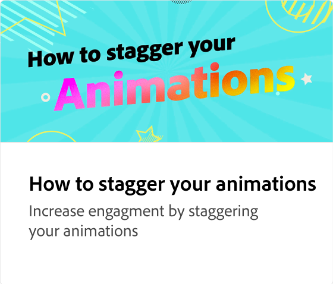
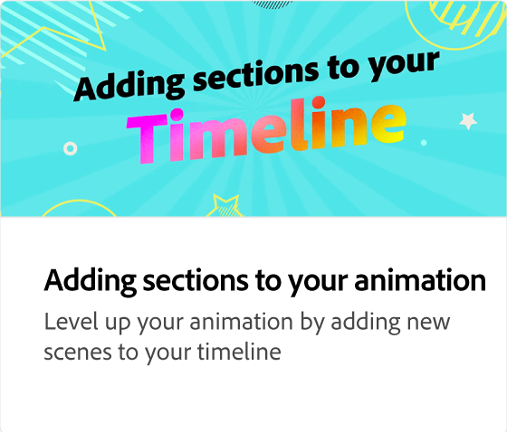
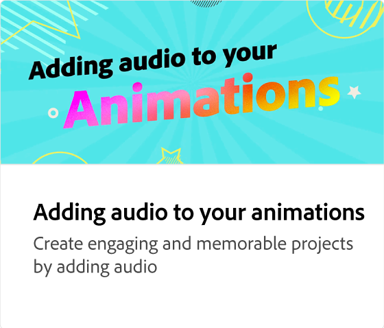
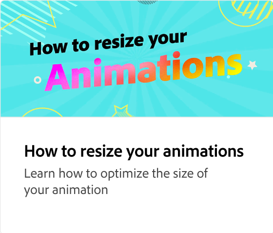

# Exporting your animations

Learn how invite people to edit, publish to the web, schedule a social post, or download your animation. Adobe Express provides recommendations for what file format to export to based on your situation.

>[!VIDEO](https://video.tv.adobe.com/v/3426985?quality=12&learn=on&hidetitle=true)

## Additional videos in this series

<table style="table-layout:fixed">
<tr>
   <td>
         
   </td>
  <td>
         
   </td>
   <td>
         
   </td>
   <td>
         
   </td>
</tr>
<tr>
    <td>
         
   </td>
   <td>
         
   </td>
   <td>
         
   </td>
   <td>
         
   </td>
</tr>
</table>
