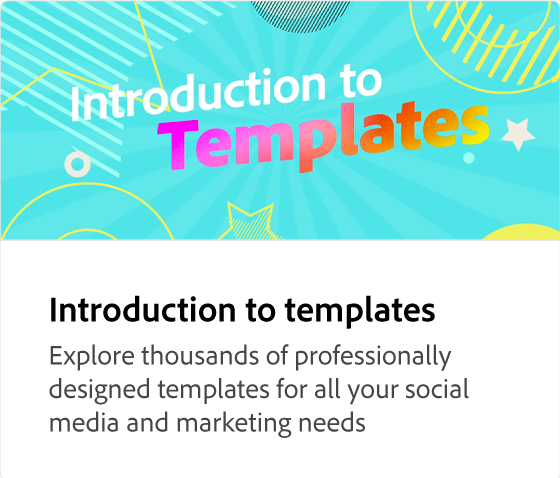

# What's on the Home page

Explore the Home page so you can easily navigate around the app. Learn about Quick actions, templates, seasonal designs, brands, libraries, scheduler, tutorials, and more.

>[!VIDEO](https://video.tv.adobe.com/v/3426924?quality=12&learn=on&hidetitle=true)

## Additional videos in this series

<table style="table-layout:fixed">
<tr>
    <td>
      
    </td>
    <td>
      
    </td>
    <td>
      
      

       
    </td>
   <td>
      
      

       
   </td>
</tr>
</table>
