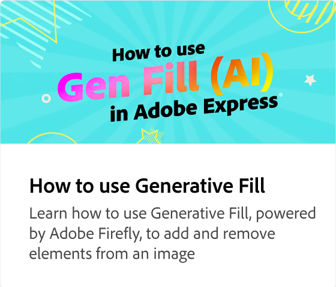

# What are the new Gen AI features in Adobe Express?

Learn about the new Gen AI features in Adobe Express. Using a text prompt, you can easily create designs and templates, add elements to images, and apply special effects to text.

>[!VIDEO](https://video.tv.adobe.com/v/3427018?quality=12&learn=on&hidetitle=true)

## Additional videos in this series

<table style="table-layout:fixed">
<tr>
   <td>
         
   </td>
    <td>
         
   </td>
   <td>
         
   </td>     
   <td>
          
</tr>
<tr>
    <td>
      
   </td>
   <td>
      
   </td>
   <td>
      
   </td>
   <td>
      
</tr>
</table>
