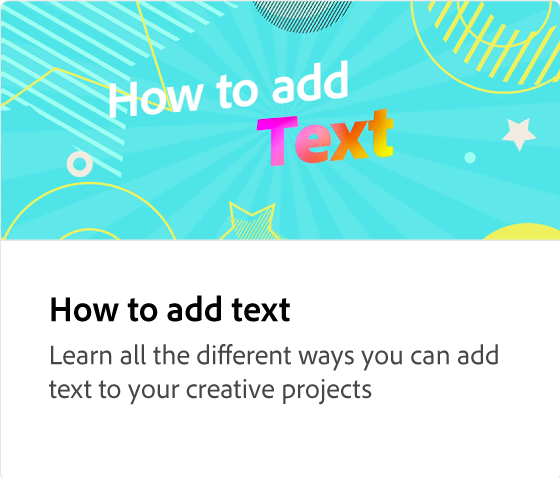
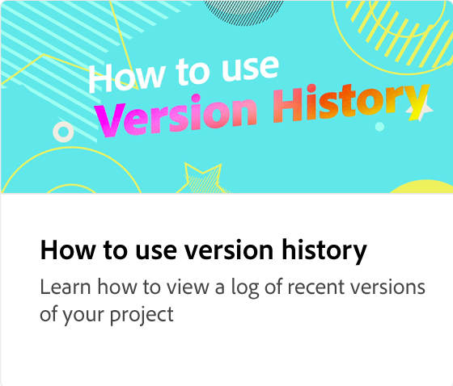

# Working with layers & artboards

Learn how to work with artboards and layers in a design project. Add, delete, duplicate, reorder, and resize artboards for different social channels. You can also change the order of elements in the layer stack.

>[!VIDEO](https://video.tv.adobe.com/v/3420214?quality=12&learn=on&hidetitle=true)

## Additional videos in this series

<table style="table-layout:fixed">
<tr>
 <td>
      
  </td>
   <td>
      
  </td>
   <td>
      
  </td>
  <td>
      
  </td>
</tr>
<tr>
   <td>
      
  </td>
   <td>
      
  </td>
   <td>
      
  </td>
   <td>
         
   </td>
</tr>
<tr>
   <td>
   
   </td>
   <td>
   
   </td>
   <td>
   
   </td>
   <td>
      
      

       
   </td>
</tr>
</table>
