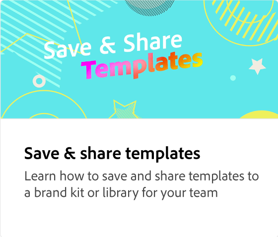
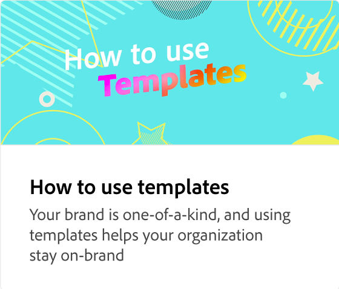

# How to and why lock layers

Learn why it's important to lock various elements of your template so they can't be changed. Certain elements, like logos, should not be changed, so they can be locked before sharing your template.

>[!VIDEO](https://video.tv.adobe.com/v/3427095?quality=12&learn=on&hidetitle=true)

## Additional videos in this series

<table style="table-layout:fixed">
<tr>
   <td>
         
   </td>
   <td>
         
   </td>
   <td>
         
   </td>
   <td>
      
      

       
   </td>
</tr>
</table>
