# Adobe [!DNL Express] how-to tutorials

Get started creating amazing work that stands out with generative AI powered by Adobe Firefly. Design flyers, TikToks, resumes, and Reels with Adobe Express.

<table style="table-layout:fixed">
<tr>
 <td>
      <a href="get-started.md">
         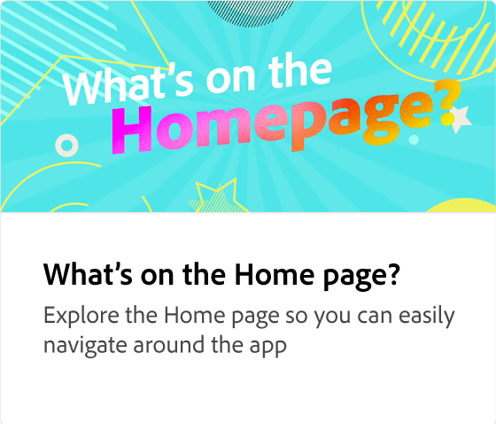
      </a>
 </td>
 <td>
      <a href="quick-actions.md">
         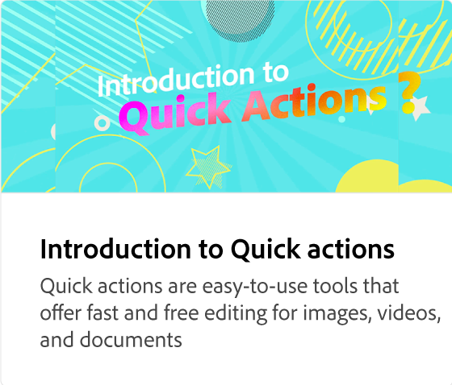
      </a>
 </td>
 <td>
      <a href="introduction-templates.md">
         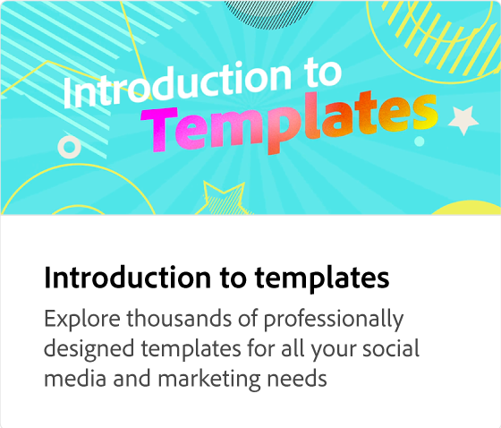
      </a>
 </td>     
 <td>
      
  </td>
</tr>
<tr>
   <td>
      <a href="new-project.md">
         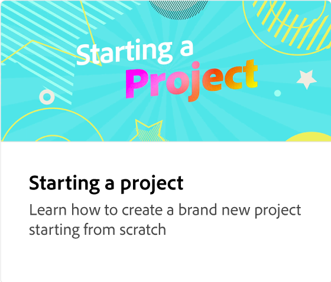
      </a>
  </td>
   <td>
      
  </td>
  <td>
      <a href="text-effects.md">
         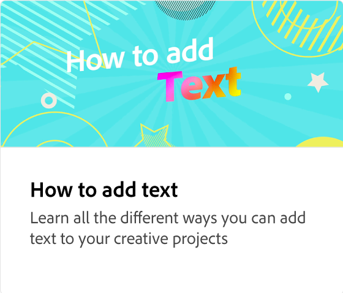
      </a>
  </td>
  <td>
      <a href="image-effects.md">
         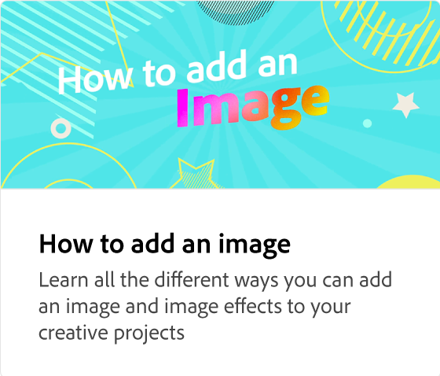
      </a>
  </td>
</tr>
<tr>
   <td>
      
  </td>
 <td>
      <a href="grids.md">
         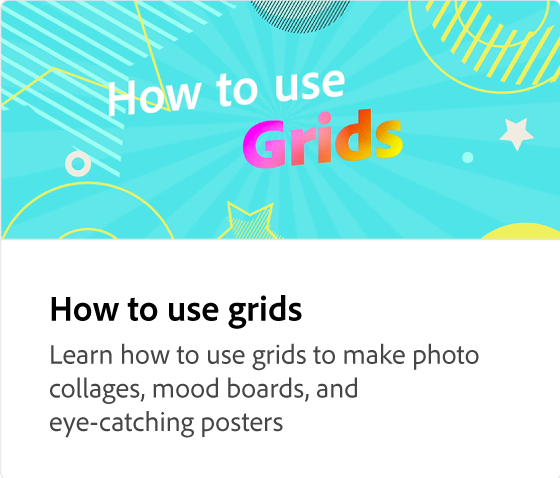
      </a>
  </td>
   <td>
         <a href="add-design-assets.md">
            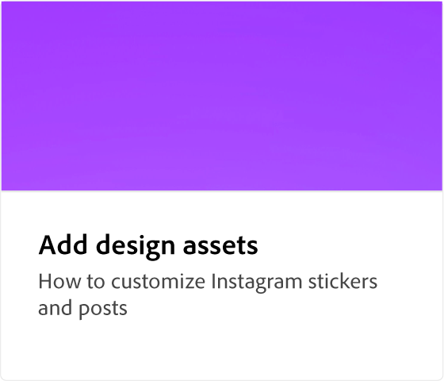
         </a>
   </td>
   <td>
         <a href="layers.md">
            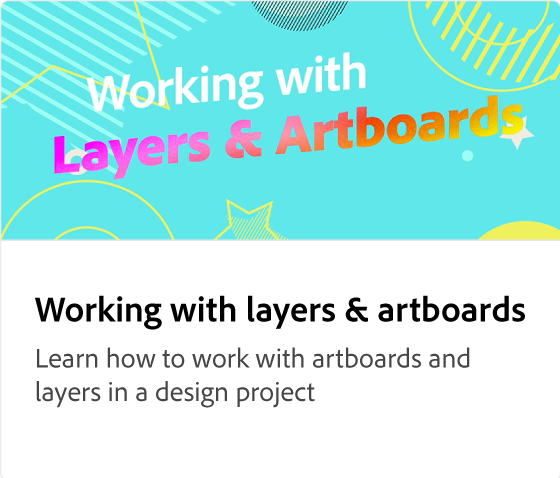
         </a>
   </td>
</tr>
<tr>
   <td>
   
  </td>
  <td>
   
  </td>
  <td>
   
  </td>
  <td>
      
  </td>
</tr>
<tr>
  <td>
      <a href="get-inspiration.md">
         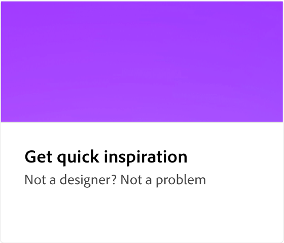
      </a>
  </td>
   <td>
   <a href="create-templates.md">
      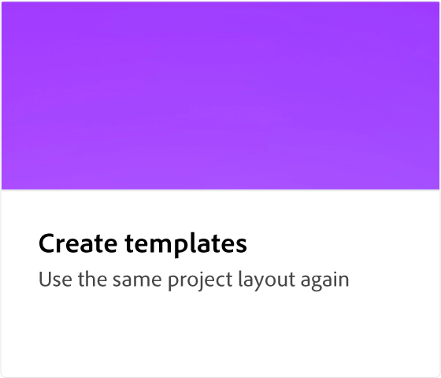
   </a>
  </td>

  <td>
         <a href="group-objects.md">
            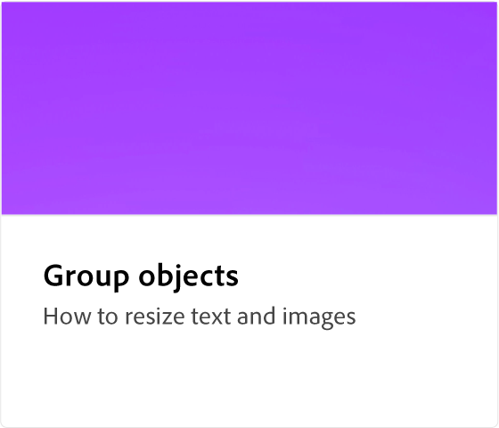
         </a>
   </td>
   <td>
      <a href="multiple-pages.md">
         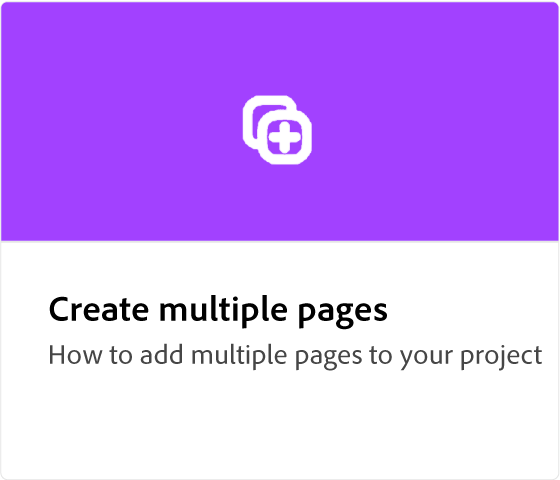
      </a>
  </td>
</tr>
<tr>
  <td>
      
   </td>
  <td>
      
  </td>
   <td>
      
  </td>
   <td>
         
   </td>
</tr>
<tr>
  <td>
         <a href="create-curved-text.md">
            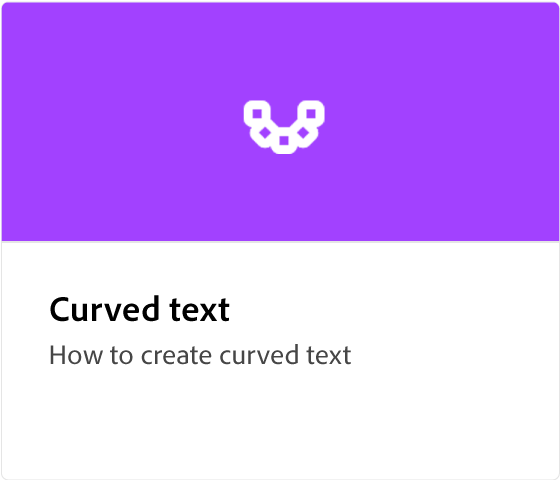
         </a>
   </td>
  <td>
      
      

       
   </td>
   <td>
      
      

       
   </td>
   <td>
      
      

       
   </td>
</tr>
</table>
