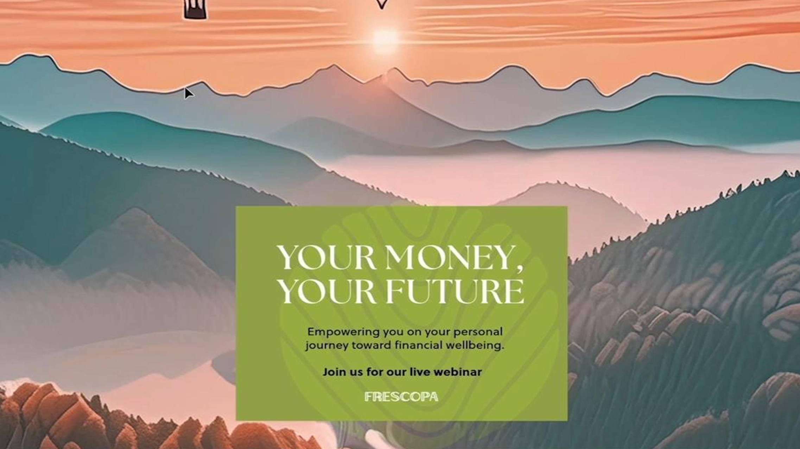
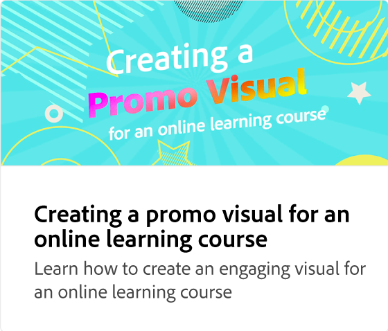
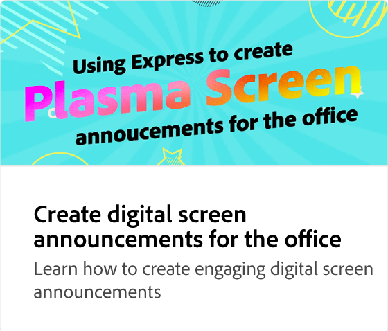
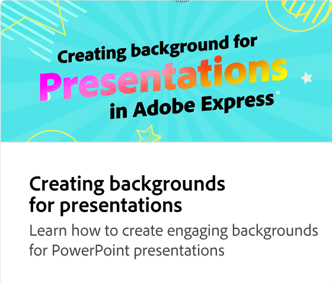
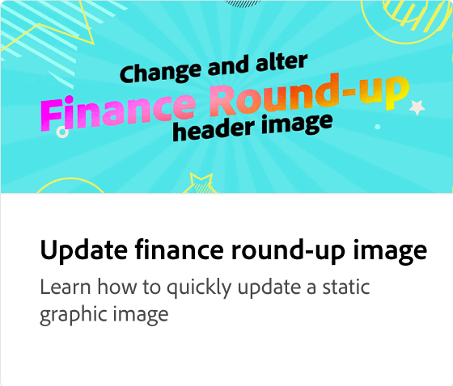

# Adobe [!DNL Express] use case tutorials

Discover how different teams within your organization can benefit from Adobe Express.

## What's new

>[!BEGINTABS]

>[!TAB Create multi-channel HR content for events]

Learn how to quickly [create multi-channel HR content for events](create-hr-content.md).

>[!TAB Creating a promo visual for an online learning course]

Learn how to create an engaging visual for an [online learning course](promo-visual.md).

>[!TAB Creating an end-of-year video]

Learn how to create an inspiring [end-of-year video](end-of-year-video.md).

>[!ENDTABS]

<table style="table-layout:fixed">
<tr>
   <td>
      
      

      <a href="create-hr-content.md">Create multi-channel HR content for events</a>
      

      Learn how to quickly create multi-channel HR content for events
       
   </td>
   <td>
      
      

      <a href="promo-visual.md">Creating a promo visual for an online learning course</a>
      

      Learn how to create an engaging visuals for an online learning course
       
   </td>
   <td>
      
      

      <a href="end-of-year-video.md">Creating an end-of-year video</a>
      

      Learn how to create an inspiring end-of-year video
       
   </td>
   <td>
      
      

      <a href="newsletter.md">How to create a newsletter</a>
      

      Learn how to create dynamic front page for a newsletter
       
   </td>
</tr>
<tr>
   <td>
      
      

      <a href="create-digital-screens.md">Create digital screen announcements for the office</a>
      

      Learn how to create engaging digital screen announcements for the office
       
   </td>
    <td>
      
      

      <a href="create-backgrounds.md">Creating backgrounds for presentations</a>
      

      Learn how to create engaging backgrounds for PowerPoint presentations
       
   </td>
   <td>
      
      

      <a href="update-image.md">Update finance round-up image</a>
      

      Learn how to quickly update a static graphic image
       
   </td>
   <td>
      
      

      <a href="compelling-merchandise.md">Create compelling merchandising content</a>
      

      Learn how to create compelling imagery for a new set of inventory
       
   </td>
</tr>
<tr>
   <td>
      
      

      <a href="multi-channel-marketing-content.md">Empower marketing teams to create multi-channel content</a>
      

      Learn how to create unique content to attract viewers for online events
       
   </td>
   <td>
      
      

      <a href="localized-marketing-content.md">Empower distributed teams to localize content</a>
      

      Learn how to localize content for regional marketing campaigns
       
   </td>
   <td>
      
      

      <a href="jumpstart-ideation.md">Jumpstart creative ideation</a>
      

      Learn how to get a head start on developing creative content
       
   </td>
   <td>
      
      

      <a href="create-local-marketing.md">Create flyer content for marketing campaign with Firefly</a>
      

      Learn how to localize content for a global marketing campaign
       
   </td>
</tr>
<tr>
   <td>
      
      

      <a href="create-on-boarding.md">Create recruiting and on-boarding content with Firefly</a>
      

      Learn how to create unique graphics for employee recruiting and on-boarding content
       
   </td>
   <td>
      
      

      <a href="create-social-posters.md">Create social posters with Firefly</a>
      

      Learn how to easily create a promotion campaign for social media
       
   </td>
   <td>
      
      

      <a href="create-blog-graphics.md">Create graphic content for blogs with Firefly</a>
      

      Learn how to create unique graphic content for web, blog, & social campaigns
       
   </td>
   <td>
      
      

      <a href="create-webinar-poster.md">Create webinar posters with Firefly</a>
      

      Learn how to create a compelling webinar poster for a virtual reality event
       
   </td>
</tr>
</table>
