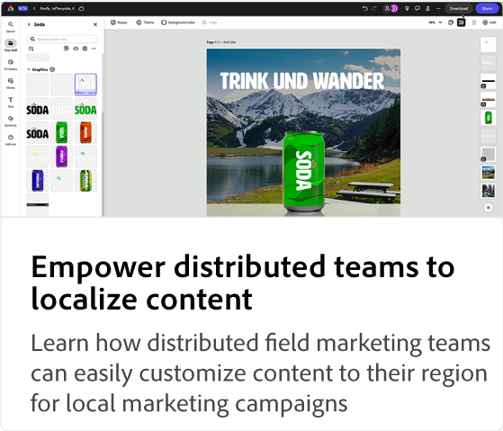
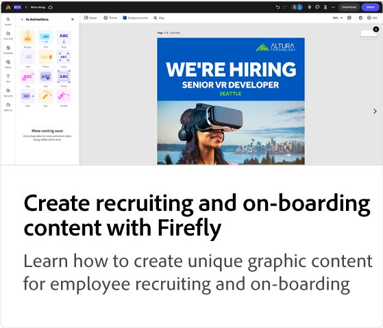
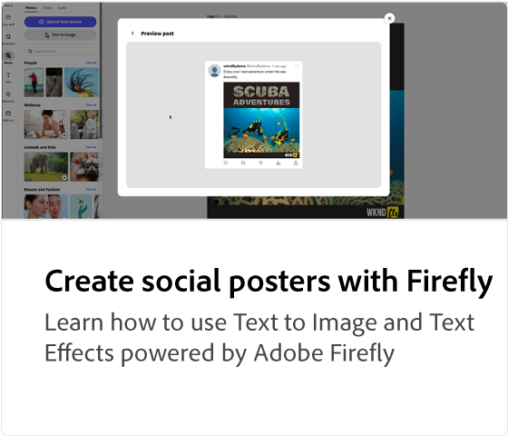
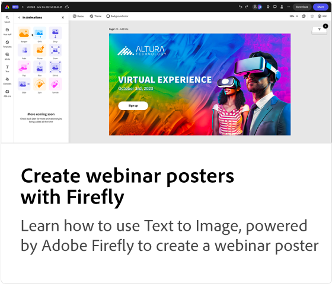

# Adobe [!DNL Express] use case tutorials

Discover how different teams within your organization can benefit from Adobe Express.

## Adobe Express use case tutorials

<table style="table-layout:fixed">
<tr>
   <td>
      
  <td>
      
  </td>
  <td>
      
   </td>     
   <td>
      
   </td>
</tr>
<tr>
   <td>
      
   </td>
   <td>
      
   </td>
   <td>
      
   </td>
   <td>
      
   </td>
</tr>
</table>
