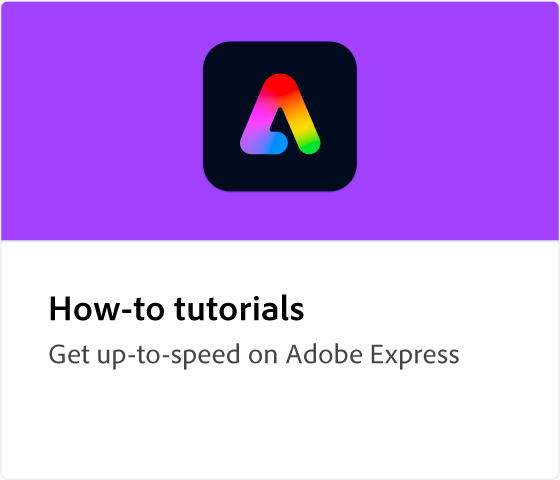
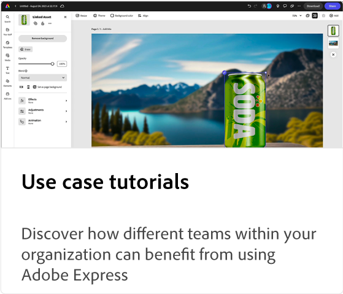

# Adobe [!DNL Express] overview

Adobe Express is an easy-to-use creative tool, with no experience required. 

## Learning paths

<table style="table-layout:fixed">
<tr>
   <td>
      
  </td>
  <td>
      
   </td>
   <td>
    
    

     
  </td>
  <td>
    
    

     
  </td>
</tr>
</table>

## Create your first design with Adobe Express

>[!VIDEO](https://video.tv.adobe.com/v/3420225?quality=12&learn=on&hidetitle=true)
