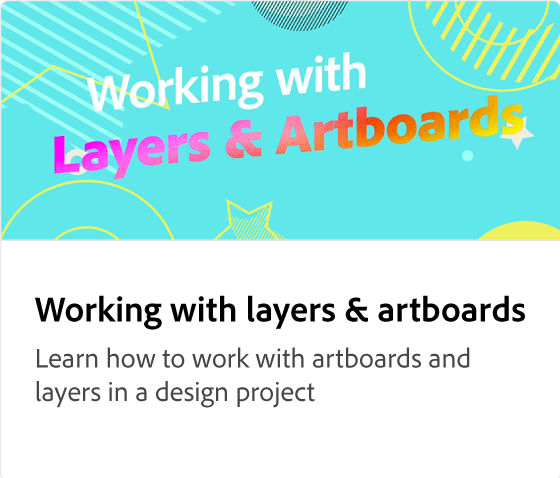

# Adobe [!DNL Express] overview

Adobe Express is an easy-to-use creative tool, with no experience required. 

 &nbsp;

## Get started with Adobe Express

 &nbsp;

>[!VIDEO](https://video.tv.adobe.com/v/3420204?quality=12&learn=on&hidetitle=true)

## Adobe Express tutorials

<table>
<tr>
   <td>
      
      

      <a href="get-started.md"><strong>Get started with Adobe Express</strong></a>
      

      <em>Learn the basics of Adobe Express</em>
       
  </td>
  <td>
      
      

      <a href="adobe-express-beginners.md"><strong>Adobe Express for beginners</strong></a>
      

      <em>Express yourself by learning how to create your first design</em>
       
  </td>
  <td>
      
      

      <a href="get-inspiration.md"><strong>Get quick inspiration</strong></a>
      

      <em>Not a designer? Not a problem. Learn how to get inspired quickly in Adobe Express</em>
       
  </td>
  <td>
   
    

   <a href="create-templates.md"><strong>Create templates</strong></a>
    

    <em>Learn how to use the same project layout again</em>
     
  </td>
</tr>
<tr>
   <td>
      
      

      <a href="add-design-assets.md"><strong>Add design assets</strong></a>
      

      <em>Learn how to customize Instagram stickers and posts</em>
       
  </td>
  <td>
      
      

      <a href="group-objects.md"><strong>Group objects</strong></a>
      

      <em>Learn how to resize text and images</em>
       
  </td>
  <td>
      
      

      <a href="layers.md"><strong>Select and move layers</strong></a>
      

      <em>Move, reorder, or overlap stickers and text with layers</em>
       
  </td>
  <td>
      
      

      <a href="multiple-pages.md"><strong>Create multiple pages</strong></a>
      

      <em>Learn how to add multiple pages to your project</em>
       
  </td>
</tr>
<tr>
   <td>
      
      

      <a href="undo-redo.md"><strong>Undo and redo</strong></a>
      

      <em>Learn how to undo and redo actions</em>
       
  </td>
  <td>
      
      

      <a href="cc-libraries.md"><strong>Use CC Libraries</strong></a>
      

      <em>Learn how to share CC Library assets with your team</em>
       
  </td>
  <td>
      
      

      <a href="brand.md"><strong>Apply your brand</strong></a>
      

      <em>Learn how to add your logo and brand color to any template</em>
       
  </td>
  <td>
      
      

      <a href="google-drive.md"><strong>Google Drive integration</strong></a>
      

      <em>Learn how to bring in images from Google Drive</em>
       
  </td>
</tr>
<tr>
    <td>
      
      

      <a href="remove-background.md"><strong>Remove background</strong></a>
      

      <em>Learn how to remove the background from your pictures</em>
       
  </td>
  <td>
      
      

      <a href="refine-cutout.md"><strong>Refine a cutout</strong></a>
      

      <em>Learn how to refine your cutouts</em>
       
  </td>
  <td>
      
      

      <a href="text-effects.md"><strong>Use text effects</strong></a>
      

      <em>Learn how to add drop shadows, shapes, and outline text</em>
       
  </td>
  <td>
      
      

      <a href="image-effects.md"><strong>Use image effects</strong></a>
      

      <em>Learn how to brighten and darken images</em>
       
  </td>
  <td>
      
      

      <a href="create-curved-text.md"><strong>Create curved text</strong></a>
      

      <em>Learn how to create curved text in your project</em>
       
  </td>
</tr>
</table>
