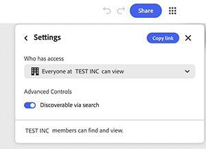

# 5. Share a graph

Learn how to share a graph with others. Sharing a graph shares the live workflow, not just an output. Anyone with edit access can rerun it, change it, and hand it to someone else. Use link level access for broad visibility inside the organization, and named invites with a specific role for anyone who needs direct access.

1. Select **Share** in the top-right corner of the graph. 

    {align="center"}

    The dialog opens with a field to add names or emails, and a summary of who currently has access. By default, only invited people can access the graph.

1. Select the gear icon to open **Settings**. 

    {align="center"}

    Three access levels are available: only invited people, everyone at the organization, or anyone with the link.

1. Select **Everyone at [organization] can view** to let anyone inside the company open the graph with the link.

    {align="center"}
    
1. Turn on Discoverable via search so members can find the graph without needing the link at all. 

    {align="center"}

    A confirmation banner states exactly who can view the graph using the link. Check this before sending the link anywhere. It applies to every future recipient of that link, not just the next person invited.

1. Type an email address directly into the invite field to give one person named access, separate from the general link setting. Select their entry from the suggestion that appears below the field.

    {align="center"}

1. Select the role dropdown next to their name to choose Editor or Viewer. 

    {align="center"}

    Editor can edit, download, and share the graph. Viewer can only view it. Choose the narrower role unless the person needs to change the graph itself.

1. Add an optional note in the **Message** field so the recipient knows why they are getting access. Select **Invite as editor** or **Invite as viewer** if that role was selected, to send it.

    {align="center"}

## Next step

Want to start from a template? Head to [5. Customize a template](https://experienceleague.adobe.com/en/docs/creative-cloud-enterprise-learn/cce-learning-hub/fireflyoverview/firefly-graph/customize-template) to make it reflect your own brief.

Return to [Get started with Firefly Graph](https://experienceleague.adobe.com/en/docs/creative-cloud-enterprise-learn/cce-learning-hub/fireflyoverview/firefly-graph/overview-firefly-graph).