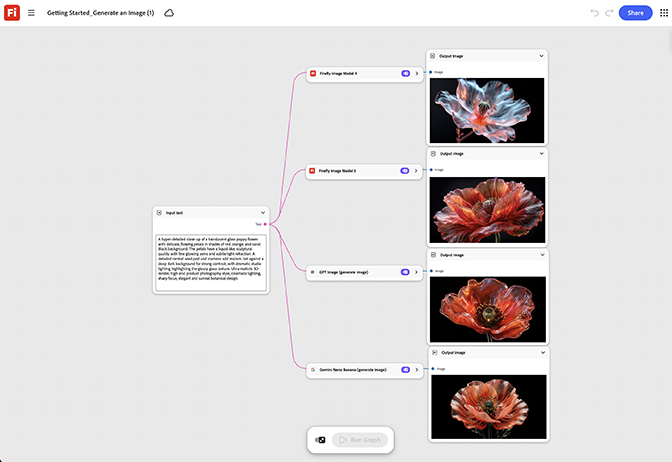

# Getting started - Generate an image

Learn how to create a basic graph: one prompt node into one generation node into one output. [Open Getting Started - Generate an image template](https://firefly.adobe.com/graph/edit/id/urn:aaid:sc:VA6C2:f556b557-d31b-4659-b9d1-358ed567c61d).

[!BADGE Industry examples]{type=Informative tooltip=""}

* **Retail** - Generate a first product hero image from a brief, to learn the basic node flow before touching a real campaign asset.
* **Health** - Test the simplest image generation flow on a placeholder product shot before scaling to a full content calendar.
* **Education** - Build a first sample image to demonstrate the graph to new team members before assigning real project work.

>[!TIP]
>
>**Before you start** - For the best results customize this template to your own brand, product, and workflow. Swap in your reference images, prompts, and copy before using any output.

{align="center"}

Return to [Get started with Firefly Graph](https://experienceleague.adobe.com/en/docs/creative-cloud-enterprise-learn/cce-learning-hub/fireflyoverview/firefly-graph/overview-firefly-graph).
