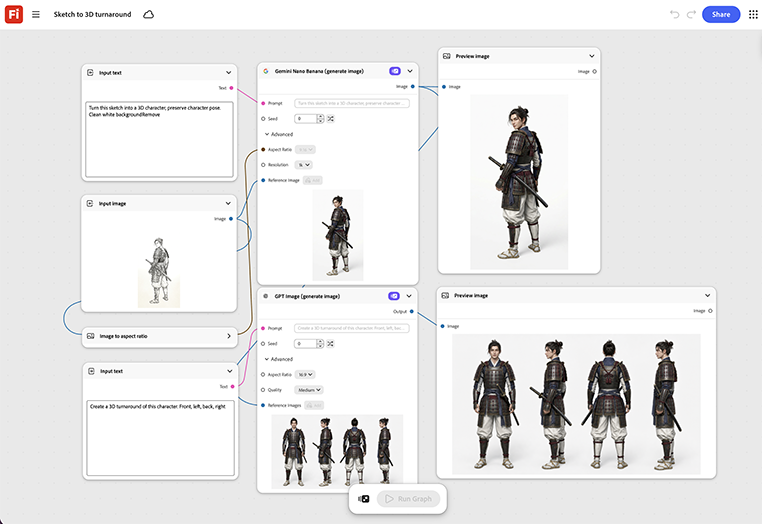

# Sketch to 3D turnaround

Learn how to turn a sketch into a 3D character. The graph builds a rotating 3D turnaround from it, ready for an internal design review before any physical prototype. [Open Sketch to 3D turnaround template](https://firefly.adobe.com/graph/edit/id/urn:aaid:sc:US:984a5ded-67e1-5a78-9283-52a0126bf8b2).

>[!TIP]
>
>**Before you start** - For the best results customize this template to your own brand, product, and workflow. Swap in your reference images, prompts, and copy before using any output.

{align="center"}

[!BADGE Industry examples]{type=Informative tooltip="Use cases"}

* **Tech** - Turn an early hardware concept sketch into a 3D turnaround for design review, before committing to a physical prototype build.
* **Automotive** - Visualize an early vehicle concept sketch as a rotating 3D turnaround for internal review.
* **Entertainment** - Turn a character concept sketch into a 3D turnaround for a pitch deck.

Return to [Get started with Firefly Graph](https://experienceleague.adobe.com/en/docs/creative-cloud-enterprise-learn/cce-learning-hub/fireflyoverview/firefly-graph/overview-firefly-graph).
