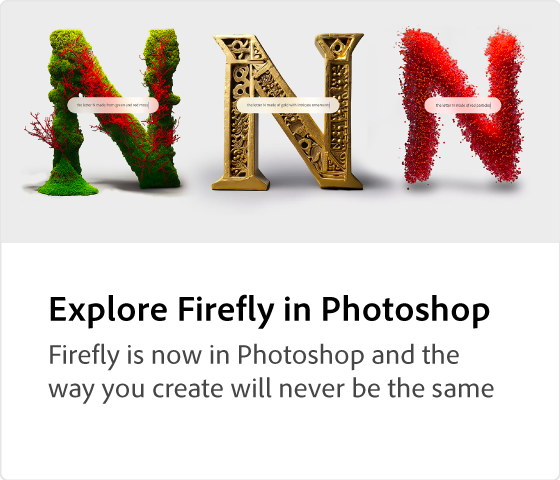

# Adobe [!DNL Firefly] overview

Firefly is the new family of creative generative AI models coming to Adobe products, focusing initially on image and text effect generation. Firefly offers new ways to ideate, create, and communicate while significantly improving creative workflows.

 &nbsp;

## Look what you can do with Adobe Firefly

 &nbsp;

>[!VIDEO](https://video.tv.adobe.com/v/3416970t1?quality=12&learn=on&hidetitle=true)

## Learn more about Adobe Firefly

<table>
<tr>
   <td>
      
      

      <a href="https://firefly.adobe.com/" target="_blank"><strong>Adobe Firefly (Beta)</strong></a>
      

      <em>Join the Adobe Firefly Beta program.</em>
       
  </td>
  <td>
      
      

      <a href="https://www.adobe.com/sensei/generative-ai/firefly.html" target="_blank"><strong>Explore Firefly in Photoshop</strong></a>
      

      <em>Firefly is now in Photoshop and the way that you create will never be the same</em>
       
  </td>
  <td>
      
      

      <a href="webinar-experimenting.md"><strong>Experimenting with Firefly webinar</strong></a>
      

      <em>Join Howard Pinsky as he dives into the Firefly beta in this webinar</em>
       
  </td>
  <td>
      
      

      <a href="generative-fill.md"><strong>Generative Fill in Photoshop</strong></a>
      

      <em>Learn how to use Generative Fill powered by Adobe Firefly</em>
       
  </td>
</tr>
<tr>
   <td>
      
      

      <a href="web-banner-ad.md"><strong>Banner ad variations in Photoshop</strong></a>
      

      <em>Learn how to use Generative Fill to accelerate web ad banner creation</em>
       
  </td>
  <td>
    
    

     
  </td>
  <td>
    
    

     
  </td>
  <td>
    
    

     
  </td>
</table>
