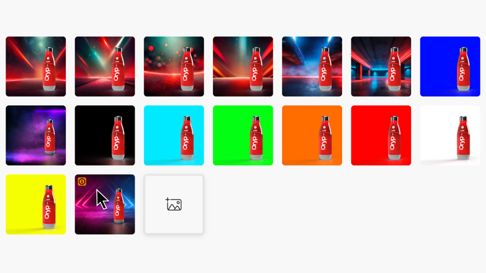
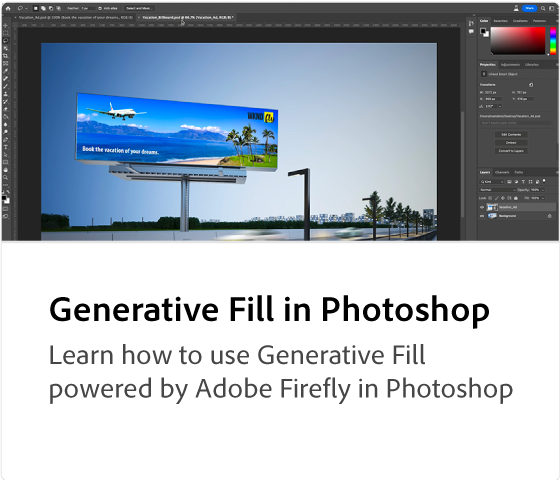
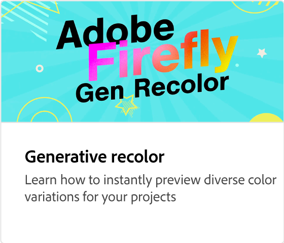
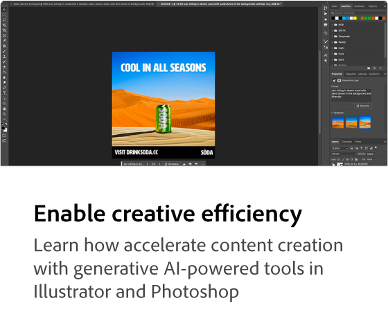
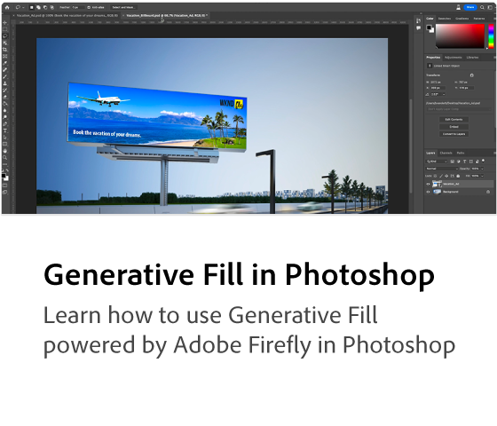
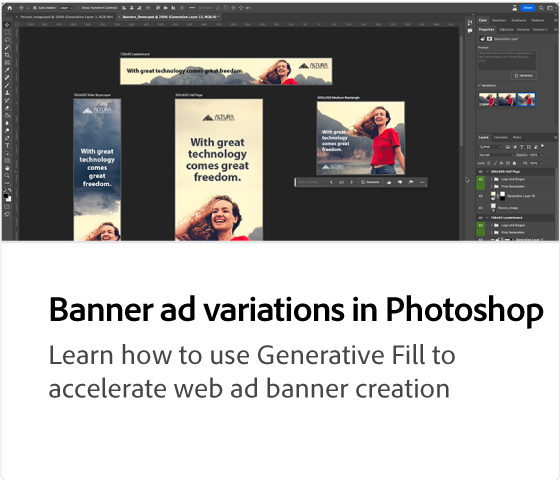
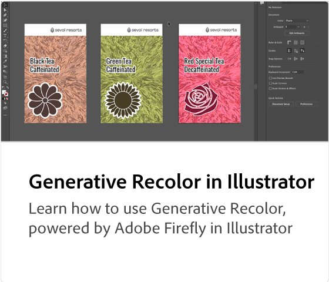

# Adobe [!DNL Firefly] overview

Firefly is the new family of creative generative AI models coming to Adobe products, focusing initially on image and text effect generation. Firefly offers new ways to ideate, create, and communicate while significantly improving creative workflows.

## Look what you can do with Adobe Firefly

 &nbsp;

>[!VIDEO](https://video.tv.adobe.com/v/3416970t1?quality=12&learn=on&hidetitle=true)

## Firefly tutorials

<table style="table-layout:fixed">
<tr>
   <td>
      
   </td>
   <td>
      
   </td>
   <td>
      
   </td>
   <td>
      
   </td>
</tr>
<tr>
  <td>
      
   </td>
   <td>
      
   </td>
   <td>
      
   </td>
    <td>
      
   </td>
</tr>
<tr>
 <td>
      
   </td>
   <td>
      
   </td>
   <td>
      
   </td>
   <td>
      
   </td>
</tr>
<tr>
  <td>
      
   </td>
  <td>
      
   </td>
  <td>
      
  </td>
  <td>
      
   </td>
</table>
