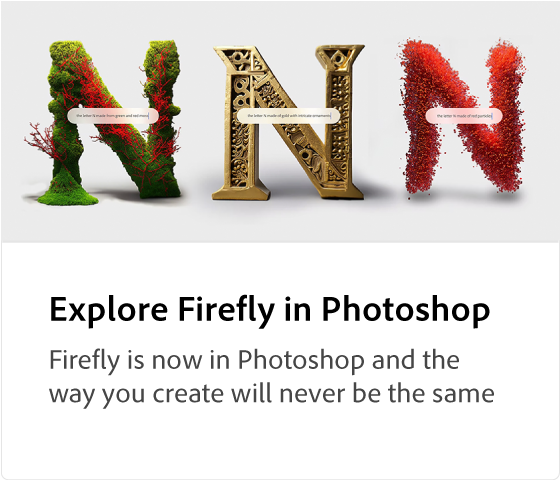

# Adobe [!DNL Firefly] Overview

Firefly is the new family of creative generative AI models coming to Adobe products, focusing initially on image and text effect generation. Firefly offers new ways to ideate, create, and communicate while significantly improving creative workflows.

>[!VIDEO](https://video.tv.adobe.com/v/3416970t1?quality=12&learn=on&hidetitle=true)

## Learn more about Adobe Firefly

<table>
<tr>
   <td>
      
      

      <a href="https://firefly.adobe.com/" {target="_blank"} ><strong>Adobe Firefly (Beta)</strong></a>
      

      <em>Join the Adobe Firefly Beta program.</em>
       
  </td>
  <td>
      
      

      <a href="https://www.adobe.com/sensei/generative-ai/firefly.html" {target="_blank"}><strong>Explore Firefly in Photoshop</strong></a>
      

      <em>Firefly is now in Photoshop and the way that you create will never be the same</em>
       
  </td>
  <td>
    
    

     
  </td>
  <td>
    
    

     
  </td>
</tr>
</table>
