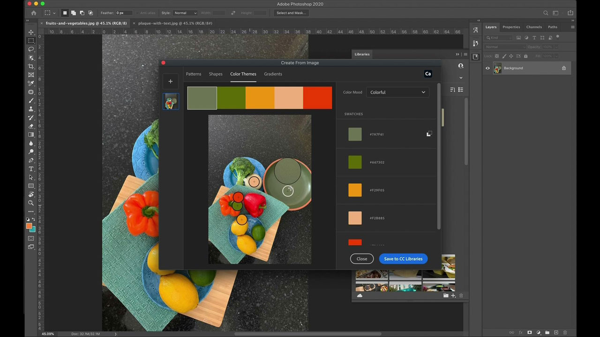

# [!DNL Capture]

Adobe [!DNL Capture] turns mobile phones and tablets into a design collection tool. Users can create many different types of assets (individual digital elements for artwork).   These assets automatically sync with other desktop and mobile Adobe applications. Users can bring them into their creative projects or easily share them with collaborators.

## Browse Product Tutorials

<table style="table-layout:fixed">
<tr>
 <td>
   
    

   <a href="capture.md#tutorial1"><strong>Capture Inspiration from the World Around You</strong></a>
    

    <em>Use the powerful selection and color editing tools in Adobe Capture to dramatically change an image to match your corporate branding needs</em>
     
  </td>
  <td>
    
    

     
  </td>
  <td>
    
    

     
  </td>
</tr>
</table>

## Capture Inspiration from the World Around You (2:56) {#tutorial1}

>[!VIDEO](https://video.tv.adobe.com/v/326825?hidetitle=true)

**Description**
Transform images and video on your mobile device into creative building blocks for all your designs.

In this tutorial, you will learn how to:
* Design Anywhere
* Integrate with Desktop Apps via CC Libraries
* Access thousands of Adobe Fonts

**Presented by:**
Emily Palmer, Solutions Consultant (Digital Media)

**[!DNL Capture] Resources**

[Learn & Support](https://helpx.adobe.com/mobile-apps/help/capture-faq.html) is your hub for additional tutorials and links to community forums.

**October 2020 Release**

Start using these features (and more!) by downloading the latest update from your Creative Cloud Desktop App.
