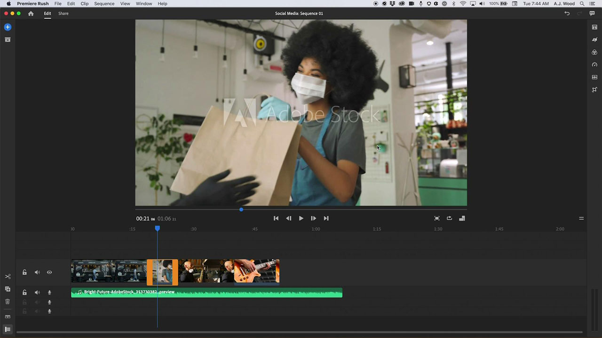

# [!DNL Rush]

Premiere [!DNL Rush] is the first all-in-one, cross-device video editing app that makes creating and sharing online content easier than ever. This integrated desktop and mobile solution automatically syncs your projects and edits to the cloud — allowing you to work anywhere, on any device.

## Browse Product Tutorials

<table style="table-layout:fixed">
<tr>
 <td>
   
    

   <a href="rush.md#tutorial1"><strong>Create a Social Media Video</strong></a>
    

    <em>Adobe [!DNL Rush] lets you work on any device and makes professional output easy enough for beginners</em>
     
  </td>
  <td>
    
    

     
  </td>
  <td>
    
    

     
  </td>
</tr>
</table>

## Create a Social Media Video (18:11) {#tutorial1}

>[!VIDEO](https://video.tv.adobe.com/v/326900?hidetitle=true)

**Description**
Tell your story using video and audio from Adobe [!DNL Stock]. Adobe [!DNL Rush] lets you work on any device and makes professional output easy enough for beginners. 

In this tutorial, you will learn how to:
* Edit video seamlessly across desktop, tablet and phone
* Keep your subject centered across horizontal, square and vertical form factors with Auto Reframe AI technology feature
* Motion Graphic Templates (MoGRTS) enable professional looking and easily customizable titles and lower-thirds
* Easily export and publish directly to social media channels
* Open [!DNL Rush] projects in Adobe Premiere Pro

**Presented by:**
A.J. Wood, Solutions Consultant (Digital Media)

**[!DNL Rush] Resources**

[Learn & Support](https://helpx.adobe.com/support/premiere-rush.html) is your hub for additional tutorials, [What's New](https://helpx.adobe.com/premiere-rush/user-guide.html/premiere-rush/help/whats-new.ug.html), and links to community forums.

**October 2020 Release**

Start using these features (and more!) by downloading the latest update from your Creative Cloud Desktop App.
