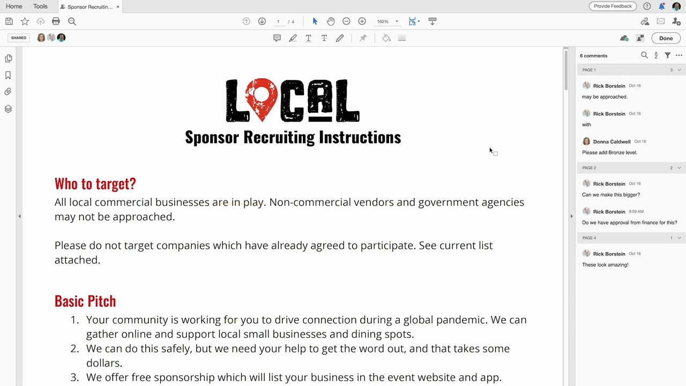
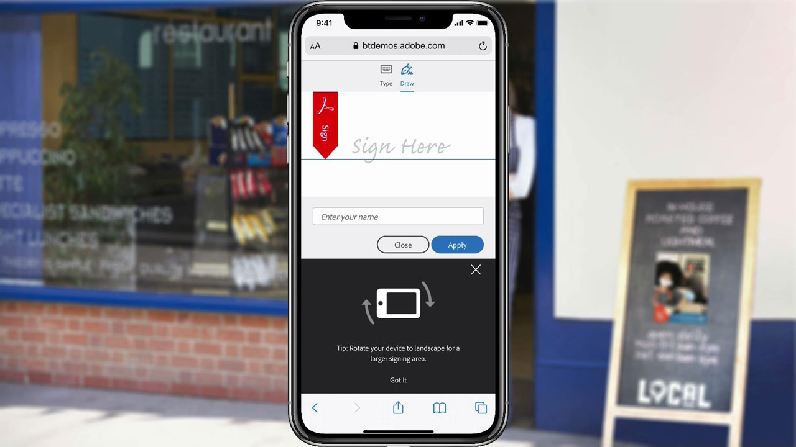
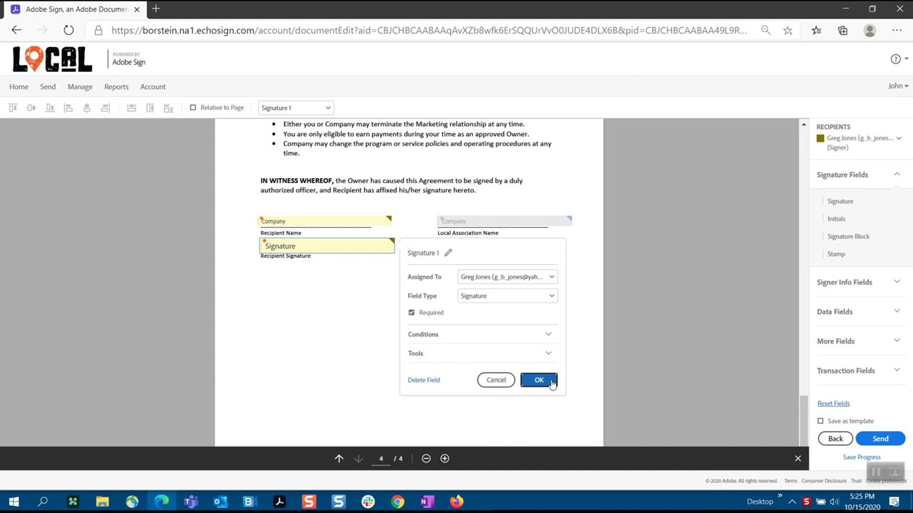
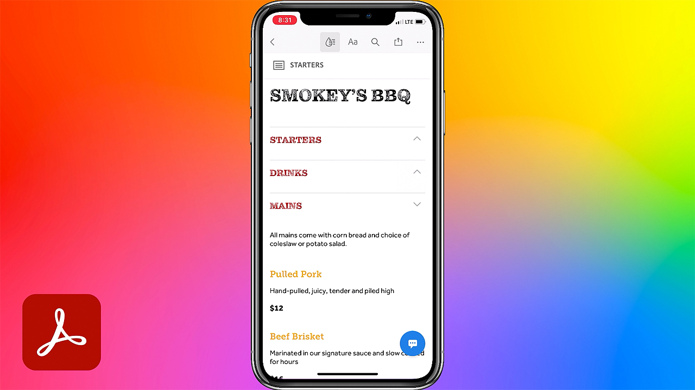
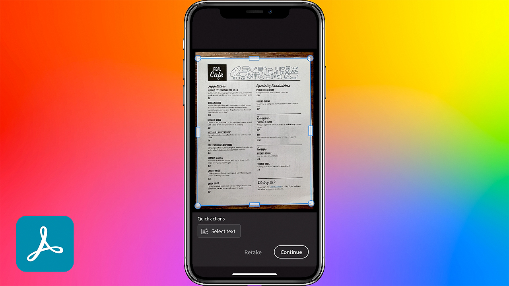
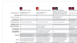

# Acrobat & Sign

With Adobe Document Cloud — which includes the world’s leading PDF and electronic signature solutions — you can turn manual document processes into efficient digital ones. Now your team can take quick action on documents, workflows, and tasks — across multiple screens and devices — anywhere, any time, and inside your favorite Microsoft and enterprise apps.

## Browse Product Tutorials

<table>
<tr>
 <td>
   
    

   <a href="acrobat-sign.md#tutorial1"><strong>Initiating an Acrobat Shared Review</strong></a>
    

    <em>Invite reviewers to add their comments to a PDF document</em>
     
  </td>
  <td>
    
    

    <a href="acrobat-sign.md#tutorial2"><strong>Create Online Waiver Forms with Adobe Sign</strong></a>
    

    <em>Quickly turn documents into online forms and post them online where anyone who needs them can fill and sign them</em>
     
  </td>
  <td>
   
    

    <a href="acrobat-sign.md#tutorial3"><strong>Request a Signature with Adobe Sign</strong></a>
    

    <em>Go from Word to PDF and send for signature with Adobe Sign</em>
     
  </td>
</tr>
<tr>
 <td>
   
    

   <a href="acrobat-sign.md#tutorial4"><strong>View Menus on Mobile with Liquid Mode</strong></a>
    

    <em>Use Liquid Mode to enhance the reader experience of PDF on mobile devices</em>
     
  </td>
  <td>
    
    

    <a href="acrobat-sign.md#tutorial5"><strong>Scan Documents to PDFs from your Mobile Phone</strong></a>
    

    <em>With Adobe Scan, easily capture and convert documents, forms, business cards, and whiteboards into high-quality Adobe PDFs</em>
     
  </td>
  <td>
    
    

     
  </td>
</tr>
</table>

## Initiating an Acrobat Shared Review (3:49) {#tutorial1}

>[!VIDEO](https://video.tv.adobe.com/v/326777?hidetitle=true)

**Description**
Invite reviewers to add their comments to a PDF document. 

In this tutorial, you will learn how to:
* Host PDF commenting in the Document Cloud
* Gather comments in one place
* Simultaneous commenting encourages collaboration

**Adobe Review and Comment Options Comparison PDF**

 

**Presented by:** 
Dan Armstrong, Solutions Consultant (Digital Media)
Rick Borstein, Senior Manager Solution Consulting (Digital Media)

## Create Online Waiver Forms with Adobe Sign (5:19) {#tutorial2}

>[!VIDEO](https://video.tv.adobe.com/v/326776?hidetitle=true)

**Description**
Quickly turn documents into online forms and post them online where anyone who needs them can fill and sign them. 

In this tutorial, you will learn how to:
* Go digital by turning paper forms into digital documents
* Post digital forms to your website where customers can access them from their own device
* Completed forms are automatically archived for your records

**Presented by:**
Taylor Kobey, Solutions Consultant (Digital Media)
Emily Palmer, Solutions Consultant (Digital Media)

## Request a Signature with Adobe Sign (3:21) {#tutorial3}

>[!VIDEO](https://video.tv.adobe.com/v/326801?hidetitle=true)

**Description**
Go from Word to PDF and send for signature with Adobe Sign.

In this tutorial, you will learn how to:
* Leverage the tools you use every day to send digital documents for signature

**Presented by:**
Rick Borstein, Senior Manager Solution Consulting (Digital Media)

## View Menus on Mobile with Liquid Mode (2:57) {#tutorial4}

>[!VIDEO](https://video.tv.adobe.com/v/327093?hidetitle=true)

**Description**
Use Liquid Mode to enhance the reader experience of PDF on mobile devices. 

In this tutorial, you will learn how to:
* Make PDF files responsive for mobile devices
* Enhance your PDF layout 
* Add features on-the-fly to help you easily read documents on your phone and tablet

**Presented by:**
Emilie Enke, Associate Solutions Consultant (Digital Media)

## Scan Documents to PDFs from your Mobile Phone (5:53) {#tutorial5}

>[!VIDEO](https://video.tv.adobe.com/v/327094?hidetitle=true)

**Description**
With Adobe Scan, easily capture and convert documents, forms, business cards, and whiteboards into high-quality Adobe PDFs.

In this tutorial, you will learn how to:
* Use your mobile phone to capture and convert documents, forms, business cards, and whiteboards into high-quality Adobe PDFs
* Automatically identify and sharpen handwritten or printed text, while removing elements you don’t want, like glare and shadow
* Open the scanned PDF in Acrobat Reader to make notes and comments and review with your team

**Presented by:**
Emilie Enke, Associate Solutions Consultant (Digital Media)

**Acrobat & Adobe Sign Resources**

[Learn & Support](https://helpx.adobe.com/support/document-cloud.html) is your hub for additional tutorials, [What’s New](https://helpx.adobe.com/acrobat/using/whats-new.html), and links to community forums.

**October 2020 Release**

Start using these features (and more!) by downloading the latest update from your Creative Cloud Desktop App.
