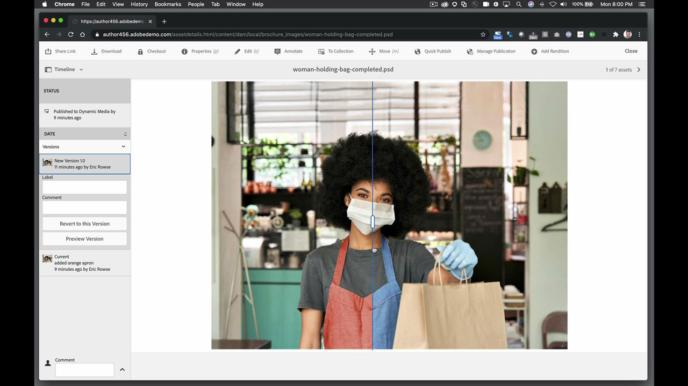
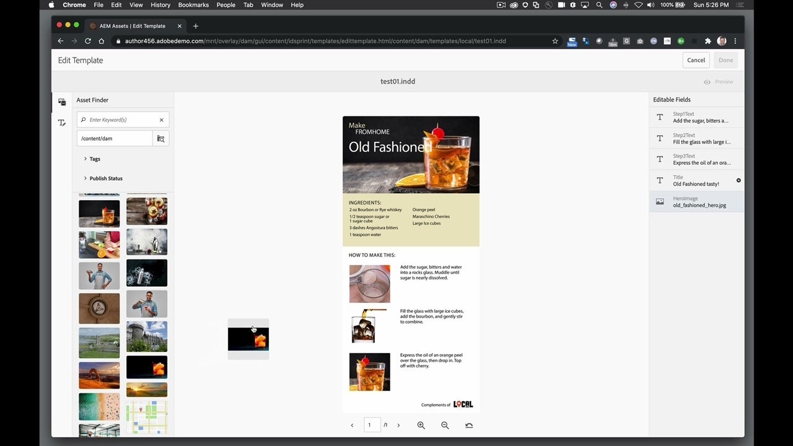

# AEM Assets and Asset Link

Adobe Experience Manager is the industry-leading digital experience management solution for enterprises and midsize organizations. It provides a modern, scalable foundation to deliver compelling experiences that promote brand engagement, drive demand and increase customer loyalty. Experience Manager includes a complete set of tools to create, manage and deliver digital experiences across all channels.

## Browse Product Tutorials

<table>
<tr>
 <td>
   
    

   <a href="aem.md#tutorial1"><strong>AEM and Asset Link</strong></a>
    

    <em>Make real-time updates to assets stored in AEM with Asset Link</em>
     
  </td>
   <td>
   
    

   <a href="aem.md#tutorial2"><strong>InDesign Files Hosted in AEM</strong></a>
    

    <em>Host your InDesign document in AEM so multiple users can create content variations - at the same time</em>
     
  </td>
  <td>
    
    

     
  </td>
</tr>
</table>

## AEM and Asset Link (5:45) {#tutorial1}

>[!VIDEO](https://video.tv.adobe.com/v/326828?hidetitle=true)

**Description**
Make real-time updates to assets stored in AEM with Asset Link.

In this tutorial, you will learn how to:
* Find what you need, when you need it with a dedicated panel to search and browse assets inside your design programs
* Upload assets easily right from your design programs
* Check out and check in assets from the DAM into your design program to make real-time updates

**Presented by:**
Eric Rowse, Senior Solutions Consultant (Digital Media)

## InDesign Files Hosted in AEM (3:16) {#tutorial2}

>[!VIDEO](https://video.tv.adobe.com/v/326829?hidetitle=true)

**Description**
Host your InDesign document in AEM so multiple users can create content variations - at the same time.

In this tutorial, you will learn how to:
* Upload InDesign file into AEM for common storage access
* Safely create variations without fear of ruining source file
* Document fields are pre-formatted allowing for quick edits or changes to content

**Presented by:**
Eric Rowse, Senior Solutions Consultant (Digital Media)

<table>
<tr>
 <td>
   
    

   <a href="https://www.adobe.com/marketing/experience-manager.html"><strong>Adobe Experience Manager</strong></a>
    

    <em>A powerhouse combo for your content and digital asset management needs</em>
     
  </td>
  <td>
   
    

   <a href="https://www.adobe.com/marketing/experience-manager-assets.html"><strong>AEM Assets</strong></a>
    

    <em>Next generation digital asset management</em>
     
  </td>
  <td>
   
    

   <a href="https://www.adobe.com/marketing/experience-manager-assets/benefits.html"><strong>AEM Assets: Benefits</strong></a>
    

    <em>Make your digital assets work for you</em>
     
  </td>
</tr>
</table>

**Asset Link & AEM Resources**

[Learn & Support](https://helpx.adobe.com/support/experience-manager.html) is your hub for additional tutorials, What’s New, and links to community forums.

**October 2020 Release**

Start using these features (and more!) by downloading the latest update from your Creative Cloud Desktop App.
