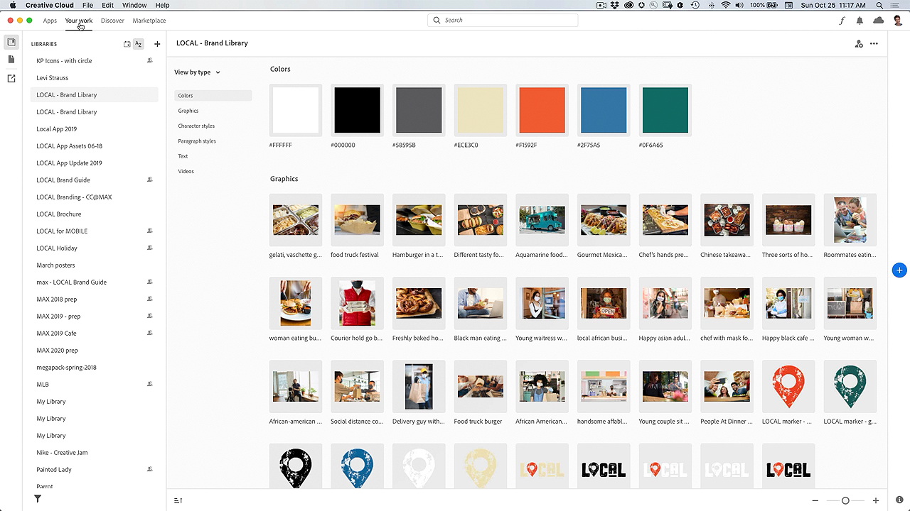

# Creative Cloud Desktop App

The Creative Cloud desktop app is your hub for managing CC apps, services, and collaboration—and more!

## Browse Product Tutorials

<table>
<tr>
 <td>
   
    

   <a href="creativeclouddesktopapp.md#tutorial1"><strong>Explore the CC Desktop App: Your Hub for 
Creative Cloud</strong></a>
    

    <em>The Creative Cloud desktop app is your hub for managing CC apps, services, and collaboration—and more!</em>
     
  </td>
  <td>
    
    

     
  </td>
  <td>
    
    

     
  </td>
</tr>
</table>

## Explore the CC Desktop App: Your Hub for Creative Cloud (2:50) {#tutorial1}

>[!VIDEO](https://video.tv.adobe.com/v/327095?hidetitle=true)

**Description**
The Creative Cloud desktop app is your hub for managing CC apps, services, and collaboration—and more!

In this tutorial, you will learn how to:
* Launch and update your desktop apps
* Find mobile and web apps
* Manage and share assets
* Access Adobe Fonts
* Discover tutorials
* Share your work on Behance

**Presented by:**
Patti Sokol, Principal Solutions Consultant (Digital Media)