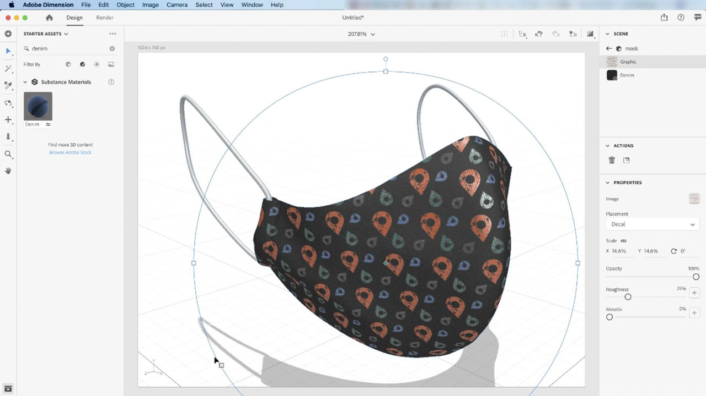

# Dimension

Create engaging content in 3D faster with high-quality models, materials, and lighting. Dimension makes it easy to build brand visualizations, illustrations, product mockups, packaging designs, and other creative work.

## Browse Product Tutorials

<table>
<tr>
 <td>
   
    

   <a href="dimension.md#tutorial1"><strong>Apply Substance Materials to 3D Models</strong></a>
    

    <em>Substance materials support thousands of variations of pattern and design in a single material</em>
     
  </td>
  <td>
    
    

     
  </td>
  <td>
    
    

     
  </td>
</tr>
</table>

## Apply Substance Materials to 3D Models (11:42) {#tutorial1}

>[!VIDEO](https://video.tv.adobe.com/v/326944?hidetitle=true)

**Description**
Substance materials support thousands of variations of pattern and design in a single material.

In this tutorial, you will learn how to:
* Create engaging content in 3D faster, with high-quality models, materials, and lighting

**Presented by:**
Jim Babbage, Senior Solutions Consultant (Digital Media)

**Dimension Resources**

[Learn & Support](https://helpx.adobe.com/support/dimension.html) is your hub for additional tutorials, [What’s New](https://helpx.adobe.com/dimension/user-guide.html/dimension/using/whats-new.ug.html), and links to community forums.

**October 2020 Release**

Start using these features (and more!) by downloading the latest update from your Creative Cloud Desktop App.