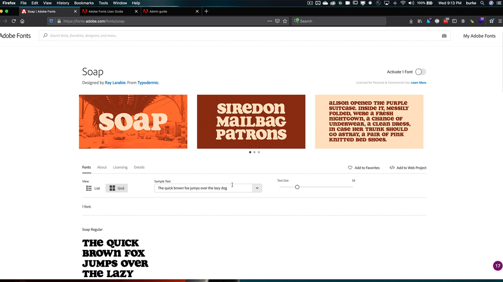

# Enterprise Administration

Manage Adobe entitlements and assets across your entire organization.

## Browse Enterprise Administration Tutorials

<table>
<tr>
 <td>
   
    

   <a href="enterprise.md#tutorial1"><strong>Adobe Fonts</strong></a>
    

    <em>Explore the nearly 200 families in Adobe Fonts and the ease-of-use of the Adobe Fonts service</em>
     
  </td>
  <td>
    
    

     
  </td>
  <td>
    
    

     
  </td>
</tr>
</table>

## Adobe Fonts (5:20) {#tutorial1}

>[!VIDEO](https://video.tv.adobe.com/v/328226?hidetitle=true)

**Description:**

Explore the nearly 200 families in Adobe Fonts and the ease-of-use of the Adobe Fonts service.

In this tutorial, you will learn how to:
* Use the powerful browsing interface to find the right font fast and easily
* Save time and money by using native Creative Cloud integrations
* Manage all of your fonts in one place in the Adobe Admin Console
      
**Presented by:**

Todd Burke, Principal Solutions Consultant (Digital Media)

**Enterprise Administration Resources:**

[Adobe Fonts User Guide](https://helpx.adobe.com/fonts/user-guide.html/fonts/using/welcome.ug.html)

[Enterprise Admin Guide](https://helpx.adobe.com/enterprise/admin-guide.html)