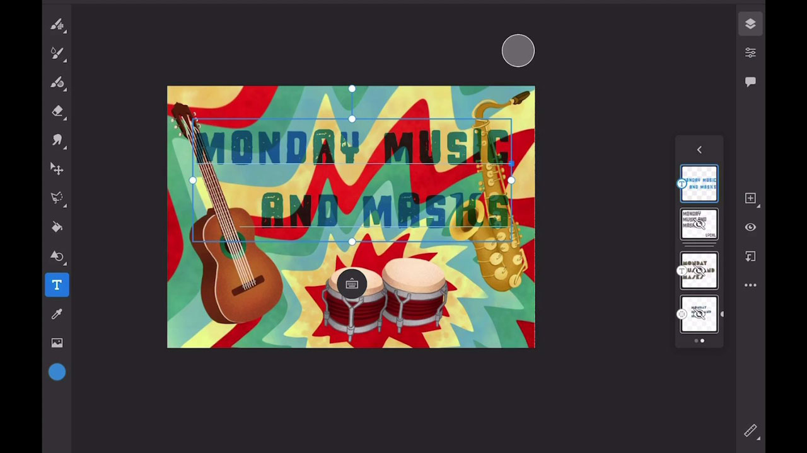
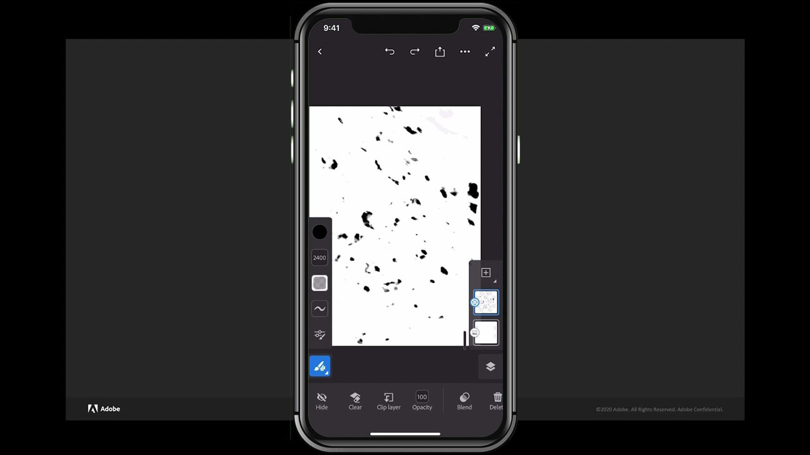

# Fresco

Adobe Fresco is a cross-platform app for creating drawings and paintings using brush-based methods combining vector and raster workflows with cloud documents.

## Browse Product Tutorials

<table>
<tr>
 <td>
   
    

   <a href="fresco.md#tutorial1"><strong>Intro to Drawing with Adobe Fresco</strong></a>
    

    <em>Use the powerful selection and color editing tools in Adobe fresco to dramatically change an image to match your corporate branding needs</em>
     
  </td>
  <td>
   
    

   <a href="fresco.md#tutorial2"><strong>Create Textured Artwork—Fresco to Illustrator</strong></a>
    

    <em>Paint and draw textures in Adobe Fresco and learn how to  use them in Illustrator</em>
     
  </td>
  <td>
    
    

     
  </td>
</tr>
</table>

## Intro to Drawing with Adobe Fresco (19:07) {#tutorial1}

>[!VIDEO](https://video.tv.adobe.com/v/326946?hidetitle=true)

**Description**
Discover Adobe Fresco for creating drawings and paintings using brush-based methods combining vector and raster workflows with cloud documents.

In this tutorial, you will learn how to:
* Use unique live brushes that mimic watercolor and oil paint along with your favorite pixel and vector brushes
* Create textured effects by layering different brushes and utilizing masks
* Create anywhere with the new Fresco app for iPhone
* Export your work to various formats to use in other mobile and desktop apps

**Presented by:**
Liz Tanonis, Solutions Consultant (Digital Media)

## Create Textured Artwork—Fresco to Illustrator (4:10) {#tutorial2}

>[!VIDEO](https://video.tv.adobe.com/v/326947?hidetitle=true)

**Description**
Paint and draw textures in Adobe Fresco and learn how to  use them in Illustrator.

In this tutorial, you will learn how to:
* Create artwork in the Adobe Fresco app for iPhone and export it to use across other Creative Cloud Apps
* Use Image Trace tool in Illustrator to convert artwork into vectors
* Apply handmade textures to vector artwork in Illustrator

**Presented by:**
Liz Tanonis, Solutions Consultant (Digital Media)

**Fresco Resources**

[Learn & Support](https://helpx.adobe.com/support/adobe-fresco.html) is your hub for additional tutorials, [What’s New](https://helpx.adobe.com/fresco/using/whats-new.html), and links to community forums.

**October 2020 Release**

Start using these features (and more!) by downloading the latest update from your Creative Cloud Desktop App.
