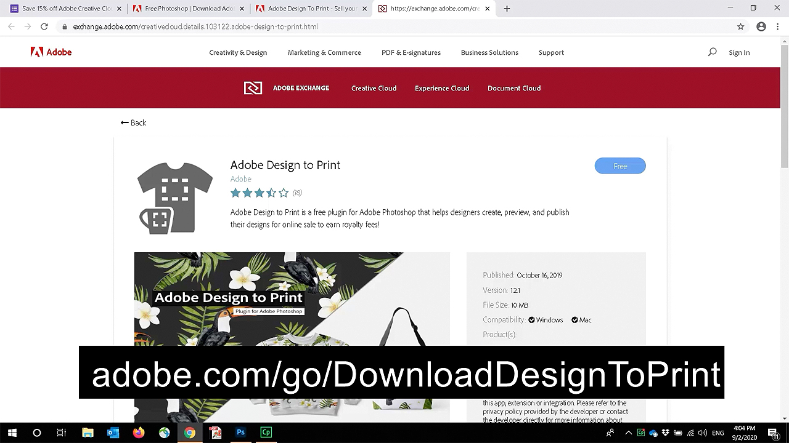
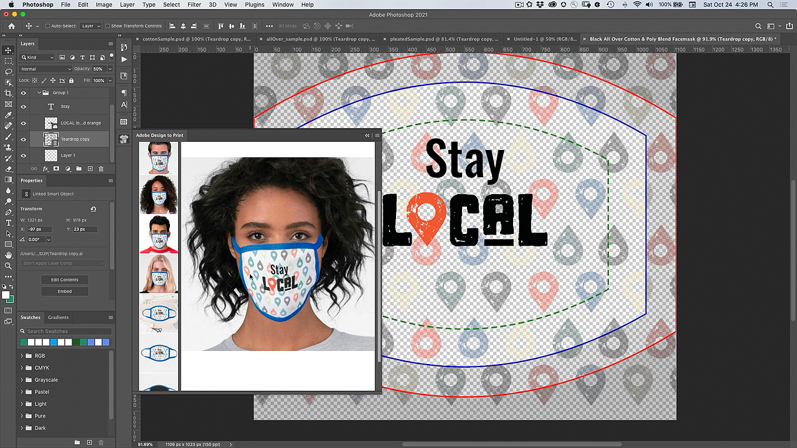
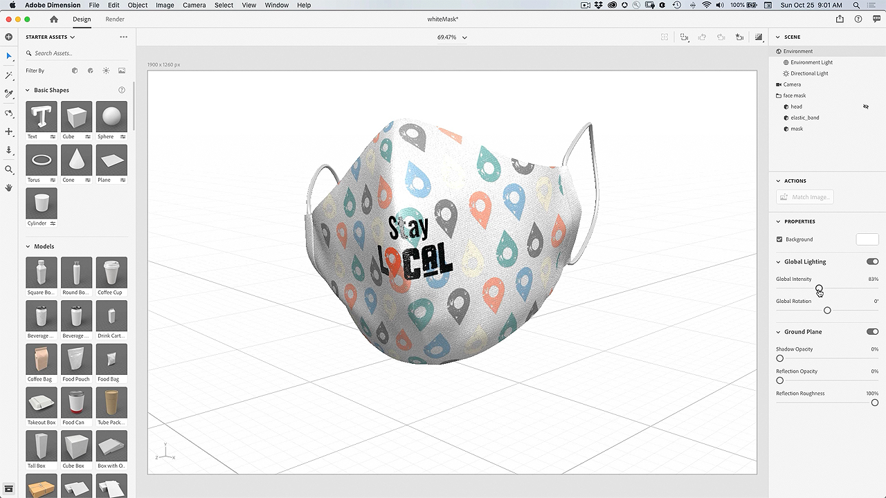
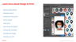
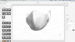

# Design to Print Plug-in–Customize a Face Mask

Wouldn’t it be cool if you could customize a face mask with your own artwork? With the Adobe Design to Print plug-in, you can visualize your designs on hundreds of Zazzle products, and publish directly to their online marketplace. 

## Browse Facemask Project Tutorials

<table>
<tr>
 <td>
   
    

   <a href="handsonproject.md#tutorial1"><strong>Install the Photoshop Design to Print Plug-in</strong></a>
    

    <em>Use the powerful selection and color editing tools in Adobe Photoshop to dramatically change an image to match your corporate branding needs</em>
     
  </td>
  <td>
    
    

    <a href="handsonproject.md#tutorial2"><strong>Customize a Face Mask with Design to Print</strong></a>
    

    <em>Customize your own Zazzle face mask</em>
     
  </td>
  <td>
    
    

   <a href="handsonproject.md#tutorial3"><strong>Create a 3D Visualization of your Face Mask</strong></a>
    

    <em>Create a 3D visualization of your face mask for the event gallery</em>
     
  </td>
</tr>
</table>

## Install the Photoshop Design to Print Plug-in (1:50) {#tutorial1}

>[!VIDEO](https://video.tv.adobe.com/v/327096?hidetitle=true)

**Description**
Learn how to install the Design to Print Plug-in for Photoshop.

In this tutorial, you will learn how to:
* Visualize your designs on products like clothing, accessories, stationery, and wall art–in real time!
* Publish to the Dazzle online marketplace

**Presented by:**
Patti Sokol, Principal Solutions Consultant (Digital Media)

## Customize a Face Mask with Design to Print (7:54) {#tutorial2}

>[!VIDEO](https://video.tv.adobe.com/v/327097?hidetitle=true)

**Description**
Customize your own Zazzle face mask

In this tutorial, you will learn how to:
* Visualize your designs on products like clothing, accessories, stationery, and wall art–in real time!
* Publish to the Dazzle online marketplace

**Click Image to Download Learn Design to Print PDF**

**Presented by:**
Patti Sokol, Principal Solutions Consultant (Digital Media)

## Create a 3D Visualization of your Face Mask (7:54) {#tutorial3}

>[!VIDEO](https://video.tv.adobe.com/v/327098?hidetitle=true)

**Description**
Create a 3D visualization of your face mask for the event gallery

In this tutorial, you will learn how to:
* Easily create photo-realistic 3D visualizations   
* Add materials and control lighting for a professional look
* Import assets to apply your brand or other designs

**Click Image to Download Dimension File with 3D Model of White Mask**

**Presented by:**
Patti Sokol, Principal Solutions Consultant (Digital Media)