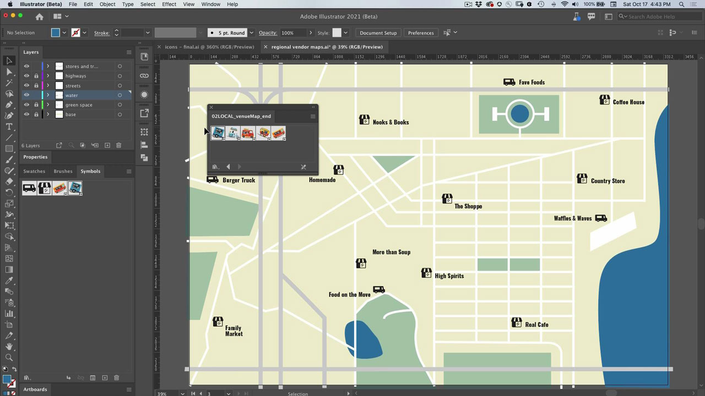
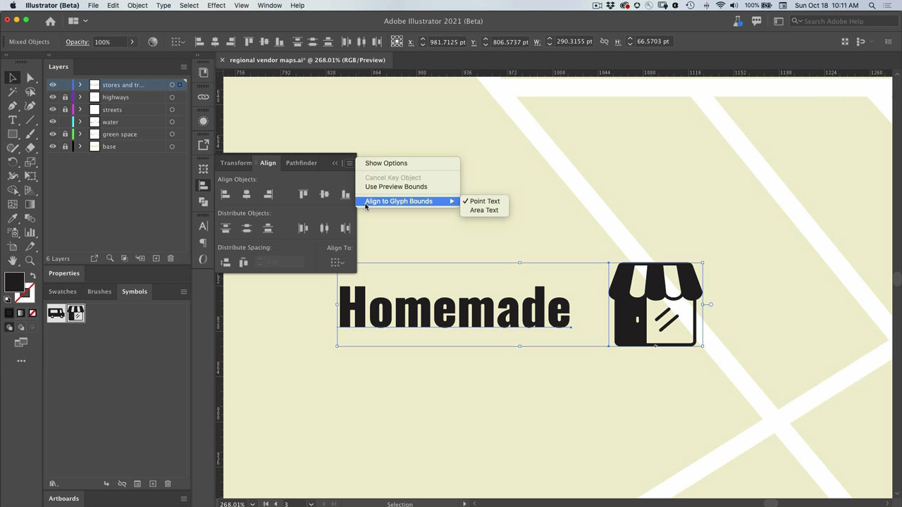

# Illustrator

The modern app for illustrations and graphics. Create logos, icons, illustrations, and any other designs you can imagine for the web, mobile, or print.

## Browse Product Tutorials

<table>
<tr>
 <td>
   
    

   <a href="illustrator.md#tutorial1"><strong>Use Symbols to Update Multiple Icon Instances</strong></a>
    

    <em>Reduce manual work and maintain consistency with symbols</em>
     
  </td>
  <td>
    
    

    <a href="illustrator.md#tutorial2"><strong>Align Text and Images with Glyph Snapping</strong></a>
    

    <em>Quickly snap glyphs to important regions of the document</em>
     
  </td>
  <td>
    
    

     
  </td>
</tr>
</table>

## Use Symbols to Update Multiple Icon Instances (5:08) {#tutorial1}

>[!VIDEO](https://video.tv.adobe.com/v/326816?hidetitle=true)

**Description**
Reduce manual work and maintain consistency with symbols.

In this tutorial, you will learn how to:
* Reduce manual work and maintain consistency with symbols

**Presented by:**
Patti Sokol, Principal Solutions Consultant (Digital Media)

## Align Text and Images with Glyph Snapping (6:48) {#tutorial2}

>[!VIDEO](https://video.tv.adobe.com/v/326817?hidetitle=true)

**Description**
Quickly snap glyphs to important regions of the document.

In this tutorial, you will learn how to:
* Quickly snap glyphs to important regions of the document

**Presented by:**
Patti Sokol, Principal Solutions Consultant (Digital Media)

**Illustrator Resources**

[Learn & Support](https://helpx.adobe.com/support/illustrator.html) is your hub for additional tutorials, [What’s New](https://helpx.adobe.com/illustrator/using/whats-new.htm), and links to community forums.

**October 2020 Release**

Start using these features (and more!) by downloading the latest update from your Creative Cloud Desktop App.
