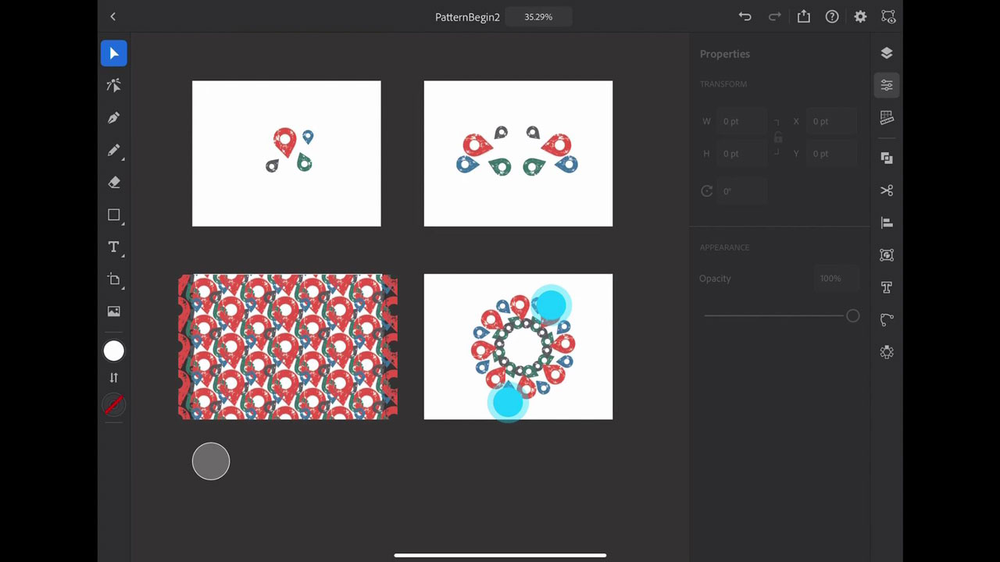

# Illustrator on iPad

Adobe Illustrator on the iPad is a vector design experience reimagined for touch, the Apple Pencil, and iPad.

## Browse Product Tutorials

<table>
<tr>
 <td>
   
    

   <a href="illustratoripad.md#tutorial1"><strong>Intro to Illustrator on the iPad</strong></a>
    

    <em>Create a distressed location icon and turn it into a pattern that you can apply to your Dimension and Zazzle project!</em>
     
  </td>
  <td>
    
    

     
  </td>
  <td>
    
    

     
  </td>
</tr>
</table>

## Intro to Illustrator on the iPad (9:21) {#tutorial1}

>[!VIDEO](https://video.tv.adobe.com/v/326823?hidetitle=true)

**Description**
This quick Illustrator for iPad overview will get you up-and-running quickly to create a distressed location icon and turn it into a pattern that you can apply to your Dimension and Zazzle project!

In this tutorial, you will learn how to:
* Illustrator reimagined for iPad transforms productivity, accelerates collaboration, expands creative skillsets and empowers creativity for all
* Touch interface enables more tactile and precision experience using Apple Pencil
* Access graphics and colors from CC Libraries
* Roundtrip workflow across mobile and desktop Illustrator

**Presented by:**
Dave Weinberg, Senior Solutions Consultant (Digital Media)

**Illustrator on iPad Resources**

[Learn & Support](https://helpx.adobe.com/support/illustrator.html) is your hub for additional tutorials, [What’s New](https://helpx.adobe.com/illustrator/using/whats-new/mobile-2021.html), and links to community forums.

**October 2020 Release**

Start using these features (and more!) by downloading the latest update from your Creative Cloud Desktop App.

