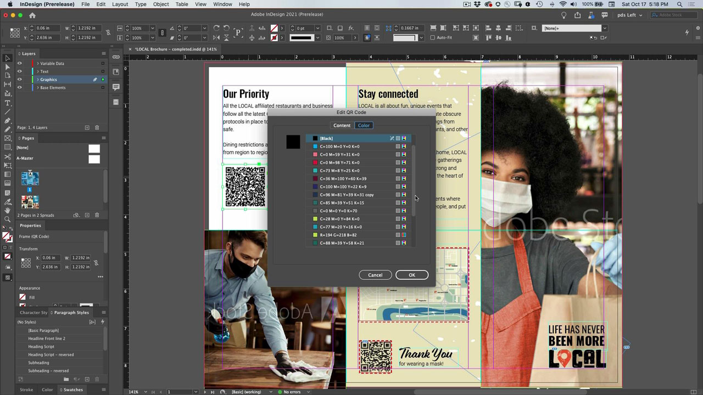
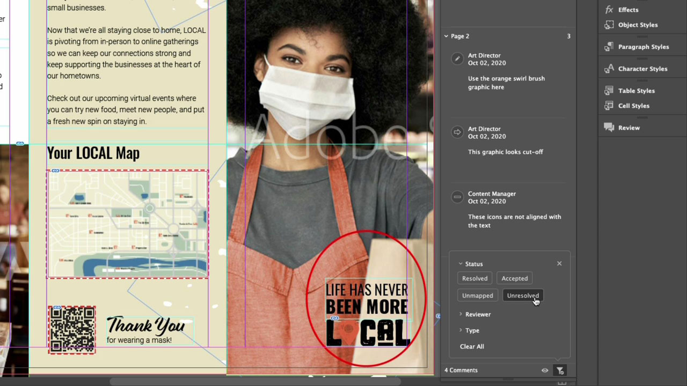
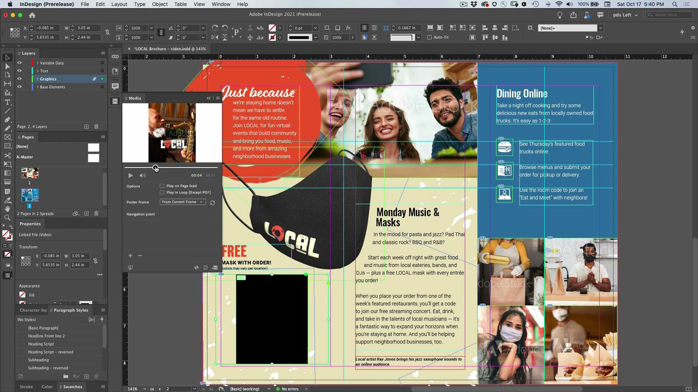

# InDesign

The industry-standard app to create beautiful documents for print and digital publishing. Create rich digital and print experiences, from eBooks and electronic magazines, to books, reports and whitepapers.

## Browse Product Tutorials

<table>
<tr>
 <td>
    
    

    <a href="indesign.md#tutorial1"><strong>Generate QR Codes</strong></a>
    

    <em>Generate QR code that links to a web site</em>
     
  </td>
  <td>
   
    

   <a href="indesign.md#tutorial2"><strong>Share for Review from InDesign</strong></a>
    

    <em>Seamless creative review experience for designers and their team members</em>
     
  </td>
  <td>
    
    

    <a href="indesign.md#tutorial3"><strong>Import PDF Comments from a Document 
Cloud Review</strong></a>
    

    <em>Import comments from a PDF directly into InDesign and quickly apply requested changes</em>
     
  </td>
</tr>
<tr>
<td>
   
    

   <a href="indesign.md#tutorial4"><strong>Add Video File to InDesign Document</strong></a>
    

    <em>Add video to InDesign. Output to PDF and publish online</em>
     
  </td>
 <td>
    
    

     
 </td>
 <td>
    
    

     
 </td>
</tr>
</table>

## Generate QR Codes (2:34) {#tutorial1}

>[!VIDEO](https://video.tv.adobe.com/v/326818?hidetitle=true)

**Description**
Generate QR code that links to a web site.

In this tutorial, you will learn how:
* Provide hands-free access to web content via mobile devices
* Make your customers feel safe
* Digital means it’s easy to keep content current

**Presented by:**
Patti Sokol, Principal Solutions Consultant (Digital Media)

## Share for Review from InDesign (4:04) {#tutorial2}

>[!VIDEO](https://video.tv.adobe.com/v/326824?hidetitle=true)

**Description**
InDesign Share for Review provides an even more seamless creative review experience for designers and their team members.

In this tutorial, you will learn how to:
* Initiate a review directly from InDesign without having to create a PDF
* Review and comment from a web browser 
* Gather feedback from multiple stakeholders in one place 
* Manage feedback in-app where changes can be made immediately.

**Adobe Review and Comment Options Comparison PDF**

 

**Presented by:**
Emily Palmer, Solutions Consultant (Digital Media)

## Import PDF Comments from a Document Cloud Review (4:52) {#tutorial3}

>[!VIDEO](https://video.tv.adobe.com/v/326959?hidetitle=true)

**Description**
Import comments from a PDF directly into InDesign and quickly apply requested changes.

In this tutorial, you will learn how to:
* Supports existing PDF commenting workflows
* Works for PDFs combined from multiple sources

**Adobe Review and Comment Options Comparison PDF**

 

**Presented by:**
Michael Murphy, Senior Solutions Consultant (Digital Media)

## Add Video File to InDesign Document (5:58) {#tutorial4}

>[!VIDEO](https://video.tv.adobe.com/v/326757?hidetitle=true)

**Description**
Add video to InDesign. Output to PDF and publish online. 

In this tutorial, you will learn how to:
* Add video to InDesign 
* Output to PDF and publish online

**Presented by:**
Patti Sokol, Principal Solutions Consultant (Digital Media)

**InDesign Resources**

[Learn & Support](https://helpx.adobe.com/support/indesign.html) is your hub for additional tutorials, [What’s New](https://helpx.adobe.com/indesign/user-guide.html/indesign/using/whats-new.ug.html), and links to community forums.

**October 2020 Release**

Start using these features (and more!) by downloading the latest update from your Creative Cloud Desktop App.